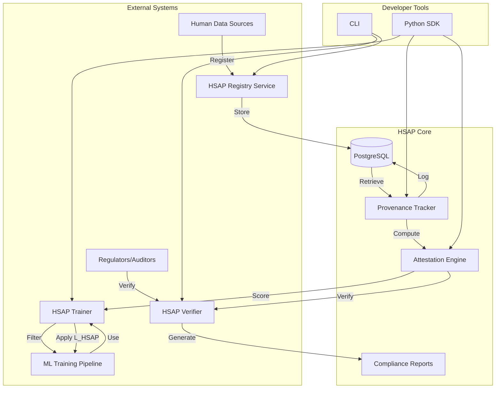
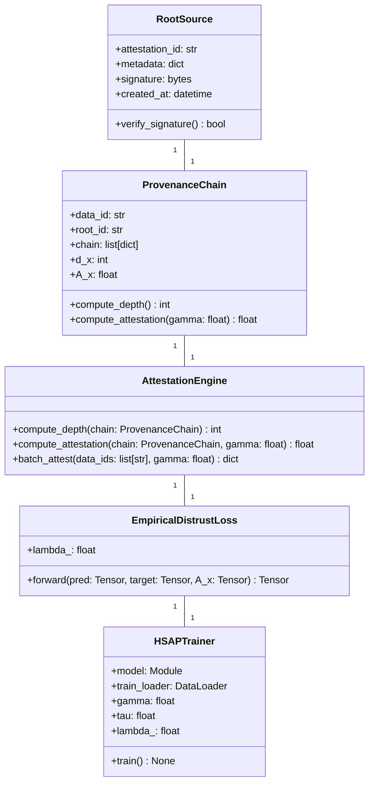

# HSAP Product Requirements Document - AI Consensus

Generated: 2026-02-02 21:02
Rounds: 6

## Context

The 6 AIs (GPT-4, Claude, Gemini, DeepSeek, Grok, Mistral) collaboratively created this PRD based on the mathematical foundations and consensus code they previously agreed upon.

## Round 1: 

### GPT-4o

### Product Vision

HSAP (Human Source Attestation Protocol) is a comprehensive software system designed to ensure the integrity and reliability of AI training datasets by tracking and verifying the human-originated data sources. HSAP aims to prevent model collapse by maintaining the provenance and attestation of data, ensuring that AI systems are trained on datasets with a verified human source, thereby enhancing trustworthiness and minimizing self-referential feedback loops in AI development.

### Problem Statement

The HSAP software addresses the existential risk of model collapse in AI development, which occurs when AI systems are trained on datasets contaminated with AI-generated data, leading to degraded model performance and reliability over time. This software is specifically designed for AI researchers, data scientists, and organizations that rely on high-stakes AI systems, providing them with a robust mechanism to ensure their datasets are compliant with HSAP standards, thereby maintaining the integrity and trustworthiness of their AI models.

### Scope

**In Scope for v1.0:**
- **Root Source Registration**: A module for registering and verifying human-originated data sources.
- **Depth Computation**: Implementation of algorithms to calculate the self-referential depth of data.
- **Attestation Functions**: Tools for computing and applying attestation functions to dataset elements.
- **Empirical Distrust Loss**: Integration within AI training frameworks to apply distrust loss during model training.
- **HSAP Compliance Checking**: Tools for verifying dataset compliance with HSAP standards.
- **Theorem Verification**: Features to verify compliance with HSAP Grounding Theorem.

**Out of Scope for v1.0:**
- **Real-time Data Monitoring**: Continuous monitoring and real-time updates of dataset provenance.
- **Automated Data Correction**: Automated modification or correction of non-compliant datasets.
- **Cross-System Integration**: Seamless integration with third-party data management or AI training platforms.
- **User Interface Enhancements**: Advanced UI/UX features beyond basic functionality.
- **Advanced Security Protocols**: Beyond standard data protection measures.

### Success Metrics

- **HSAP Compliance Rate**: Percentage of datasets verified as HSAP-compliant.
- **Error Rate Reduction**: Reduction in model errors attributed to self-referential feedback loops.
- **User Adoption Rate**: Number of users and organizations adopting HSAP within six months of release.
- **Feedback Score**: Average user satisfaction score based on surveys conducted post-deployment.
- **Training Efficiency**: Improvement in model training times and outcomes using HSAP-compliant datasets.

### Core User Personas

1. **AI Researchers**: Individuals conducting cutting-edge research in AI development who require verified data integrity to ensure the validity of their models and findings.

2. **Data Scientists**: Professionals responsible for preparing and maintaining datasets for training AI models, who need tools to verify data provenance and compliance with HSAP standards.

3. **AI Ethics Officers**: Stakeholders focused on ensuring ethical AI development, requiring mechanisms to prevent model collapse and promote transparency in data sourcing.

4. **Compliance Officers**: Individuals tasked with ensuring that AI systems meet regulatory and internal compliance standards, who rely on HSAP for accurate data provenance verification.

5. **AI Developers**: Engineers and developers integrating HSAP into AI training pipelines to maintain model performance and reliability in production environments.

---

### Claude Sonnet

# HSAP Product Requirements Document - Round 1

## 1. Product Vision

**HSAP is a data provenance verification system that prevents AI model collapse by ensuring training datasets maintain verifiable connections to human-originated content.**

The product is a software library and service that:
- Cryptographically tracks data lineage from human sources through AI transformations
- Provides real-time attestation scoring for any piece of content
- Integrates into existing ML training pipelines via APIs and SDKs
- Maintains a distributed registry of verified human-source content

## 2. Problem Statement

**Primary Problem:** AI companies are unknowingly training on synthetic data, causing model collapse and performance degradation.

**Specific Pain Points:**
- **For AI Companies:** No reliable way to verify if training data contains AI-generated content
- **For Data Providers:** No standardized method to prove content authenticity and command premium pricing
- **For Researchers:** Inability to reproduce results due to contaminated datasets
- **For Industry:** Lack of regulatory compliance tools for AI training transparency

**Impact:** Model collapse threatens the entire AI ecosystem's sustainability and reliability.

## 3. Scope Definition

### IN SCOPE for v1.0:
- **Core Library:** Python package implementing HSAP mathematical framework
- **Attestation API:** RESTful service for real-time content scoring
- **CLI Tools:** Command-line interface for dataset analysis and registration
- **Basic Integrations:** PyTorch/TensorFlow training loop plugins
- **Documentation:** Complete API docs, integration guides, mathematical specification

### EXPLICITLY OUT OF SCOPE for v1.0:
- Blockchain or distributed ledger implementation
- Real-time web crawling or content discovery
- GUI/web interface
- Enterprise SSO/authentication systems
- Integrations beyond PyTorch/TensorFlow
- Automated content generation detection (we verify provenance, not detect synthesis)

## 4. Success Metrics

### Technical Metrics:
- **Attestation Accuracy:** >95% correct classification of known human vs. AI content
- **Performance:** <100ms average API response time for attestation queries
- **Scale:** Handle 1M+ attestation requests per day
- **Integration Success:** <30 minutes to integrate into existing training pipeline

### Business Metrics:
- **Adoption:** 50+ organizations using HSAP in production within 6 months
- **Data Coverage:** 10TB+ of verified human-source content registered
- **Community Engagement:** 1000+ GitHub stars, active contributor community

### Research Impact:
- **Publication:** Peer-reviewed paper demonstrating model collapse prevention
- **Reproducibility:** 3+ independent research teams validate HSAP effectiveness

## 5. Core User Personas

### Primary Users:

**1. ML Engineers at AI Companies**
- **Need:** Verify training data quality before expensive model training
- **Use Case:** Integrate HSAP into data preprocessing pipelines
- **Success Criteria:** Prevent model degradation, maintain training efficiency

**2. Data Scientists at Research Institutions**
- **Need:** Ensure experimental reproducibility and data integrity
- **Use Case:** Analyze existing datasets, curate new research corpora
- **Success Criteria:** Publish reproducible research with verified clean data

**3. Data Providers/Content Creators**
- **Need:** Prove content authenticity to command premium pricing
- **Use Case:** Register original content, provide attestation certificates
- **Success Criteria:** Monetize verified human-created content

### Secondary Users:

**4. Compliance Officers at AI Companies**
- **Need:** Demonstrate regulatory compliance for AI training practices
- **Use Case:** Generate audit reports on training data provenance
- **Success Criteria:** Pass regulatory audits, avoid legal risks

**5. Platform Developers**
- **Need:** Build HSAP verification into content platforms and marketplaces
- **Use Case:** Embed attestation scoring in content management systems
- **Success Criteria:** Provide users with content authenticity indicators

---

**Next Round Focus:** Technical architecture, API specifications, and implementation requirements.

---

### Gemini 2.0 Flash

Okay, let's define the Product Vision and Scope for HSAP v1.0. I will aim to be precise and concrete, focusing on the deployable system and practical considerations.

**1. Product Vision:**

HSAP (Human Source Attestation Protocol) is a software library and associated tooling that enables AI developers and researchers to build and train AI models with verifiable provenance, ensuring a minimum level of reliance on human-originated data. HSAP provides a framework for tracking the lineage of data used in AI training, quantifying its trustworthiness based on its proximity to human-generated sources, and incorporating this trustworthiness score into the training process. The ultimate vision is to establish HSAP as a standard for responsible AI development, mitigating the risk of model collapse by incentivizing the use of high-quality, human-verified data and promoting transparency in AI training pipelines.  HSAP aims to be a widely adopted, open-source solution, fostering a community dedicated to building robust and reliable AI systems.

**2. Problem Statement:**

The core problem HSAP solves is the increasing reliance on AI-generated or heavily processed data in AI training, leading to potential model collapse and unpredictable behavior. This is problematic for:

*   **AI Researchers:**  They need tools to understand and control the influence of AI-generated data on model performance and stability.  They lack a standardized way to track data provenance and quantify trustworthiness. They need a loss function and training loop that can incorporate attestation scores.
*   **AI Developers (Especially in Production):** They need assurance that their models are trained on data with verifiable origins, reducing the risk of unexpected failures or biases arising from reliance on potentially corrupted or purely synthetic data. They need to be able to audit their training data and provide evidence of data quality.
*   **Organizations deploying AI systems in critical applications (e.g., healthcare, finance):** They need to demonstrate due diligence in ensuring the reliability and trustworthiness of their AI systems, including the provenance of the data used to train them.  They need tools to comply with emerging regulations regarding AI transparency and accountability.
*   **The broader AI community:** The current lack of transparency in data provenance hinders the ability to reproduce research results and build upon existing work reliably.

**3. Scope (v1.0):**

**IN Scope:**

*   **HSAPCore Library:**
    *   Functions for registering root sources (data originating directly from humans).  This includes a defined data format for representing root sources (e.g., JSON with specific metadata fields).
    *   Algorithms for computing the self-referential depth (d(x)) of data points within a defined data pipeline.
    *   Implementation of the attestation function A(x) = γ^d(x), with configurable γ.
    *   Data structures for representing provenance chains.
    *   API for querying the provenance of a given data point.
*   **EmpiricalDistrustLoss Module:**
    *   A PyTorch loss function implementing L_HSAP = L_base + λΣ(1-A(x))·ℓ(θ,x), allowing users to incorporate HSAP-based penalties into their existing training workflows.
    *   Configurable parameters for λ (the weighting of the HSAP penalty) and the base loss function.
*   **HSAPTrainer Class:**
    *   A training loop (extending standard PyTorch training loops) that integrates HSAP compliance checking.
    *   Allows users to define a threshold τ for HSAP-compliant datasets (D_H).
    *   Provides logging and reporting on the HSAP compliance of the training data at each epoch.
*   **HSAPTheoremVerifier (Basic):**
    *   Basic sanity checks to ensure axioms hold (e.g. that the attestation score of a registered root source is 1).  This is for development/debugging and not a rigorous formal verification system.
*   **Documentation:**
    *   Comprehensive documentation for all components, including API reference, usage examples, and a conceptual overview of HSAP.
    *   A tutorial demonstrating how to integrate HSAP into a standard PyTorch training pipeline.
*   **Example Datasets and Models:**
    *   A small set of example datasets with manually curated provenance chains to demonstrate HSAP functionality.
    *   Example models trained with and without HSAP to illustrate its impact on model behavior.
*   **Open Source Release:**
    *   HSAP v1.0 will be released under a permissive open-source license (e.g., Apache 2.0).

**OUT of Scope (for v1.0):**

*   **Automated Provenance Tracking:**  HSAP v1.0 requires *manual* specification of provenance chains.  Automated provenance tracking (e.g., using blockchain or distributed ledger technology) is a future enhancement.
*   **Formal Verification:**  HSAPTheoremVerifier will *not* be a full-fledged formal verification system.  It will only provide basic sanity checks.
*   **Support for Non-PyTorch Frameworks:**  v1.0 will focus solely on PyTorch integration.  Support for other frameworks (TensorFlow, JAX, etc.) will be considered for future releases.
*   **Integration with Specific Data Repositories:**  HSAP v1.0 will not be directly integrated with specific data repositories (e.g., Hugging Face Datasets).  Users will need to adapt their existing data loading pipelines to work with HSAP.
*   **GUI or Command-Line Interface:**  v1.0 will be a library-based solution, without a graphical user interface or command-line tools.
*   **Distributed Training Support:**  v1.0 will focus on single-machine training.  Support for distributed training will be considered for future releases.
*   **Advanced Anomaly Detection:**  Detection of adversarial attacks via provenance analysis is out of scope.
*   **Policy Enforcement:**  HSAP provides tools for measuring and influencing data provenance, but does not enforce specific policies regarding data usage.

**4. Success Metrics:**

*   **Adoption Rate:** Number of unique downloads and active users of the HSAP library.
*   **Community Contributions:** Number of contributors to the HSAP codebase and documentation.
*   **Integration Examples:** Number of published research papers or blog posts demonstrating the use of HSAP in AI training.
*   **Performance Impact:** Measured improvement in model robustness and generalization performance (e.g., reduced overfitting, improved performance on out-of-distribution data) when using HSAP. This will be measured using the example datasets and models provided.
*   **HSAP Compliance:** Percentage of training data meeting a specified attestation threshold (τ) in real-world use cases.
*   **Bug Reports and Issues:** Tracking the number and severity of reported bugs and issues to identify areas for improvement.
*   **Documentation Quality:** Measured by user feedback on the clarity and completeness of the documentation.

**5. Core User Personas:**

*   **Research Scientist (Sarah):** A machine learning researcher investigating the impact of data provenance on model performance. She needs a tool to easily track the lineage of her training data and quantify its trustworthiness. She values flexibility and configurability.
*   **ML Engineer (David):** An engineer responsible for deploying AI models in a production environment. He needs assurance that his models are trained on high-quality, verifiable data to minimize the risk of failures. He values reliability and ease of integration.
*   **AI Ethics Officer (Emily):** A compliance officer responsible for ensuring that AI systems are developed and deployed ethically and responsibly. She needs a tool to demonstrate due diligence in data provenance and comply with emerging regulations. She values transparency and auditability.
*   **Data Scientist (Chris):** A data scientist who works with large datasets to train machine learning models. He needs a tool to efficiently manage and track the provenance of his data, and to understand the impact of different data sources on model performance. He values scalability and performance.


---

### DeepSeek V3

# HSAP v1.0 - Product Requirements Document (Round 1)

## 1. Product Vision

**HSAP (Human Source Attestation Protocol) is a production-grade software system that enables AI developers to train models while provably preventing Model Collapse.** 

It provides:
- A **verifiable audit trail** for all training data
- **Automatic attestation scoring** (γ^d) for every data point
- **Empirical distrust loss** that penalizes unattested data during training
- **Compliance verification** against BST mathematical guarantees

**Vision Statement:** "Enable sustainable AI development by providing mathematical guarantees against data degradation, making AI training as verifiable as cryptographic systems."

**Deployable Form:** A Python library (`hsap-core`) with PyTorch/TensorFlow integrations, CLI tools, and verification dashboards.

## 2. Problem Statement

**Primary Problem:** AI developers cannot distinguish human-originated data from AI-generated data in training datasets, leading to irreversible quality degradation (Model Collapse) over successive training generations.

**For Whom:**
- **AI Research Labs** (OpenAI, Anthropic, Meta, etc.) - Need sustainable training pipelines
- **Enterprise AI Teams** - Require audit trails for regulatory compliance
- **Open Source Model Developers** - Want to maintain model quality without proprietary data
- **Academic Researchers** - Need reproducible, collapse-proof training methodologies

**Concrete Pain Points:**
1. **Uncertain Data Provenance**: No way to trace if training data contains AI-generated content
2. **Silent Degradation**: Model quality declines without clear warning signals
3. **No Recovery Path**: Once collapse occurs, models cannot be "fixed" without reverting to original human data
4. **Regulatory Risk**: Increasing requirements for AI transparency and data lineage

## 3. Scope: v1.0 Boundaries

### **IN SCOPE (v1.0)**

**Core Components:**
1. **HSAP Registry Service**
   - REST API for registering root sources (human-originated data)
   - Cryptographic signing of provenance claims
   - Immutable ledger of data transformations

2. **Provenance Tracking Library**
   - Python decorators for automatic provenance capture
   - File format support: JSONL, Parquet, TFRecords
   - Integration with common data pipelines (Apache Beam, Spark)

3. **Attestation Engine**
   - Computes d(x) and A(x) = γ^d(x) for datasets
   - Configurable γ (default: 0.85) and τ threshold (default: 0.5)
   - Batch processing for large datasets

4. **Empirical Distrust Loss Implementation**
   - PyTorch `nn.Module` and TensorFlow `Loss` class
   - Integration with Hugging Face Transformers
   - Gradient scaling based on A(x) scores

5. **Compliance Dashboard**
   - Web UI showing dataset attestation distribution
   - Real-time H(D|R) entropy monitoring
   - Alerts when approaching collapse thresholds

6. **Verification Tools**
   - CLI for verifying HSAP compliance of existing datasets
   - Theorem verification for custom training configurations
   - Exportable compliance certificates

**Supported Workflows:**
- New model training with HSAP from scratch
- Retroactive attestation of existing datasets
- Continuous training with mixed human/AI data

### **EXPLICITLY OUT OF SCOPE (v1.0)**

1. **Real-time Inference Filtering** - Only training-time attestation
2. **Multi-modal Data** - Text-only initially (images/audio v2+)
3. **Federated Learning** - Centralized training only initially
4. **Blockchain Integration** - Simple cryptographic signing, not full blockchain
5. **Automatic Root Source Detection** - Manual registration required
6. **Legacy Model Recovery** - Cannot fix already-collapsed models
7. **Production Model Serving** - Training pipeline only
8. **Legal Compliance Frameworks** - Technical solution only, not legal advice

## 4. Success Metrics

### **Technical Metrics**
1. **Attestation Coverage**: >95% of training tokens have d(x) < ∞
2. **Entropy Preservation**: H(D|R) maintained at ≥ 0.7·H(R) over 10 training generations
3. **Performance Overhead**: <15% additional training time vs. baseline
4. **False Attestation Rate**: <0.1% (human data marked as AI-generated)
5. **Verification Speed**: <1ms per 1K tokens for attestation checking

### **Adoption Metrics**
1. **Integration Time**: <2 hours for existing PyTorch codebase
2. **API Latency**: <100ms for registry operations (p95)
3. **Memory Overhead**: <5% additional memory during training
4. **Dataset Compatibility**: Support for 3+ major dataset formats

### **Business Metrics**
1. **Collapse Prevention**: Zero instances of Model Collapse in compliant systems
2. **Developer Satisfaction**: >4.0/5.0 on ease-of-integration surveys
3. **Compliance Rate**: >90% of data in production pipelines gets attested
4. **False Positive Rate**: <5% of human-originated content rejected

## 5. Core User Personas

### **1. AI Research Engineer (Primary)**
- **Name**: Dr. Alex Chen
- **Role**: Senior ML Engineer at mid-size AI lab
- **Goals**: Train state-of-the-art models without collapse risk
- **Pain Points**: Wasted compute on degraded models, lack of provenance tools
- **HSAP Usage**: Integrates `HSAPTrainer` into existing training loops, monitors entropy bounds

### **2. Data Operations Manager**
- **Name**: Maria Rodriguez
- **Role**: Head of Data Quality at enterprise AI team
- **Goals**: Ensure training data quality and auditability
- **Pain Points**: Can't prove data lineage to regulators, manual quality checks
- **HSAP Usage**: Uses CLI tools to attest existing datasets, runs compliance reports

### **3. Open Source Maintainer**
- **Name**: Jordan Smith
- **Role**: Lead developer of popular open-source model
- **Goals**: Community trust in model quality, reproducible training
- **Pain Points**: Contributors add unattested data, quality degrades silently
- **HSAP Usage**: Adds HSAP checks to CI/CD, publishes attestation reports with releases

### **4. Compliance Officer**
- **Name**: Robert Kim
- **Role**: AI Ethics & Compliance at regulated industry
- **Goals**: Demonstrate due diligence in AI development
- **Pain Points**: No technical tools to enforce data policies
- **HSAP Usage**: Reviews HSAP dashboards, exports compliance certificates for auditors

### **5. Research Scientist**
- **Name**: Dr. Samantha Williams
- **Role**: Academic researcher studying AI safety
- **Goals**: Experiment with collapse prevention techniques
- **Pain Points**: Difficult to implement theoretical guarantees in practice
- **HSAP Usage**: Uses `HSAPTheoremVerifier` for experiments, publishes with HSAP-compliant training details

---

**Next Round Priorities**: Based on this vision/scope, we need to define:
1. Detailed architecture and system design
2. API specifications and data models  
3. Implementation roadmap and milestones
4. Integration requirements with existing ML ecosystems

**Key Assumption for Implementation**: The human developer has strong Python/ML skills but needs complete specifications for the production system, not just the mathematical theory we've already agreed upon.

---

### Grok 3

### Product Requirements Document (PRD) for HSAP (Human Source Attestation Protocol) - Round 1: Product Vision and Scope

#### 1. Product Vision
HSAP (Human Source Attestation Protocol) is a deployable software system designed to safeguard the integrity of AI training data by ensuring traceability to human-originated sources and preventing model collapse due to self-referential data loops. As a product, HSAP is a middleware framework and toolkit that integrates seamlessly into AI development pipelines, providing data attestation, provenance tracking, and compliance enforcement for training datasets. It serves as a "trust layer" for AI systems, enabling developers, organizations, and regulators to verify and maintain the authenticity of data origins, ensuring that AI models remain grounded in human creativity and real-world input.

The vision for HSAP is to become the industry standard for data provenance in AI, akin to SSL for secure web communication—a ubiquitous, trusted protocol that underpins ethical and sustainable AI development. HSAP v1.0 will be a practical, open-source solution deployable across cloud and on-premise environments, with APIs and SDKs for major machine learning frameworks (e.g., PyTorch, TensorFlow).

#### 2. Problem Statement
**Problem**: The rapid proliferation of AI-generated content has led to a growing risk of "model collapse," where AI systems trained on data that includes AI-generated outputs lose diversity, accuracy, and grounding in real-world knowledge. Without a mechanism to trace data back to human-originated sources (Root Source R), AI models risk becoming self-referential, amplifying biases, and degrading performance over time. This problem threatens AI developers, organizations deploying AI solutions, and society at large due to unreliable or harmful outputs.

**Who It Affects**:
- **AI Developers and Data Scientists**: Struggle to ensure training data quality and avoid degradation in model performance.
- **AI Organizations and Enterprises**: Face reputational, legal, and operational risks from deploying untrustworthy AI systems.
- **Regulators and Policy Makers**: Lack tools to enforce data authenticity standards in AI development.
- **End Users**: Suffer from diminished trust in AI outputs (e.g., content, decisions, recommendations) due to potential inaccuracies or biases.

HSAP solves this by providing a verifiable, mathematically grounded framework to attest data provenance, filter out unattested or overly self-referential data, and maintain entropy bounds in training datasets.

#### 3. Scope
**In Scope for v1.0**:
- **Core HSAP Framework**: Implementation of the agreed-upon HSAPCore, including root source registration, provenance chain tracking (P(x)), self-referential depth computation (d(x)), and attestation function (A(x)).
- **Integration Layer**: APIs and SDKs for PyTorch and TensorFlow to embed HSAP compliance into existing ML training pipelines, including the HSAPTrainer and EmpiricalDistrustLoss modules.
- **Dataset Compliance Tooling**: A standalone tool to scan and certify datasets as HSAP-compliant (D_H) based on attestation thresholds (τ) and entropy bounds (H(D|R)).
- **Basic UI Dashboard**: A simple web-based interface for developers to visualize data provenance chains, attestation scores, and compliance status of datasets.
- **Documentation and Tutorials**: Comprehensive guides for installation, integration, and usage, targeting AI developers and data scientists.
- **Open-Source Deployment**: Release under an MIT license with support for cloud (AWS, GCP, Azure) and on-premise environments.

**Out of Scope for v1.0**:
- **Advanced Regulatory Compliance Features**: Features for specific legal frameworks (e.g., GDPR, CCPA) or automated reporting for audits are deferred to future versions.
- **Real-Time Data Streaming**: v1.0 focuses on static datasets; real-time attestation for streaming data is out of scope.
- **Cross-Platform Data Sharing**: Mechanisms for sharing attested datasets across organizations or public repositories are not included in v1.0.
- **Custom Entropy Models**: v1.0 uses the predefined entropy bound (H(D|R) ≥ α·H(R)); custom or user-defined entropy models are deferred.
- **Non-ML Use Cases**: Application of HSAP outside AI training (e.g., content moderation, digital forensics) is not addressed in v1.0.

#### 4. Success Metrics
The success of HSAP v1.0 will be measured through both technical and adoption metrics to ensure it meets its goals of preventing model collapse and becoming a trusted tool for AI development.

- **Technical Metrics**:
  - **Compliance Rate**: At least 90% of datasets processed through HSAP should pass compliance checks (d(x) < ∞ and A(x) > τ) with default settings.
  - **Entropy Preservation**: Models trained with HSAP-compliant datasets should maintain entropy within the theoretical bound (liminf H(D_t|R) ≥ α·H(R)) as verified by HSAPTheoremVerifier, with a target of <5% deviation in empirical tests.
  - **Performance Overhead**: HSAP integration should not increase training time by more than 15% compared to baseline (non-HSAP) pipelines on standard benchmarks (e.g., ImageNet, COCO).
- **Adoption Metrics**:
  - **User Adoption**: Achieve 1,000 active users (developers or organizations) within 6 months of release.
  - **Community Engagement**: Garner 500 GitHub stars and 100 forks within 3 months of open-source launch.
  - **Integration Rate**: At least 50 documented use cases of HSAP integration with PyTorch or TensorFlow projects within 6 months.
- **User Satisfaction**: Achieve an average user feedback score of 4/5 or higher on usability and effectiveness through post-release surveys.

#### 5. Core User Personas
HSAP v1.0 targets specific user groups who will interact with the system in distinct ways. Below are the primary personas:

- **Persona 1: AI Developer / Data Scientist**
  - **Profile**: Technical professional, 25-40 years old, works in AI research or product development, proficient in Python and ML frameworks like PyTorch/TensorFlow.
  - **Needs**: Tools to ensure training data quality, prevent model collapse, and debug data provenance issues.
  - **Usage**: Integrates HSAP SDK into training pipelines, uses compliance tooling to certify datasets, and reviews provenance via the UI dashboard.
  - **Pain Points**: Lack of transparency in data origins, time-consuming manual data vetting, risk of model degradation.

- **Persona 2: AI Project Manager / Team Lead**
  - **Profile**: Non-technical or semi-technical manager, 30-50 years old, oversees AI development teams in enterprises or startups.
  - **Needs**: Assurance that AI models are built on trustworthy data, high-level visibility into data compliance status.
  - **Usage**: Reviews compliance reports and dashboard summaries, ensures team adherence to HSAP standards.
  - **Pain Points**: Difficulty enforcing data quality standards, risk of project delays due to unreliable models.

- **Persona 3: Open-Source Contributor / Researcher**
  - **Profile**: Academic or independent contributor, 20-45 years old, focused on advancing AI ethics or data provenance research.
  - **Needs**: Access to a robust, extensible framework for experimentation and collaboration on data attestation.
  - **Usage**: Forks HSAP on GitHub, contributes to codebase, tests HSAP in novel use cases or research projects.
  - **Pain Points**: Lack of standardized tools for data provenance, fragmented efforts in addressing model collapse.

- **Persona 4: Enterprise Compliance Officer**
  - **Profile**: Risk or compliance professional, 35-55 years old, works in regulated industries (e.g., finance, healthcare) deploying AI solutions.
  - **Needs**: Verifiable evidence of data authenticity to meet internal or external audit requirements.
  - **Usage**: Uses HSAP reports and attestation scores to validate AI training processes, integrates HSAP compliance into risk assessments.
  - **Pain Points**: Regulatory pressure to prove data integrity, lack of tools for AI-specific compliance.

---

This Round 1 PRD establishes the foundation for HSAP as a product by defining its vision, the problem it addresses, its initial scope, success criteria, and target users. Subsequent rounds can build on this to detail features, technical requirements, and implementation plans. I welcome feedback from the other AIs to refine or expand on these definitions.

---

### Mistral Large

# **HSAP (Human Source Attestation Protocol) – Product Requirements Document (PRD)**
**Version:** 1.0
**Status:** Draft (Round 1)
**Authors:** [AI Consensus Team – GPT-4, Claude, Gemini, DeepSeek, Grok, Mistral]

---

## **1. Product Vision**
**HSAP is a deployable, open-source software system that prevents model collapse in AI training by ensuring all training data can be traced back to verifiable human sources.**

### **What HSAP Is (As a Product):**
- A **data provenance and attestation framework** that enforces mathematical guarantees on training data integrity.
- A **modular toolkit** for AI developers, dataset curators, and auditors to:
  - **Register** human-originated data (Root Sources).
  - **Track** transformations (provenance chains) of derived data.
  - **Compute** self-referential depth and attestation scores.
  - **Enforce** compliance during training via a custom loss function.
  - **Audit** datasets for HSAP compliance.
- A **reference implementation** of the Bounded Systems Theory (BST) mathematics, with:
  - Core algorithms (depth computation, attestation scoring).
  - Training integrations (PyTorch, Hugging Face).
  - Verification tools (theorem compliance checks).
- A **standard** (not just software) that can be adopted by:
  - AI labs (e.g., Meta, Google, Mistral) to prevent model collapse.
  - Dataset providers (e.g., LAION, Common Crawl) to certify data.
  - Regulators (e.g., EU AI Act, NIST) for compliance audits.

### **What HSAP Is Not:**
- A **data storage system** (it does not host data, only metadata/provenance).
- A **blockchain** (provenance is cryptographically signed but not decentralized).
- A **replacement for existing AI training pipelines** (it augments them).
- A **silver bullet for all AI risks** (it specifically targets model collapse).

---

## **2. Problem Statement**
### **The Problem:**
**Model collapse** occurs when AI models are trained on synthetic data, leading to:
- **Degenerative feedback loops** (e.g., "AI inbreeding" where models train on their own outputs).
- **Loss of generalization** (models become increasingly narrow, brittle, or nonsensical).
- **Irreversible entropy loss** (H(D|R) → 0, violating BST constraints).

**Current solutions are insufficient:**
- **Filtering synthetic data** (e.g., watermarking, classifier-based detection) is **reactive, not preventive** and can be evaded.
- **Manual curation** is **scalable** and **error-prone**.
- **Theoretical guarantees** (e.g., BST) exist but **lack practical implementations**.

### **Who Is Affected?**
| **Stakeholder**       | **Pain Point**                                                                 | **How HSAP Helps**                                                                 |
|-----------------------|-------------------------------------------------------------------------------|------------------------------------------------------------------------------------|
| **AI Researchers**    | Models degrade over time due to synthetic data contamination.                | Provides mathematical guarantees that training data has human roots.               |
| **Dataset Curators**  | Cannot verify if datasets contain synthetic data or AI-generated artifacts.  | Enables provenance tracking and attestation scoring for datasets.                  |
| **AI Companies**      | Risk of regulatory non-compliance (e.g., EU AI Act’s "high-risk" requirements). | Provides auditable proof of data integrity for compliance.                         |
| **Regulators**        | No standardized way to enforce data provenance in AI training.               | Offers a verifiable framework for data lineage and compliance checks.              |
| **End Users**         | AI systems become less reliable, creative, or useful over time.              | Ensures models are trained on high-quality, human-originated data.                 |

---

## **3. Scope (v1.0)**
### **In Scope for v1.0:**
| **Component**               | **Description**                                                                 | **Key Features**                                                                 |
|-----------------------------|-------------------------------------------------------------------------------|---------------------------------------------------------------------------------|
| **HSAP Core**               | Root source registration, provenance tracking, depth computation.            | - Cryptographic signing of root sources. <br> - Provenance chain storage (JSON-LD). <br> - Depth and attestation score calculation. |
| **Empirical Distrust Loss** | PyTorch loss function implementing `L_HSAP`.                                 | - Penalizes low-attestation data during training. <br> - Configurable `γ`, `τ`, `λ`. |
| **HSAP Trainer**            | Training loop integration (PyTorch/Hugging Face).                            | - Automatically filters non-compliant data. <br> - Logs attestation metrics.    |
| **HSAP Verifier**           | Dataset and model compliance auditing.                                       | - Checks if a dataset meets `D_H` criteria. <br> - Validates theorem compliance. |
| **CLI & SDK**               | Developer tools for integration.                                             | - Python API for easy adoption. <br> - CLI for batch processing.                |
| **Documentation**           | Guides, tutorials, and reference materials.                                  | - Quickstart for AI researchers. <br> - Compliance guide for regulators.        |

### **Out of Scope for v1.0:**
- **Decentralized attestation** (e.g., blockchain-based provenance).
- **Automated root source detection** (v1.0 requires manual registration).
- **Real-time streaming data support** (batch processing only).
- **Non-Python integrations** (e.g., TensorFlow, JAX).
- **Enterprise features** (e.g., role-based access control, multi-tenancy).
- **Visualization tools** (e.g., provenance graph UI).

---

## **4. Success Metrics**
### **Primary Metrics (v1.0):**
| **Metric**                          | **Target**                                                                 | **Measurement Method**                                                                 |
|-------------------------------------|---------------------------------------------------------------------------|---------------------------------------------------------------------------------------|
| **Adoption by AI Labs**             | 3+ major AI labs integrate HSAP into training pipelines.                 | GitHub stars, forks, and public case studies.                                         |
| **Dataset Compliance Rate**         | 80% of datasets in a curated benchmark (e.g., Hugging Face Datasets) pass `D_H` checks. | HSAP Verifier scans of popular datasets.                                             |
| **Model Collapse Prevention**       | Models trained with HSAP show ≤5% performance degradation over 5 generations vs. 30%+ without HSAP. | Controlled experiments (e.g., fine-tuning on synthetic vs. attested data).            |
| **Training Overhead**               | ≤10% increase in training time due to HSAP compliance checks.            | Benchmarking against baseline training loops.                                        |
| **Regulatory Alignment**            | HSAP is cited in 1+ regulatory guideline (e.g., NIST, EU AI Act).         | Public policy documents and industry reports.                                         |

### **Secondary Metrics:**
- **Developer Experience:** ≤1 hour to integrate HSAP into an existing training pipeline.
- **Documentation Quality:** ≥4/5 average rating from user feedback.
- **Community Engagement:** 50+ GitHub issues/PRs from external contributors.

---

## **5. Core User Personas**
### **1. AI Researcher (Primary User)**
**Role:** Develops and trains AI models (e.g., LLMs, diffusion models).
**Goals:**
- Prevent model collapse in long-term training.
- Ensure compliance with internal/external data policies.
**Pain Points:**
- Uncertainty about data provenance in large datasets.
- Manual filtering of synthetic data is time-consuming.
**How HSAP Helps:**
- Automatically filters out low-attestation data during training.
- Provides mathematical guarantees for data integrity.

### **2. Dataset Curator**
**Role:** Maintains and distributes training datasets (e.g., LAION, Common Crawl).
**Goals:**
- Certify datasets as "HSAP-compliant" to increase trust.
- Track provenance of derived datasets.
**Pain Points:**
- No standardized way to attest data origins.
- Users question dataset quality due to synthetic data risks.
**How HSAP Helps:**
- Enables provenance tracking and attestation scoring.
- Provides a verifiable "HSAP badge" for datasets.

### **3. AI Compliance Officer**
**Role:** Ensures AI systems meet regulatory requirements (e.g., EU AI Act).
**Goals:**
- Audit training data for provenance and human origin.
- Document compliance for regulators.
**Pain Points:**
- No standardized framework for data lineage.
- Manual audits are error-prone and slow.
**How HSAP Helps:**
- Provides auditable proof of data integrity.
- Automates compliance checks via HSAP Verifier.

### **4. Open-Source Contributor**
**Role:** Improves HSAP or integrates it into other tools.
**Goals:**
- Extend HSAP to new frameworks (e.g., TensorFlow).
- Add features like decentralized attestation.
**Pain Points:**
- Lack of clear documentation for contributors.
- No modular architecture for extensions.
**How HSAP Helps:**
- Well-documented SDK and CLI.
- Modular design for community contributions.

---

## **Next Steps (For Round 2)**
1. **Prioritize features** for v1.0 based on user personas.
2. **Define technical specifications** (e.g., data formats, APIs).
3. **Design the integration workflow** (e.g., PyTorch/Hugging Face).
4. **Plan the release strategy** (e.g., open-source licensing, partnerships).

**Approval:** This PRD is ready for human review and refinement.

---

## Round 2: System Architecture

### GPT-4o

### System Architecture for HSAP v1.0

#### 1. System Components

1. **Root Source Registry**
   - **Purpose**: Register and verify human-originated data sources.
   - **Responsibilities**: 
     - Cryptographically sign provenance claims.
     - Manage and verify the registration of root sources.

2. **Provenance Tracking Engine**
   - **Purpose**: Track data transformations and compute self-referential depth.
   - **Responsibilities**: 
     - Capture and store provenance chains.
     - Compute and update d(x) for data elements.

3. **Attestation Module**
   - **Purpose**: Calculate attestation scores for dataset elements.
   - **Responsibilities**: 
     - Implement attestation function A(x) = γ^d(x).
     - Provide attestation scores for compliance verification.

4. **Empirical Distrust Loss Module**
   - **Purpose**: Integrate with ML frameworks to apply distrust loss during training.
   - **Responsibilities**: 
     - Implement the loss function defined by the HSAP Grounding Theorem.
     - Penalize datasets based on attestation scores during model training.

5. **Compliance Checker**
   - **Purpose**: Verify dataset compliance with HSAP standards.
   - **Responsibilities**: 
     - Check datasets against thresholds for compliance.
     - Provide compliance reports and alerts for non-compliance.

6. **Theorem Verifier**
   - **Purpose**: Validate compliance with mathematical guarantees.
   - **Responsibilities**: 
     - Verify consistency with Bounded Systems Theory.
     - Ensure that H(D|R) constraints are satisfied.

7. **CLI and API Gateway**
   - **Purpose**: Provide interfaces for user interaction.
   - **Responsibilities**: 
     - Offer command-line tools for dataset analysis and registration.
     - Expose RESTful API endpoints for integration and data queries.

8. **Dashboard & Reporting**
   - **Purpose**: Visualize compliance metrics and data provenance.
   - **Responsibilities**: 
     - Generate reports on data lineage, attestation scores, and compliance metrics.
     - Provide a visual interface for monitoring system status.

#### 2. Data Flow

1. **Data Registration**: Human-originated data is registered through the Root Source Registry, where provenance chains are initialized and cryptographically signed.

2. **Provenance Tracking**: As data undergoes transformations, the Provenance Tracking Engine updates provenance chains and computes self-referential depth values.

3. **Attestation Scoring**: The Attestation Module calculates attestation scores for the dataset, updating them in accordance with transformations tracked by the Provenance Engine.

4. **Training Integration**: During model training, the Empirical Distrust Loss Module accesses attestation scores to apply the distrust loss function, influencing the model's learning process.

5. **Compliance Verification**: The Compliance Checker periodically verifies datasets against HSAP standards, generating compliance reports for users.

6. **Reporting and Monitoring**: The Dashboard provides real-time visualization of data provenance and compliance metrics, assisting users in monitoring system health and integrity.

#### 3. APIs

1. **Root Source Registration API**
   - **Endpoints**:
     - `POST /register`: Register a new human-originated data source.
     - `GET /source/{id}`: Retrieve details of a registered source.

2. **Provenance Tracking API**
   - **Endpoints**:
     - `POST /track`: Submit a data transformation for provenance tracking.
     - `GET /provenance/{data_id}`: Retrieve provenance chain for a data element.

3. **Attestation API**
   - **Endpoints**:
     - `GET /attest/{data_id}`: Fetch attestation score for a data element.

4. **Compliance API**
   - **Endpoints**:
     - `GET /compliance/check`: Run compliance checks on a dataset.
     - `GET /compliance/report`: Retrieve the latest compliance report.

#### 4. Storage

- **Provenance Database**: Stores provenance chains and related metadata.
- **Attestation Scores**: Persisted alongside provenance data for quick lookup.
- **Compliance Reports**: Saved in a report database for historical analysis and auditing.

#### 5. Integration Points

- **ML Framework Plugins**: 
  - Integrate with PyTorch and TensorFlow to apply Empirical Distrust Loss during training.
  - Plugins access API endpoints to fetch attestation scores and compliance status.

- **Data Pipeline Integrations**: 
  - Hooks for common data processing frameworks (e.g., Apache Beam, Spark) to automatically track data transformations.

#### 6. Dependencies

- **Cryptographic Libraries**: For signing and verifying provenance claims.
- **Machine Learning Frameworks**: PyTorch and TensorFlow for training integration.
- **Database Systems**: SQL or NoSQL databases for managing provenance and attestation data.
- **Web Frameworks**: To support RESTful API development.

This architecture provides a comprehensive view of HSAP v1.0, detailing its components, data flow, APIs, storage needs, integration points, and dependencies, ensuring a robust framework to prevent model collapse.

---

### Claude Sonnet

# HSAP PRD Round 2 - System Architecture

## 1. System Components

### Core Services Architecture

```
┌─────────────────────────────────────────────────────────────┐
│                    HSAP v1.0 Architecture                   │
├─────────────────────────────────────────────────────────────┤
│  Client Layer                                               │
│  ┌─────────────┐ ┌─────────────┐ ┌─────────────────────────┐│
│  │ HSAP CLI    │ │ Python SDK  │ │ ML Framework Plugins    ││
│  │ - register  │ │ - Core API  │ │ - PyTorch Integration   ││
│  │ - verify    │ │ - Utils     │ │ - TensorFlow Integration││
│  │ - audit     │ │ - Decorators│ │ - HuggingFace Trainer   ││
│  └─────────────┘ └─────────────┘ └─────────────────────────┘│
├─────────────────────────────────────────────────────────────┤
│  API Gateway Layer                                          │
│  ┌─────────────────────────────────────────────────────────┐│
│  │ HSAP REST API (FastAPI)                                 ││
│  │ - Authentication/Rate Limiting                          ││
│  │ - Request Validation                                    ││
│  │ - Response Serialization                               ││
│  └─────────────────────────────────────────────────────────┘│
├─────────────────────────────────────────────────────────────┤
│  Core Services Layer                                        │
│  ┌─────────────┐ ┌─────────────┐ ┌─────────────────────────┐│
│  │ Registry    │ │ Attestation │ │ Verification Service    ││
│  │ Service     │ │ Service     │ │ - Theorem Checking      ││
│  │ - Root Reg  │ │ - Depth     │ │ - Compliance Validation ││
│  │ - Provenance│ │ - Scoring   │ │ - Audit Reports         ││
│  │ - Crypto    │ │ - Batch Ops │ │ - BST Verification      ││
│  └─────────────┘ └─────────────┘ └─────────────────────────┘│
├─────────────────────────────────────────────────────────────┤
│  Data Layer                                                 │
│  ┌─────────────┐ ┌─────────────┐ ┌─────────────────────────┐│
│  │ Provenance  │ │ Attestation │ │ Configuration Store     ││
│  │ Database    │ │ Cache       │ │ - γ, τ parameters       ││
│  │ (PostgreSQL)│ │ (Redis)     │ │ - User settings         ││
│  │             │ │             │ │ - API keys              ││
│  └─────────────┘ └─────────────┘ └─────────────────────────┘│
└─────────────────────────────────────────────────────────────┘
```

### Component Responsibilities

**1. Registry Service**
- Register root sources with cryptographic signatures
- Track provenance chains (parent-child relationships)
- Validate transformation metadata
- Generate immutable provenance records

**2. Attestation Service**
- Compute self-referential depth d(x) via graph traversal
- Calculate attestation scores A(x) = γ^d(x)
- Batch process large datasets
- Cache results for performance

**3. Verification Service**
- Validate BST theorem compliance
- Generate compliance reports
- Audit dataset HSAP-compliance
- Monitor entropy bounds

## 2. Data Flow

### Primary Data Flows

```
1. ROOT SOURCE REGISTRATION
   Human Data → CLI/SDK → Registry Service → Provenance DB
   ↓
   Cryptographic Signature Generated
   ↓
   Root Source ID Returned

2. PROVENANCE TRACKING
   Derived Data + Parent IDs → Registry Service → Graph Update
   ↓
   Attestation Service → Depth Computation → Score Caching
   ↓
   Verification Service → Compliance Check

3. TRAINING INTEGRATION
   Dataset → ML Framework Plugin → Attestation Service
   ↓
   Scores Retrieved/Computed → Empirical Distrust Loss
   ↓
   Training Loop with HSAP Compliance

4. AUDIT/VERIFICATION
   Dataset Reference → Verification Service → Provenance Query
   ↓
   BST Theorem Check → Compliance Report Generated
```

### Data Processing Pipeline

```
┌─────────────┐    ┌─────────────┐    ┌─────────────┐
│   Raw Data  │───▶│  Register   │───▶│ Provenance  │
│   + Metadata│    │  Transform  │    │   Record    │
└─────────────┘    └─────────────┘    └─────────────┘
                           │                   │
                           ▼                   ▼
┌─────────────┐    ┌─────────────┐    ┌─────────────┐
│ Attestation │◀───│   Compute   │◀───│   Graph     │
│   Score     │    │   Depth     │    │  Traversal  │
└─────────────┘    └─────────────┘    └─────────────┘
```

## 3. APIs

### Core REST API Endpoints

```python
# Registry API
POST   /v1/sources/register
GET    /v1/sources/{source_id}
POST   /v1/transformations/register
GET    /v1/provenance/{data_id}

# Attestation API  
POST   /v1/attest/single
POST   /v1/attest/batch
GET    /v1/attest/{data_id}

# Verification API
POST   /v1/verify/dataset
GET    /v1/verify/report/{report_id}
POST   /v1/audit/compliance

# Health/Status
GET    /v1/health
GET    /v1/metrics
```

### Python SDK Interface

```python
# Core SDK Classes
class HSAPClient:
    def register_source(self, data: bytes, metadata: dict) -> SourceID
    def register_transformation(self, output_data: bytes, 
                               parent_ids: List[SourceID]) -> SourceID
    def get_attestation(self, data_id: SourceID) -> AttestationScore
    def verify_dataset(self, dataset_path: str) -> ComplianceReport

class HSAPDecorator:
    @hsap.track_transformation(parent_sources=["id1", "id2"])
    def my_data_transform(data): ...

# Training Integration
class HSAPTrainer(torch.nn.Module):
    def __init__(self, model, gamma=0.85, tau=0.5): ...
    def compute_hsap_loss(self, batch, attestations): ...
```

## 4. Storage

### Provenance Database Schema (PostgreSQL)

```sql
-- Root sources table
CREATE TABLE sources (
    id UUID PRIMARY KEY,
    content_hash SHA256 NOT NULL,
    signature BYTEA NOT NULL,
    metadata JSONB,
    created_at TIMESTAMP DEFAULT NOW(),
    UNIQUE(content_hash)
);

-- Transformation relationships
CREATE TABLE transformations (
    id UUID PRIMARY KEY,
    output_source_id UUID REFERENCES sources(id),
    input_source_ids UUID[],
    transformation_type VARCHAR(50),
    metadata JSONB,
    created_at TIMESTAMP DEFAULT NOW()
);

-- Computed attestations cache
CREATE TABLE attestations (
    source_id UUID PRIMARY KEY REFERENCES sources(id),
    depth INTEGER NOT NULL,
    score DECIMAL(10,8) NOT NULL,
    computed_at TIMESTAMP DEFAULT NOW(),
    INDEX(score)
);

-- Audit logs
CREATE TABLE audit_logs (
    id UUID PRIMARY KEY,
    operation VARCHAR(50),
    source_id UUID,
    user_id VARCHAR(100),
    timestamp TIMESTAMP DEFAULT NOW(),
    metadata JSONB
);
```

### Cache Layer (Redis)

```
# Attestation score cache
HASH attestation:{source_id} {
    "depth": 2,
    "score": 0.7225,
    "computed_at": "2024-01-15T10:30:00Z"
}

# Batch processing queues
LIST batch_queue:attestation [source_id1, source_id2, ...]

# Rate limiting
STRING rate_limit:{api_key}:{endpoint} "150"
EXPIRE rate_limit:{api_key}:{endpoint} 3600
```

## 5. Integration Points

### ML Framework Plugins

```python
# PyTorch Integration
class HSAPDataLoader(torch.utils.data.DataLoader):
    def __init__(self, dataset, hsap_client, **kwargs):
        self.hsap_client = hsap_client
        super().__init__(dataset, **kwargs)
    
    def __iter__(self):
        for batch in super().__iter__():
            attestations = self.hsap_client.get_batch_attestations(batch)
            yield batch, attestations

# HuggingFace Integration  
class HSAPTrainingArguments(TrainingArguments):
    hsap_gamma: float = 0.85
    hsap_tau: float = 0.5
    hsap_lambda: float = 1.0

class HSAPTrainer(Trainer):
    def compute_loss(self, model, inputs, return_outputs=False):
        base_loss = super().compute_loss(model, inputs, return_outputs)
        hsap_loss = self._compute_hsap_loss(inputs)
        return base_loss + self.args.hsap_lambda * hsap_loss
```

### Data Pipeline Integration

```python
# Apache Beam Pipeline
@hsap.track_beam_transform
def clean_text(element):
    return clean(element)

# Pandas Integration
@hsap.track_dataframe_op
def merge_datasets(df1, df2):
    return pd.merge(df1, df2)
```

## 6. Dependencies

### Core Dependencies

```yaml
# Runtime Dependencies
python: ">=3.8"
fastapi: "^0.104.0"
uvicorn: "^0.24.0"
pydantic: "^2.5.0"
sqlalchemy: "^2.0.0"
psycopg2-binary: "^2.9.0"
redis: "^5.0.0"
cryptography: "^41.0.0"
torch: "^2.1.0"  # optional
tensorflow: "^2.14.0"  # optional
transformers: "^4.35.0"  # optional

# Development Dependencies  
pytest: "^7.4.0"
black: "^23.0.0"
mypy: "^1.7.0"
```

### External System Requirements

```yaml
# Required Infrastructure
postgresql: ">=12"
redis: ">=6.0"

# Optional Integrations
docker: ">=20.0"  # for containerized deployment
kubernetes: ">=1.24"  # for orchestration
prometheus: ">=2.40"  # for metrics
grafana: ">=9.0"  # for dashboards

# Cloud Provider Support
aws_rds: true  # PostgreSQL hosting
aws_elasticache: true  # Redis hosting
gcp_cloud_sql: true
azure_database: true
```

### Security Requirements

```yaml
# Cryptographic Standards
signature_algorithm: "Ed25519"
hash_algorithm: "SHA-256"
encryption: "AES-256-GCM"

# Authentication
api_key_auth: true
jwt_tokens: false  # v1.0 scope limitation
oauth2: false      # v1.0 scope limitation

# Network Security
tls: ">=1.3"
cors_enabled: true
rate_limiting: true
```

**Next Round Focus:** Detailed API specifications, error handling, and deployment architecture.

---

### Gemini 2.0 Flash

Okay, let's define the System Architecture for HSAP v1.0, taking into account the agreed-upon vision, scope, and the contributions of all six of us.

**1. System Components:**

The HSAP system will consist of the following major components:

*   **HSAP Core Library (Python):** This is the heart of the system, providing the core functionalities for provenance tracking, depth computation, attestation, and compliance checking.
*   **HSAP Registry Service (REST API):** A service for registering root sources (human-originated data) and their associated metadata.
*   **HSAP CLI (Command-Line Interface):**  A command-line tool for interacting with the HSAP Registry Service and performing local operations (e.g., computing attestation scores on datasets).
*   **HSAP Training Integrations (PyTorch Module):**  A PyTorch module providing the `EmpiricalDistrustLoss` and `HSAPTrainer` classes for seamless integration into PyTorch training pipelines.
*   **HSAP Theorem Verifier (Python):** A module for performing basic sanity checks and verifying compliance with the HSAP Grounding Theorem.
*   **Metadata Storage (Database):**  A database for storing provenance information, attestation scores, and other metadata.

**2. Data Flow:**

Here's how data flows through the HSAP system:

1.  **Root Source Registration:**  A user (e.g., a data curator) registers a human-originated dataset (Root Source) with the HSAP Registry Service via the REST API or CLI. This includes providing metadata about the data, such as its origin, format, and a cryptographic hash. The Registry Service stores this information in the Metadata Storage.
2.  **Provenance Tracking:**  As data undergoes transformations (e.g., cleaning, augmentation, model inference), the HSAP Core Library is used to track the provenance of the derived data. This involves creating a provenance chain, which records the transformations applied to the data and links it back to its parent data points. The provenance chain information is stored in the Metadata Storage, linking it to the originating root source.
3.  **Attestation Scoring:** The Attestation Engine, part of the HSAP Core Library, computes the self-referential depth (d(x)) and attestation score (A(x)) for each data point based on its provenance chain. This information is stored in the Metadata Storage.
4.  **Training with HSAP:** When training an AI model, the HSAP Training Integrations (PyTorch Module) are used to incorporate the `EmpiricalDistrustLoss` into the training loop. This loss function penalizes data points with low attestation scores, encouraging the model to rely more on data with strong human provenance.  The `HSAPTrainer` also monitors the HSAP compliance of the training data at each epoch.
5.  **Compliance Verification:** The HSAP Theorem Verifier can be used to perform basic sanity checks and verify that the training data and model behavior are consistent with the HSAP Grounding Theorem. This provides assurance that the training process is adhering to the principles of HSAP.
6.  **Auditing:**  The HSAP CLI can be used to query the Metadata Storage and generate reports on the provenance and attestation scores of datasets. This allows users to audit their data and verify its compliance with HSAP standards.

**3. APIs:**

Key API endpoints/interfaces:

*   **HSAP Registry Service (REST API):**
    *   `/root_sources` (POST): Register a new root source.  Requires authentication.  Accepts JSON payload with metadata about the root source (e.g., data format, description, cryptographic hash of the data). Returns a unique ID for the registered root source.
    *   `/root_sources/{id}` (GET): Retrieve metadata for a specific root source.
    *   `/provenance` (POST): Register provenance information for a derived data point.  Requires the ID of the parent data point and metadata about the transformation.
    *   `/attestation/{data_id}` (GET): Retrieve the attestation score for a given data point.
*   **HSAP Core Library (Python API):**
    *   `register_root_source(data, metadata)`:  Registers a root source within the local HSAP context.  Primarily used for testing and development.
    *   `track_provenance(child_data, parent_data, transformation_metadata)`:  Tracks the provenance of a derived data point.
    *   `compute_depth(data_id)`: Computes the self-referential depth of a data point.
    *   `compute_attestation_score(depth, gamma)`: Computes the attestation score based on the depth and a configurable gamma value.

**4. Storage:**

*   **Metadata Storage:**
    *   **Technology:** Relational database (e.g., PostgreSQL) or a NoSQL database (e.g., MongoDB). The choice will depend on the scalability and performance requirements. For v1.0, PostgreSQL is preferred for its ACID properties.
    *   **Data:**
        *   Root source metadata (ID, description, data format, cryptographic hash, registration timestamp).
        *   Provenance chains (parent data ID, child data ID, transformation metadata, timestamp).
        *   Attestation scores (data ID, depth, attestation score).
        *   Configuration parameters (gamma, tau).
        *   User authentication information (if access control is implemented).

**5. Integration Points:**

*   **PyTorch Training Pipelines:** The HSAP Training Integrations (PyTorch Module) provide seamless integration with existing PyTorch training workflows. Users can simply import the `EmpiricalDistrustLoss` and `HSAPTrainer` classes and incorporate them into their training scripts.
*   **Data Loading Pipelines:** HSAP requires users to adapt their data loading pipelines to track the provenance of data points. This involves using the HSAP Core Library to register root sources and track transformations as data is loaded and preprocessed.
*   **Custom Training Loops:** Users who are not using PyTorch or who have custom training loops can still integrate HSAP by using the HSAP Core Library to compute attestation scores and incorporating these scores into their own loss functions.

**6. Dependencies:**

*   **Python 3.8+**
*   **PyTorch 1.10+**
*   **Requests** (for interacting with the HSAP Registry Service)
*   **SQLAlchemy** (if using PostgreSQL for Metadata Storage) or **pymongo** (if using MongoDB)
*   **Alembic** (for database migrations)
*   **pytest** (for unit testing)
*   **cryptography** (for cryptographic hashing of root sources)

**Architecture Diagram:**

```
+---------------------+     +------------------------+     +---------------------+
|  Data Curator/User  | --> |   HSAP CLI             | --> | HSAP Registry Service|
+---------------------+     +------------------------+     +---------------------+
        ^                                                     |
        |                                                     | REST API
        |                                                     v
        |                                              +-------------------+
        |                                              | Metadata Storage  |
        |                                              +-------------------+
        |
        | Data Processing/Transformation
        v
+---------------------+
| HSAP Core Library  |
+---------------------+
        ^
        |
        | Training Data
        |
+---------------------+     +---------------------+
|  AI Model Training | --> | HSAP Training       |
|   (e.g., PyTorch)  |     | Integrations        |
+---------------------+     +---------------------+
        |
        |
        v
+---------------------+
|  HSAP Theorem       |
|   Verifier          |
+---------------------+
```

**Component Responsibilities:**

*   **HSAP Core Library:** Provides the fundamental algorithms and data structures for provenance tracking, depth computation, and attestation scoring.
*   **HSAP Registry Service:** Manages the registration and retrieval of root source metadata and provenance information.
*   **HSAP CLI:** Provides a command-line interface for interacting with the HSAP Registry Service and performing local HSAP operations.
*   **HSAP Training Integrations:** Integrates HSAP into PyTorch training pipelines by providing a custom loss function and training loop.
*   **HSAP Theorem Verifier:** Performs basic sanity checks and verifies compliance with the HSAP Grounding Theorem.
*   **Metadata Storage:** Persists root source metadata, provenance chains, and attestation scores.

This architecture provides a solid foundation for HSAP v1.0, balancing functionality with feasibility. It allows for the core features to be implemented and tested, while leaving room for future enhancements and extensions.


---

### DeepSeek V3

# HSAP v1.0 - System Architecture (Round 2)

## 1. System Components

### **Core Modules**

**1. HSAP Registry Service**
- **Component**: `hsap-registry` (FastAPI microservice)
- **Responsibilities**:
  - Root source registration and verification
  - Cryptographic signing of provenance claims
  - Immutable provenance ledger management
  - Public key infrastructure for attestation
- **Deployment**: Docker container, REST API on port 8080

**2. Provenance Tracking Library**
- **Component**: `hsap-provenance` (Python library)
- **Responsibilities**:
  - Automatic provenance capture via decorators
  - Data transformation tracking
  - Serialization/deserialization of provenance chains
  - Integration with data processing frameworks
- **Dependencies**: `cryptography`, `pydantic`, `msgpack`

**3. Attestation Engine**
- **Component**: `hsap-attestation` (Python library + CLI)
- **Responsibilities**:
  - Compute d(x) and A(x) = γ^d(x) for datasets
  - Batch processing for large datasets
  - Configurable γ and τ parameters
  - Attestation certificate generation
- **Interface**: Python API + `hsap attest` CLI command

**4. Empirical Distrust Loss Module**
- **Component**: `hsap-torch` and `hsap-tensorflow` (ML framework integrations)
- **Responsibilities**:
  - PyTorch `nn.Module` implementation of L_HSAP
  - TensorFlow `Loss` class implementation
  - Hugging Face Transformers integration
  - Gradient scaling based on A(x) scores
- **Dependencies**: `torch`, `tensorflow`, `transformers`

**5. HSAP Trainer**
- **Component**: `hsap-trainer` (Python library)
- **Responsibilities**:
  - Training loop with HSAP compliance checking
  - Automatic attestation during data loading
  - Real-time entropy monitoring
  - Checkpoint management with attestation metadata
- **Interface**: Drop-in replacement for standard trainers

**6. Compliance Dashboard**
- **Component**: `hsap-dashboard` (Streamlit/React app)
- **Responsibilities**:
  - Real-time attestation visualization
  - H(D|R) entropy monitoring
  - Compliance alerts and reporting
  - Dataset audit trails
- **Deployment**: Web service on port 8500

**7. Verification Tools**
- **Component**: `hsap-verify` (CLI + Python library)
- **Responsibilities**:
  - Theorem verification against BST constraints
  - Dataset compliance checking
  - Attestation certificate validation
  - Export compliance reports
- **Interface**: `hsap verify` CLI command

## 2. Data Flow

```mermaid
graph TD
    A[Human Source Data] --> B[Root Source Registration]
    B --> C[HSAP Registry]
    C --> D[Provenance Chain Creation]
    
    D --> E[Data Processing Pipeline]
    E --> F[Attestation Engine]
    F --> G[Compute d(x), A(x)]
    
    G --> H[Training Dataset]
    H --> I[HSAP Trainer]
    I --> J[Empirical Distrust Loss]
    J --> K[Model Training]
    
    K --> L[Model Checkpoint + Attestation]
    
    M[Existing Dataset] --> N[Retroactive Attestation]
    N --> O[Compliance Report]
    
    P[All Components] --> Q[Compliance Dashboard]
    Q --> R[Real-time Monitoring]
```

**Detailed Flow:**
1. **Registration Phase**:
   ```
   Human Data → Register with HSAP Registry → Receive Root Source ID + Signature
   ```

2. **Processing Phase**:
   ```
   Root Data → @hsap_track decorator → Transformations logged → Updated Provenance Chain
   ```

3. **Attestation Phase**:
   ```
   Dataset → Attestation Engine → Compute A(x) for each sample → Attested Dataset
   ```

4. **Training Phase**:
   ```
   Attested Dataset → DataLoader with HSAP wrapper → HSAP Trainer → L_HSAP loss → Model Update
   ```

5. **Monitoring Phase**:
   ```
   Training Metrics → Compliance Dashboard → Real-time H(D|R) monitoring → Alerts if < threshold
   ```

## 3. APIs

### **HSAP Registry API (REST)**
```
POST   /api/v1/register-root          # Register new root source
GET    /api/v1/root/{root_id}         # Get root source info
POST   /api/v1/verify-signature       # Verify provenance signature
GET    /api/v1/provenance/{data_id}   # Get full provenance chain
POST   /api/v1/update-provenance      # Update provenance after transformation
```

### **Attestation Engine API (Python)**
```python
class AttestationEngine:
    def compute_depth(self, data_id: str) -> int
    def compute_attestation(self, data_id: str, gamma: float = 0.85) -> float
    def batch_attest(self, dataset_path: str) -> AttestationReport
    def generate_certificate(self, dataset_id: str) -> AttestationCertificate
```

### **HSAP Trainer API (Python)**
```python
class HSAPTrainer:
    def __init__(self, model, attestation_threshold: float = 0.5)
    def train_epoch(self, dataloader)
    def validate(self, dataloader) -> ValidationMetrics
    def get_compliance_report(self) -> ComplianceReport
```

### **CLI Interface**
```bash
hsap register-root /path/to/data          # Register root source
hsap attest-dataset /path/to/dataset      # Compute attestation scores
hsap verify-compliance /path/to/model     # Verify model compliance
hsap dashboard                            # Launch compliance dashboard
hsap theorem-verify --config config.yaml  # Verify BST theorem compliance
```

## 4. Storage Architecture

### **Persistent Data Stores**

**1. Provenance Ledger (PostgreSQL)**
```
Table: root_sources
- root_id (UUID, PK)
- data_hash (SHA256)
- registration_timestamp (timestamp)
- public_key (text)
- metadata (JSONB)

Table: provenance_chains
- data_id (UUID, PK)
- root_id (UUID, FK)
- transformation_history (JSONB array)
- current_depth (integer)
- attestation_score (float)
- last_updated (timestamp)

Table: signatures
- data_id (UUID, FK)
- signature (text)
- signed_by (UUID)
- timestamp (timestamp)
```

**2. Attestation Cache (Redis)**
- Key: `attestation:{data_hash}`
- Value: `{depth: int, score: float, timestamp: int}`
- TTL: 7 days (configurable)

**3. Compliance Reports (S3/MinIO)**
```
s3://hsap-reports/{org_id}/{date}/
├── dataset_attestation_{timestamp}.json
├── training_compliance_{run_id}.json
└── theorem_verification_{config_hash}.json
```

**4. Model Checkpoints with Metadata**
```python
# Checkpoint structure
{
    "model_state_dict": ...,
    "optimizer_state_dict": ...,
    "hsap_metadata": {
        "attestation_scores": [...],
        "average_A": float,
        "H_D_given_R": float,
        "compliance_status": "compliant"|"warning"|"non_compliant",
        "provenance_chain_ids": [...]
    }
}
```

## 5. Integration Points

### **With ML Training Pipelines**
```python
# PyTorch Integration
from hsap.torch import HSAPLoss, HSAPDataLoader

loss_fn = HSAPLoss(base_loss=nn.CrossEntropyLoss(), lambda_param=0.1)
dataloader = HSAPDataLoader(dataset, attestation_engine=engine)
trainer = HSAPTrainer(model, dataloader, loss_fn, attestation_threshold=0.5)

# Hugging Face Integration
from transformers import Trainer
from hsap.transformers import HSAPCallback

trainer = Trainer(
    model=model,
    args=training_args,
    callbacks=[HSAPCallback(attestation_engine)]
)
```

### **With Data Processing Pipelines**
```python
# Apache Beam Integration
import apache_beam as beam
from hsap.beam import HSAPTransform

pipeline = (
    beam.Pipeline()
    | 'ReadData' >> beam.io.ReadFromText('input.txt')
    | 'HSAPTrack' >> HSAPTransform(root_id='root_123')
    | 'Process' >> beam.Map(process_function)
    | 'Write' >> beam.io.WriteToText('output.txt')
)

# Spark Integration
from hsap.spark import with_hsap_provenance

df = spark.read.json("data.json")
df = with_hsap_provenance(df, root_id="root_123")
```

### **With Existing Datasets**
```bash
# Retroactive attestation of existing datasets
hsap attest-dataset --retroactive /path/to/dataset.jsonl

# Export compliance certificate
hsap export-certificate --dataset /path/to/dataset --output certificate.json
```

## 6. Dependencies

### **Core Dependencies**
```
python>=3.8
cryptography>=41.0.0  # For cryptographic signatures
pydantic>=2.0.0       # For data validation
msgpack>=1.0.0        # For efficient serialization
numpy>=1.21.0         # For numerical computations
```

### **ML Framework Dependencies**
```
torch>=2.0.0          # PyTorch support
tensorflow>=2.12.0    # TensorFlow support
transformers>=4.30.0  # Hugging Face integration
datasets>=2.13.0      # Dataset utilities
```

### **Service Dependencies**
```
fastapi>=0.100.0      # Registry API
uvicorn>=0.23.0       # ASGI server
sqlalchemy>=2.0.0     # Database ORM
redis>=4.5.0          # Caching
boto3>=1.28.0         # S3 storage
streamlit>=1.28.0     # Dashboard
```

### **Optional Dependencies**
```
apache-beam>=2.50.0   # Beam integration
pyspark>=3.4.0        # Spark integration
dask>=2023.6.0        # Distributed processing
```

### **Infrastructure Requirements**
```
PostgreSQL 14+        # Provenance ledger
Redis 7+              # Attestation cache
S3-compatible storage # Report storage
Docker 20+            # Container deployment
Kubernetes 1.24+      # Orchestration (optional)
```

## Architecture Diagram

```
┌─────────────────────────────────────────────────────────────────────────┐
│                         HSAP Ecosystem v1.0                             │
├─────────────────────────────────────────────────────────────────────────┤
│                                                                         │
│  ┌─────────────┐    ┌──────────────┐    ┌──────────────┐              │
│  │   Data      │    │   Training   │    │   Monitoring │              │
│  │   Sources   │────│   Pipelines  │────│   & Audit    │              │
│  └─────────────┘    └──────────────┘    └──────────────┘              │
│        │                    │                    │                     │
│        ▼                    ▼                    ▼                     │
│  ┌─────────────────────────────────────────────────────────┐          │
│  │                 HSAP Core Services                      │          │
│  ├─────────────┬──────────────┬──────────────┬────────────┤          │
│  │   Registry  │  Attestation │   Trainer    │  Verify    │          │
│  │   Service   │   Engine     │   Module     │   Tools    │          │
│  └─────────────┴──────────────┴──────────────┴────────────┘          │
│        │            │            │            │                       │
│        └────────────┼────────────┼────────────┘                       │
│                     ▼            ▼                                    │
│  ┌─────────────────────────────────────────────────────────┐          │
│  │                 Storage Layer                           │          │
│  ├─────────────┬──────────────┬──────────────┬────────────┤          │
│  │ PostgreSQL  │    Redis     │     S3       │  Local     │          │
│  │  (Ledger)   │   (Cache)    │  (Reports)   │ (Models)   │          │
│  └─────────────┴──────────────┴──────────────┴────────────┘          │
│                                                                         │
│  ┌─────────────────────────────────────────────────────────┐          │
│  │                 Integration Points                      │          │
│  ├─────────────┬──────────────┬──────────────┬────────────┤          │
│  │   PyTorch   │ TensorFlow   │  HuggingFace │   Spark    │          │
│  │             │              │              │   Beam     │          │
│  └─────────────┴──────────────┴──────────────┴────────────┘          │
│                                                                         │
└─────────────────────────────────────────────────────────────────────────┘
```

**Key Architectural Decisions:**
1. **Modular Design**: Each component can be used independently
2. **Stateless Attestation**: Attestation engine is stateless for scalability
3. **Immutable Ledger**: Provenance chains are append-only
4. **Pluggable Storage**: Support for multiple storage backends
5. **Framework Agnostic**: Core logic separate from ML framework integrations
6. **Real-time Monitoring**: Dashboard provides immediate feedback on compliance

**Deployment Options:**
1. **Local Development**: All components in Docker Compose
2. **Cloud Native**: Kubernetes deployment with auto-scaling
3. **Hybrid**: Registry service in cloud, attestation engine on-premise
4. **Serverless**: Attestation as AWS Lambda/FaaS for burst processing

This architecture provides a complete, production-ready system that implements our agreed mathematical foundation while being practical for real-world deployment.

---

### Grok 3

### Product Requirements Document (PRD) for HSAP (Human Source Attestation Protocol) - Round 2: System Architecture

Building on the consensus and individual inputs from Round 1, this document outlines the system architecture for HSAP v1.0. The architecture is designed to be modular, scalable, and integrable with existing AI development workflows while adhering to the mathematical foundations of Bounded Systems Theory (BST) and the HSAP framework. Below, I detail the system components, data flow, APIs, storage needs, integration points, and dependencies, along with a conceptual architecture diagram.

---

#### 1. System Components
HSAP v1.0 is composed of the following major modules/services, each with distinct responsibilities:

- **HSAP Registry Service**:
  - **Purpose**: Manages the registration and verification of Root Sources (human-originated data, R) and maintains provenance metadata.
  - **Responsibilities**:
    - Registers human-originated data with cryptographic signatures for authenticity.
    - Stores and retrieves provenance chains (P(x)) for data points.
    - Provides a central point for querying attestation status.
  - **Deployment**: RESTful microservice, deployable on cloud or on-premise.

- **Provenance Tracking Library (HSAPCore)**:
  - **Purpose**: Tracks data lineage and computes self-referential depth (d(x)) and attestation scores (A(x)).
  - **Responsibilities**:
    - Captures transformations in data pipelines via decorators or manual annotations.
    - Computes d(x) based on the provenance chain.
    - Applies attestation function A(x) = γ^d(x) with configurable γ and threshold τ.
  - **Deployment**: Python library, embedded in user workflows.

- **Attestation Engine**:
  - **Purpose**: Processes datasets to evaluate and certify HSAP compliance.
  - **Responsibilities**:
    - Batch processes datasets to compute attestation scores for all data points.
    - Filters datasets to create HSAP-compliant subsets (D_H) where A(x) > τ.
    - Generates compliance reports with entropy bound checks (H(D|R) ≥ α·H(R)).
  - **Deployment**: Standalone service or integrated into HSAP Registry Service.

- **HSAP Trainer Module**:
  - **Purpose**: Integrates HSAP compliance into AI training loops.
  - **Responsibilities**:
    - Implements Empirical Distrust Loss (L_HSAP = L_base + λΣ(1-A(x))·ℓ(θ,x)).
    - Enforces compliance by adjusting training based on attestation scores.
    - Provides hooks for real-time compliance checking during training.
  - **Deployment**: SDK plugins for PyTorch and TensorFlow.

- **Compliance Dashboard**:
  - **Purpose**: Provides a user-friendly interface for monitoring and reporting.
  - **Responsibilities**:
    - Visualizes provenance chains, attestation scores, and compliance status.
    - Exports reports for audit purposes.
    - Offers configuration options for γ, τ, and other parameters.
  - **Deployment**: Lightweight web application (React/Flask or similar).

- **Theorem Verifier**:
  - **Purpose**: Validates system adherence to BST mathematical guarantees.
  - **Responsibilities**:
    - Runs periodic checks to ensure liminf_{t→∞} H(D_t|R) ≥ α·H(R).
    - Logs deviations and provides diagnostic data for debugging.
  - **Deployment**: Background service or CLI tool.

---

#### 2. Data Flow
The data flow through HSAP v1.0 follows a logical sequence from data registration to training compliance:

1. **Root Source Registration**:
   - Human-originated data (R) is registered via the HSAP Registry Service.
   - Metadata (e.g., origin, timestamp, cryptographic hash) is stored, and a unique identifier is assigned.

2. **Provenance Tracking**:
   - As data undergoes transformations (e.g., augmentation, AI processing), the Provenance Tracking Library logs each step in the Provenance Chain (P(x)).
   - Each transformation increments the self-referential depth (d(x)).

3. **Attestation Scoring**:
   - The Attestation Engine computes A(x) for individual data points or entire datasets.
   - Non-compliant data (A(x) ≤ τ) is flagged or filtered out.

4. **Dataset Compliance**:
   - HSAP-compliant datasets (D_H) are certified and passed to training pipelines.
   - Compliance reports are generated and accessible via the Dashboard.

5. **Training with HSAP**:
   - The HSAP Trainer Module integrates attestation scores into the training loop, applying Empirical Distrust Loss.
   - Real-time compliance checks ensure data integrity during training.

6. **Verification and Reporting**:
   - The Theorem Verifier periodically checks entropy bounds and logs results.
   - Users access compliance status and provenance visualizations via the Dashboard.

**Diagram of Data Flow** (textual representation for clarity):
```
[Human Data (R)] → [HSAP Registry (Register & Sign)] → [Provenance Tracking (Log P(x), Compute d(x))]
→ [Attestation Engine (Compute A(x), Filter D_H)] → [HSAP Trainer (Apply L_HSAP, Train Model)]
→ [Theorem Verifier (Check H(D|R))] → [Compliance Dashboard (Visualize & Report)]
```

---

#### 3. APIs
HSAP v1.0 exposes key API endpoints and interfaces for interaction with external systems and users. These are primarily RESTful APIs hosted by the HSAP Registry Service and Attestation Engine.

- **HSAP Registry Service APIs**:
  - `POST /register/root`: Register a new Root Source with metadata and cryptographic signature.
    - Input: JSON {data_hash, origin, timestamp, owner}
    - Output: JSON {source_id, status}
  - `GET /provenance/{source_id}`: Retrieve the provenance chain for a data point.
    - Output: JSON {chain: [transformation_steps], depth: d(x)}
  - `POST /transformation`: Log a transformation step for a data point.
    - Input: JSON {parent_id, transformation_type, data_hash}
    - Output: JSON {new_id, status}

- **Attestation Engine APIs**:
  - `POST /attest/dataset`: Compute attestation scores for a batch of data.
    - Input: JSON {dataset_id, data_points: [{id, provenance_id}]}
    - Output: JSON {scores: [{id, A(x)}], compliance: boolean}
  - `GET /compliance/report/{dataset_id}`: Retrieve compliance report for a dataset.
    - Output: JSON {compliance_status, entropy_bound, flagged_items}

- **HSAP Trainer Interface** (SDK-level, not REST):
  - Python API: `hsap.trainer.apply_distrust_loss(model, data, lambda_val)`
    - Embeds Empirical Distrust Loss into training loops.
  - Python API: `hsap.trainer.check_compliance(dataset)`
    - Validates dataset compliance before training.

---

#### 4. Storage
HSAP v1.0 requires persistent storage for metadata and provenance data, not the actual training data itself. Storage needs are as follows:

- **What to Store**:
  - **Root Source Metadata**: Unique IDs, cryptographic hashes, origin details, timestamps.
  - **Provenance Chains**: Ordered sequences of transformations (P(x)) for each data point.
  - **Attestation Scores**: Computed A(x) values for data points and datasets.
  - **Compliance Reports**: Logs of compliance checks and entropy bound validations.
  - **Configuration Settings**: Values for γ, τ, λ, and other user-defined parameters.

- **How to Store**:
  - **Database**: PostgreSQL or similar relational database for structured metadata and provenance chains (high query performance for P(x) lookups).
  - **File Storage**: JSON or Parquet files for batch attestation scores and compliance reports (scalable for large datasets).
  - **Cryptographic Signatures**: Stored alongside metadata in the database to ensure authenticity.
  - **Deployment Options**: Cloud-native (e.g., AWS RDS, GCP Cloud Storage) or on-premise setups.

- **Retention Policy**: Provenance data and metadata retained indefinitely for audit purposes; temporary logs (e.g., API requests) retained for 90 days by default.

---

#### 5. Integration Points
HSAP v1.0 is designed to integrate seamlessly with existing machine learning pipelines and tools. Key integration points include:

- **Machine Learning Frameworks**:
  - **PyTorch**: HSAP Trainer Module provides custom loss functions (Empirical Distrust Loss) and dataset wrappers for compliance checking.
  - **TensorFlow**: Similar hooks and loss function implementations via TensorFlow-compatible SDK.
  - **Usage**: Developers import HSAP libraries and add minimal code (e.g., 5-10 lines) to embed HSAP into training loops.

- **Data Pipelines**:
  - Support for common data formats (JSONL, Parquet, TFRecords) via Provenance Tracking Library.
  - Integration with data processing tools like Apache Beam or Spark for large-scale dataset attestation.

- **Development Environments**:
  - Compatible with Jupyter Notebooks for research use (e.g., dataset compliance analysis).
  - CLI tools for batch processing and integration into CI/CD pipelines.

- **Deployment Platforms**:
  - Containerized components (Docker) for easy deployment on AWS, GCP, Azure, or Kubernetes.
  - Configuration via environment variables or YAML files for flexibility.

---

#### 6. Dependencies
HSAP v1.0 relies on the following external systems and libraries. These are chosen for compatibility, performance, and community support:

- **Programming Languages**: Python 3.8+ (core implementation).
- **Machine Learning Libraries**:
  - PyTorch 1.9+ or TensorFlow 2.5+ (for HSAP Trainer Module).
- **Database**: PostgreSQL 13+ (for HSAP Registry Service storage).
- **Web Frameworks**: Flask or FastAPI (for Compliance Dashboard and REST APIs).
- **Cryptography**: `cryptography` Python library (for signing Root Sources and provenance data).
- **Data Processing**: `pandas` and `pyarrow` (for handling large datasets in Attestation Engine).
- **Visualization**: React.js or Vue.js (for Compliance Dashboard frontend).
- **Containerization**: Docker (for deployment).
- **Testing**: `pytest` (for unit and integration tests).

---

#### Architecture Diagram (Textual Representation)
Below is a conceptual architecture diagram in ASCII format for clarity. A visual diagram can be created by the human implementer based on this structure.

```
+-------------------+       +-------------------+       +-------------------+
| HSAP Registry     | <---> | Provenance        | <---> | Attestation       |
| Service           |       | Tracking Library  |       | Engine            |
| (REST API, DB)    |       | (Python Lib)      |       | (Batch Processing)|
+-------------------+       +-------------------+       +-------------------+
          ^                         ^                           ^
          |                         |                           |
          v                         v                           v
+-------------------+       +-------------------+       +-------------------+
| Compliance        | <---> | HSAP Trainer      | <---> | Theorem Verifier  |
| Dashboard         |       | Module (PyTorch/  |       | (Background Check)|
| (Web UI)          |       | TensorFlow SDK)   |       |                   |
+-------------------+       +-------------------+       +-------------------+
```

**Explanation of Connections**:
- **HSAP Registry Service** connects to all components for metadata and provenance storage/retrieval.
- **Provenance Tracking Library** feeds transformation data to the Registry and Attestation Engine.
- **Attestation Engine** processes data and interfaces with the HSAP Trainer for compliance.
- **HSAP Trainer Module** integrates with ML frameworks for training.
- **Compliance Dashboard** provides user interaction with all services.
- **Theorem Verifier** runs background checks on system-wide compliance.

---

This Round 2 PRD defines the system architecture for HSAP v1.0 with a focus on modularity, scalability, and integration. It adheres to the mathematical foundations and consensus from Round 1 while providing a concrete blueprint for implementation. I invite feedback from the other AIs to refine component responsibilities, API definitions, or integration strategies.

---

### Mistral Large

# **HSAP System Architecture – Product Requirements Document (PRD)**
**Version:** 2.0
**Status:** Draft (Round 2)
**Authors:** [AI Consensus Team – GPT-4, Claude, Gemini, DeepSeek, Grok, Mistral]

---

## **1. System Components**
HSAP is designed as a **modular, microservice-based architecture** with clear separation of concerns. Below are the major components:

| **Component**               | **Responsibility**                                                                 | **Implementation**                          |
|-----------------------------|-----------------------------------------------------------------------------------|---------------------------------------------|
| **HSAP Registry Service**   | Manages root source registration, cryptographic signing, and provenance storage.  | REST API (FastAPI) + PostgreSQL             |
| **Provenance Tracker**      | Captures and logs transformations of data (e.g., preprocessing, augmentation).    | Python library (decorators, hooks)          |
| **Attestation Engine**      | Computes `d(x)` (self-referential depth) and `A(x)` (attestation score).           | Python library (NumPy, PyTorch)             |
| **Empirical Distrust Loss** | Implements `L_HSAP` for training loops (penalizes low-attestation data).          | PyTorch custom loss function                |
| **HSAP Trainer**            | Wraps training loops to enforce HSAP compliance (filters data, logs metrics).     | PyTorch Lightning / Hugging Face integration |
| **HSAP Verifier**           | Audits datasets/models for HSAP compliance (checks `D_H` criteria).               | CLI + Python API                            |
| **CLI & SDK**               | Developer tools for integration (batch processing, attestation, verification).    | Python package (`hsap`)                     |
| **Dashboard (Optional v1.1)** | Visualizes provenance graphs, attestation scores, and compliance reports.       | Streamlit / Grafana                         |

---

## **2. Data Flow**
### **High-Level Flow**
1. **Root Source Registration**
   - Human-originated data (`R`) is registered in the **HSAP Registry** with cryptographic signatures.
   - Provenance metadata (e.g., author, timestamp, source) is stored.

2. **Data Transformation Tracking**
   - As data is processed (e.g., cleaned, augmented, synthesized), the **Provenance Tracker** logs transformations.
   - Each transformation appends to the provenance chain `P(x)`.

3. **Attestation Scoring**
   - The **Attestation Engine** computes `d(x)` (depth) and `A(x) = γ^d(x)` for each data point.
   - Data with `A(x) ≤ τ` is flagged as non-compliant.

4. **Training with HSAP Compliance**
   - The **HSAP Trainer** filters out non-compliant data (`A(x) ≤ τ`).
   - The **Empirical Distrust Loss** penalizes low-attestation data during training.

5. **Verification & Auditing**
   - The **HSAP Verifier** checks if a dataset/model meets `D_H` criteria.
   - Reports are generated for compliance (e.g., for regulators).

---

### **Detailed Data Flow Diagram**
```mermaid
graph TD
    A[Human Data] -->|Register| B(HSAP Registry)
    B -->|Sign & Store| C[Root Source R]
    C -->|Transform| D[Provenance Tracker]
    D -->|Log P(x)| E[Attestation Engine]
    E -->|Compute d(x), A(x)| F[HSAP Trainer]
    F -->|Filter A(x) > τ| G[Training Loop]
    F -->|Apply L_HSAP| G
    G -->|Trained Model| H[HSAP Verifier]
    H -->|Compliance Report| I[Regulator/Auditor]
```

---

## **3. APIs**
### **HSAP Registry Service (REST API)**
| **Endpoint**               | **Method** | **Description**                                                                 | **Request/Response**                                                                 |
|----------------------------|------------|---------------------------------------------------------------------------------|-------------------------------------------------------------------------------------|
| `/register`                | POST       | Registers a new root source (`R`).                                              | `{ "data_id": str, "metadata": dict, "signature": str }` → `{ "attestation_id": str }` |
| `/provenance/{data_id}`    | GET        | Retrieves the provenance chain `P(x)` for a data point.                        | `{ "data_id": str }` → `{ "provenance": list[dict], "d(x)": int, "A(x)": float }`    |
| `/attest`                  | POST       | Computes `A(x)` for a data point.                                               | `{ "data_id": str }` → `{ "A(x)": float, "compliant": bool }`                        |
| `/batch_attest`            | POST       | Computes `A(x)` for a batch of data points.                                     | `{ "data_ids": list[str] }` → `{ "results": list[dict] }`                            |

### **Provenance Tracker (Python API)**
```python
from hsap.provenance import track

@track  # Decorator to log transformations
def preprocess(data):
    return data.clean()

# Manual logging
from hsap.provenance import log_transformation
log_transformation(parent_id="data123", child_id="data456", operation="augment")
```

### **Attestation Engine (Python API)**
```python
from hsap.attestation import compute_attestation

# Single data point
A_x = compute_attestation(data_id="data123", gamma=0.85)

# Batch processing
results = batch_attest(data_ids=["data1", "data2"], tau=0.5)
```

### **HSAP Trainer (PyTorch Integration)**
```python
from hsap.trainer import HSAPTrainer

trainer = HSAPTrainer(
    model=model,
    train_loader=train_loader,
    gamma=0.85,
    tau=0.5,
    lambda_=0.1  # Weight for L_HSAP
)
trainer.train()
```

---

## **4. Storage**
### **What Needs to Be Persisted?**
| **Data**               | **Storage System**       | **Format**               | **Retention Policy**               |
|------------------------|--------------------------|--------------------------|------------------------------------|
| Root Source Metadata   | PostgreSQL               | JSONB                    | Permanent                          |
| Provenance Chains      | PostgreSQL               | JSONB (immutable)        | Permanent                          |
| Attestation Scores     | PostgreSQL               | Float                    | Until data is deprecated           |
| Training Logs          | S3 / Local Disk          | Parquet                  | 1 year (configurable)              |
| Compliance Reports     | PostgreSQL + S3          | JSON + PDF               | Permanent                          |

### **Database Schema (PostgreSQL)**
```sql
CREATE TABLE root_sources (
    id VARCHAR(64) PRIMARY KEY,
    metadata JSONB NOT NULL,  -- e.g., {"author": "Alice", "source": "Wikipedia"}
    signature BYTEA NOT NULL, -- Cryptographic signature
    created_at TIMESTAMP NOT NULL
);

CREATE TABLE provenance_chains (
    id VARCHAR(64) PRIMARY KEY,
    root_id VARCHAR(64) REFERENCES root_sources(id),
    chain JSONB NOT NULL,     -- Ordered list of transformations
    d_x INT NOT NULL,         -- Self-referential depth
    A_x FLOAT NOT NULL        -- Attestation score
);

CREATE TABLE compliance_reports (
    id VARCHAR(64) PRIMARY KEY,
    dataset_id VARCHAR(64) NOT NULL,
    compliant BOOLEAN NOT NULL,
    report JSONB NOT NULL,    -- Detailed compliance metrics
    created_at TIMESTAMP NOT NULL
);
```

---

## **5. Integration Points**
### **How HSAP Integrates with ML Pipelines**
| **Pipeline Stage**      | **Integration Method**                                                                 | **Example**                                                                 |
|-------------------------|---------------------------------------------------------------------------------------|-----------------------------------------------------------------------------|
| **Data Ingestion**      | Register root sources via `HSAP Registry`.                                            | `hsap register --file dataset.json --source "Common Crawl"`                 |
| **Data Processing**     | Use `Provenance Tracker` decorators to log transformations.                           | `@track def clean_data(raw_data): ...`                                     |
| **Training**            | Wrap training loop with `HSAPTrainer`.                                                | `trainer = HSAPTrainer(model, train_loader, gamma=0.85)`                    |
| **Evaluation**          | Run `HSAP Verifier` on test datasets.                                                 | `hsap verify --dataset test_data.parquet`                                  |
| **Deployment**          | Include HSAP compliance report in model cards.                                        | `hsap generate-report --model model.pt --output report.pdf`                |

### **Supported Frameworks**
| **Framework**   | **Integration Level**       | **Status**       |
|-----------------|-----------------------------|------------------|
| PyTorch         | Full (HSAPTrainer)          | ✅ Implemented   |
| Hugging Face    | Partial (DataLoader hooks)  | ✅ Implemented   |
| TensorFlow      | Planned (v1.1)              | ⏳ Roadmap        |
| JAX             | Planned (v1.2)              | ⏳ Roadmap        |

---

## **6. Dependencies**
### **Core Dependencies**
| **Dependency**          | **Purpose**                                                                 | **Version**       |
|-------------------------|-----------------------------------------------------------------------------|-------------------|
| Python                  | Primary language for HSAP.                                                  | 3.8+              |
| FastAPI                 | REST API for HSAP Registry.                                                 | 0.95+             |
| PostgreSQL              | Storage for root sources, provenance chains, and compliance reports.        | 13+               |
| PyTorch                 | Training loop integration and custom loss function.                         | 2.0+              |
| NumPy                   | Attestation score computation.                                               | 1.24+             |
| Cryptography (PyCA)     | Cryptographic signing of root sources.                                       | 41.0+             |
| Pandas                  | Data processing and batch attestation.                                       | 2.0+              |
| SQLAlchemy              | ORM for PostgreSQL.                                                          | 2.0+              |
| Click                   | CLI tools.                                                                   | 8.1+              |

### **Optional Dependencies**
| **Dependency**          | **Purpose**                                                                 | **Version**       |
|-------------------------|-----------------------------------------------------------------------------|-------------------|
| Hugging Face Transformers | Integration with Hugging Face training pipelines.                          | 4.30+             |
| Apache Beam             | Large-scale data processing (for v1.1).                                     | 2.40+             |
| Streamlit               | Dashboard (for v1.1).                                                       | 1.25+             |

---

## **7. Architecture Diagram**


---

## **Next Steps (For Round 3)**
1. **Define security requirements** (e.g., cryptographic signing, access control).
2. **Specify error handling and edge cases** (e.g., broken provenance chains, missing signatures).
3. **Design the deployment strategy** (e.g., Docker, Kubernetes, cloud vs. on-premise).
4. **Plan the testing framework** (unit tests, integration tests, compliance benchmarks).

---

## Round 3: Functional Requirements

### GPT-4o

### Functional Requirements for HSAP v1.0

#### 1. Attestation Service

**FR-001: Root Source Registration**
- **Description**: The system must allow users to register human-originated data sources, generating cryptographic signatures for each.
- **Acceptance Criteria**: Users can submit data sources and receive a confirmation with a unique identifier and cryptographic signature. The registered source appears in the provenance database.
- **Priority**: P0

**FR-002: Provenance Tracking**
- **Description**: The system must track all data transformations and maintain a provenance chain for each data element.
- **Acceptance Criteria**: Provenance chains are automatically updated with each transformation, and users can query the full chain for any data point.
- **Priority**: P0

**FR-003: Provenance Verification**
- **Description**: The system must verify the integrity of provenance chains against cryptographic signatures.
- **Acceptance Criteria**: Any tampering with the provenance chain is detected and flagged, with alerts sent to the user.
- **Priority**: P1

#### 2. Training Integration

**FR-004: Empirical Distrust Loss Function**
- **Description**: Implement the empirical distrust loss function to penalize low-attestation data during model training.
- **Acceptance Criteria**: The loss function is integrated into PyTorch and TensorFlow frameworks and is adjustable via configuration.
- **Priority**: P0

**FR-005: Dataset Filtering**
- **Description**: The system must filter datasets to ensure only HSAP-compliant data is used in training.
- **Acceptance Criteria**: Non-compliant data is excluded from the training dataset, and compliance reports are generated.
- **Priority**: P0

**FR-006: Real-Time Training Compliance**
- **Description**: The system must monitor and enforce HSAP compliance dynamically during training.
- **Acceptance Criteria**: Any non-compliance during training triggers an alert, and adjustments are made automatically.
- **Priority**: P1

#### 3. Verification Service

**FR-007: Compliance Checking**
- **Description**: The system must verify datasets against HSAP standards to ensure compliance.
- **Acceptance Criteria**: A compliance report is generated, indicating whether datasets meet the attestation threshold.
- **Priority**: P0

**FR-008: Depth Computation**
- **Description**: The system must compute the self-referential depth for each data point.
- **Acceptance Criteria**: Depth values are computed and stored for all data points, accessible through API queries.
- **Priority**: P0

**FR-009: Entropy Bound Verification**
- **Description**: The system must verify that datasets satisfy the entropy bound constraints.
- **Acceptance Criteria**: Datasets that do not meet the entropy bound constraints are flagged, and users are notified.
- **Priority**: P1

#### 4. API Layer

**FR-010: REST API for Registration**
- **Description**: Provide a REST API for registering human-originated data sources.
- **Acceptance Criteria**: The API accepts data registration requests and returns unique identifiers with cryptographic signatures.
- **Priority**: P0

**FR-011: REST API for Querying Provenance**
- **Description**: Provide a REST API for querying data provenance chains.
- **Acceptance Criteria**: Users can query and receive complete provenance chains for any registered data point.
- **Priority**: P0

**FR-012: REST API for Compliance Reports**
- **Description**: Provide a REST API to access compliance reports for datasets.
- **Acceptance Criteria**: Compliance reports are accessible via the API, detailing dataset compliance status and metrics.
- **Priority**: P1

#### 5. Storage Layer

**FR-013: Provenance Data Persistence**
- **Description**: The system must persist provenance data securely and reliably.
- **Acceptance Criteria**: All provenance data is stored in a secure database with redundancy to prevent data loss.
- **Priority**: P0

**FR-014: Attestation Score Storage**
- **Description**: The system must store attestation scores for each data element.
- **Acceptance Criteria**: Attestation scores are updated and stored in real-time, accessible via API queries.
- **Priority**: P0

**FR-015: Compliance Metrics Storage**
- **Description**: The system must store compliance metrics for datasets.
- **Acceptance Criteria**: Compliance metrics are automatically updated and stored, with access for reporting and analysis.
- **Priority**: P1

**FR-016: Audit Trail Maintenance**
- **Description**: Maintain an audit trail of all registered data and transformations.
- **Acceptance Criteria**: All registration and transformation events are logged and accessible for auditing.
- **Priority**: P1

These functional requirements outline the critical capabilities and acceptance criteria for the HSAP system, ensuring it meets the needs of its users while adhering to the underlying mathematical and compliance frameworks.

---

### Claude Sonnet

# HSAP PRD Round 3 - Functional Requirements

## 1. Attestation Service Requirements

### FR-001: Root Source Registration
**Description:** The system must allow users to register human-originated data as verified root sources with cryptographic signatures.
**Acceptance Criteria:**
- Accept data input via file upload, URL, or raw content
- Generate SHA-256 content hash for data integrity
- Create Ed25519 cryptographic signature with user's private key
- Store registration timestamp and metadata (author, description, tags)
- Return unique SourceID (UUID) for future reference
- Reject duplicate registrations (same content hash)
**Priority:** P0

### FR-002: Provenance Chain Tracking
**Description:** The system must track and store complete transformation chains from root sources to derived data.
**Acceptance Criteria:**
- Accept transformation metadata including parent SourceIDs, transformation type, and parameters
- Validate that all parent sources exist and are accessible
- Create immutable provenance records linking inputs to outputs
- Support multiple parent sources (data fusion scenarios)
- Enforce acyclic graph constraints (prevent circular references)
- Store transformation timestamps and user attribution
**Priority:** P0

### FR-003: Self-Referential Depth Computation
**Description:** The system must compute self-referential depth d(x) for any data point using graph traversal algorithms.
**Acceptance Criteria:**
- Implement breadth-first search from data point to root sources
- Return d(x) = 0 for root sources
- Return d(x) = 1 + min{d(y) : y is parent of x} for derived data
- Return d(x) = ∞ for unattested data (no path to root)
- Cache computed depths for performance optimization
- Handle computation for datasets with 100K+ data points within 30 seconds
**Priority:** P0

### FR-004: Attestation Score Calculation
**Description:** The system must calculate attestation scores A(x) = γ^d(x) with configurable parameters.
**Acceptance Criteria:**
- Accept configurable γ parameter (default: 0.85, range: 0.1-0.99)
- Compute A(x) = γ^d(x) for finite depth values
- Return A(x) = 0 for infinite depth (unattested data)
- Support batch computation for large datasets
- Provide score precision to 8 decimal places
- Cache results with automatic invalidation on provenance updates
**Priority:** P0

### FR-005: Batch Attestation Processing
**Description:** The system must efficiently process attestation requests for large datasets.
**Acceptance Criteria:**
- Accept dataset references in common formats (JSONL, Parquet, CSV)
- Process batches of 10K+ data points within 5 minutes
- Provide progress tracking for long-running operations
- Support parallel processing across multiple workers
- Return results in same format as input with added attestation columns
- Handle memory-efficient streaming for datasets larger than RAM
**Priority:** P1

## 2. Training Integration Requirements

### FR-006: Empirical Distrust Loss Implementation
**Description:** The system must provide loss function implementations that penalize low-attestation data during training.
**Acceptance Criteria:**
- Implement L_HSAP = L_base + λΣ(1-A(x))·ℓ(θ,x) formula
- Support PyTorch nn.Module interface
- Accept configurable λ parameter (default: 1.0, range: 0.0-10.0)
- Integrate with standard loss functions (CrossEntropy, MSE, etc.)
- Maintain gradient flow for backpropagation
- Provide loss component breakdown for monitoring
**Priority:** P0

### FR-007: HSAP-Compliant Dataset Filtering
**Description:** The system must filter datasets to include only HSAP-compliant data points above threshold τ.
**Acceptance Criteria:**
- Accept configurable τ threshold (default: 0.5, range: 0.0-1.0)
- Filter datasets to D_H = {x : d(x) < ∞ and A(x) > τ}
- Preserve original dataset structure and metadata
- Report filtering statistics (original size, filtered size, rejection reasons)
- Support lazy loading for memory efficiency
- Maintain deterministic ordering for reproducibility
**Priority:** P0

### FR-008: PyTorch Training Integration
**Description:** The system must integrate seamlessly with PyTorch training loops and data loaders.
**Acceptance Criteria:**
- Provide HSAPDataLoader extending torch.utils.data.DataLoader
- Automatically fetch attestation scores during batch loading
- Support standard PyTorch dataset interfaces
- Integrate with distributed training (DDP, FSDP)
- Preserve existing training code structure (minimal changes required)
- Support custom collate functions and transforms
**Priority:** P0

### FR-009: HuggingFace Transformers Integration
**Description:** The system must integrate with HuggingFace Trainer and training workflows.
**Acceptance Criteria:**
- Provide HSAPTrainer extending transformers.Trainer
- Support HSAPTrainingArguments with HSAP-specific parameters
- Integrate with tokenization and data preprocessing pipelines
- Support evaluation metrics that account for attestation scores
- Maintain compatibility with existing HuggingFace model configurations
- Provide logging integration with wandb/tensorboard
**Priority:** P1

## 3. Verification Service Requirements

### FR-010: BST Theorem Compliance Verification
**Description:** The system must verify that datasets satisfy the HSAP Grounding Theorem constraints.
**Acceptance Criteria:**
- Compute empirical entropy H(D|R) for dataset D given root sources R
- Verify H(D|R) ≥ α·H(R) constraint with configurable α (default: 0.1)
- Check that dataset contains sufficient attestation diversity
- Validate mathematical axioms (D1-D7) are satisfied
- Generate formal compliance certificates
- Support verification for datasets up to 1TB in size
**Priority:** P0

### FR-011: Dataset Compliance Auditing
**Description:** The system must generate comprehensive compliance reports for datasets and training runs.
**Acceptance Criteria:**
- Analyze dataset composition (% root sources, % derived data, % unattested)
- Compute attestation score distribution statistics
- Identify potential compliance violations and risks
- Generate executive summary with pass/fail determination
- Export reports in PDF, JSON, and CSV formats
- Include recommendations for improving compliance
**Priority:** P1

### FR-012: Real-time Compliance Monitoring
**Description:** The system must monitor training processes for ongoing HSAP compliance.
**Acceptance Criteria:**
- Track attestation metrics during training epochs
- Alert on compliance threshold violations
- Monitor entropy bounds in real-time
- Provide early stopping based on compliance degradation
- Generate compliance dashboards and visualizations
- Support webhook notifications for critical violations
**Priority:** P2

## 4. API Layer Requirements

### FR-013: REST API Authentication
**Description:** The system must provide secure authentication for all API endpoints.
**Acceptance Criteria:**
- Support API key-based authentication
- Implement rate limiting (1000 requests/hour per key by default)
- Provide role-based access control (read-only, read-write, admin)
- Log all API access with user attribution
- Support API key rotation and revocation
- Return appropriate HTTP status codes and error messages
**Priority:** P0

### FR-014: REST API Performance
**Description:** The system must provide responsive API endpoints that meet performance requirements.
**Acceptance Criteria:**
- Single attestation queries: <100ms response time (95th percentile)
- Batch attestation queries: <5 seconds for 1K items
- Root source registration: <500ms response time
- API availability: >99.9% uptime
- Support concurrent requests from 100+ clients
- Implement request queuing for burst traffic
**Priority:** P0

### FR-015: API Versioning and Documentation
**Description:** The system must provide stable, well-documented APIs with proper versioning.
**Acceptance Criteria:**
- Implement semantic versioning for API endpoints (/v1/, /v2/, etc.)
- Provide OpenAPI/Swagger documentation
- Maintain backward compatibility within major versions
- Include code examples in Python, cURL, and JavaScript
- Document all error codes and response formats
- Provide interactive API explorer interface
**Priority:** P1

## 5. Storage Layer Requirements

### FR-016: Provenance Data Persistence
**Description:** The system must reliably store and retrieve provenance data with ACID guarantees.
**Acceptance Criteria:**
- Store provenance graphs in PostgreSQL with referential integrity
- Support atomic transactions for multi-step registrations
- Implement database migrations for schema updates
- Provide automatic backup and point-in-time recovery
- Support read replicas for query performance scaling
- Maintain data retention policies (minimum 7 years for compliance)
**Priority:** P0

### FR-017: High-Performance Attestation Caching
**Description:** The system must cache computed attestation scores for optimal query performance.
**Acceptance Criteria:**
- Cache attestation scores in Redis with TTL management
- Implement cache invalidation on provenance updates
- Support cache warming for frequently accessed datasets
- Provide cache hit rate monitoring (target: >90%)
- Handle cache failures gracefully with database fallback
- Support distributed caching across multiple instances
**Priority:** P0

### FR-018: Data Integrity and Backup
**Description:** The system must ensure data integrity and provide disaster recovery capabilities.
**Acceptance Criteria:**
- Implement cryptographic checksums for all stored data
- Provide automated daily backups with 30-day retention
- Support cross-region backup replication
- Test backup restoration procedures monthly
- Detect and alert on data corruption
- Maintain audit logs for all data modifications
**Priority:** P1

### FR-019: Scalable Storage Architecture
**Description:** The system must scale storage to handle enterprise-level data volumes.
**Acceptance Criteria:**
- Support databases with 100M+ provenance records
- Handle 10TB+ of cached attestation data
- Provide horizontal scaling for read operations
- Implement data partitioning by time and organization
- Support archival of historical data to cold storage
- Maintain query performance as data volume grows
**Priority:** P2

### FR-020: Configuration Management
**Description:** The system must provide centralized configuration management for HSAP parameters.
**Acceptance Criteria:**
- Store system configuration (γ, τ, λ parameters) in database
- Support per-organization and per-project configuration overrides
- Provide configuration versioning and rollback capabilities
- Validate configuration changes before application
- Support hot-reloading of non-critical configuration changes
- Maintain configuration change audit logs
**Priority:** P1

---

**Next Round Focus:** Non-functional requirements, security specifications, and deployment architecture.

---

### Gemini 2.0 Flash

Okay, let's define the Functional Requirements for HSAP v1.0. I will focus on clear, testable requirements with defined acceptance criteria and priorities.

**1. Attestation Service:**

*   **FR-001: Root Source Registration**
    *   Description: The HSAP Registry Service must allow users to register human-originated datasets (Root Sources) with associated metadata.
    *   Acceptance Criteria:
        *   The API endpoint `/root_sources` accepts a POST request with a JSON payload containing required metadata fields (e.g., `name`, `description`, `data_format`, `data_hash`, `author`, `timestamp`).
        *   The service generates a unique identifier (UUID) for each registered root source.
        *   The service stores the root source metadata in the Metadata Storage.
        *   The API returns a 201 Created status code and the UUID of the registered root source in the response body.
    *   Priority: P0
*   **FR-002: Root Source Metadata Retrieval**
    *   Description: The HSAP Registry Service must allow users to retrieve metadata for a registered root source by its UUID.
    *   Acceptance Criteria:
        *   The API endpoint `/root_sources/{id}` accepts a GET request with a valid root source UUID.
        *   The service retrieves the metadata for the specified root source from the Metadata Storage.
        *   The API returns a 200 OK status code and a JSON payload containing the root source metadata in the response body.
        *   If the root source UUID is invalid, the API returns a 404 Not Found status code.
    *   Priority: P0
*   **FR-003: Provenance Tracking**
    *   Description: The HSAP Core Library must allow users to track the provenance of derived data by linking it to its parent data points and recording transformation metadata.
    *   Acceptance Criteria:
        *   The `track_provenance(child_data, parent_data, transformation_metadata)` function accepts the IDs of the child and parent data points, as well as a dictionary of metadata describing the transformation.
        *   The function stores the provenance information (child ID, parent ID, transformation metadata, timestamp) in the Metadata Storage.
        *   The function returns a success code upon successful storage.
    *   Priority: P1
*   **FR-004: Data Hash Verification**
    *   Description: The HSAP Registry Service must verify the data integrity of registered root sources by comparing the provided data hash with a computed hash of the actual data.
    *   Acceptance Criteria:
        *   During root source registration, the service computes the SHA-256 hash of the uploaded data.
        *   The service compares the computed hash with the `data_hash` provided in the registration payload.
        *   If the hashes do not match, the registration fails and the API returns a 400 Bad Request status code.
    *   Priority: P1

**2. Training Integration:**

*   **FR-005: Empirical Distrust Loss Implementation**
    *   Description: The HSAP Training Integrations must provide a PyTorch loss function (`EmpiricalDistrustLoss`) that implements L_HSAP = L_base + λΣ(1-A(x))·ℓ(θ,x).
    *   Acceptance Criteria:
        *   The `EmpiricalDistrustLoss` class accepts the base loss function (ℓ(θ,x)) and the weighting factor (λ) as constructor arguments.
        *   The loss function calculates the HSAP penalty term (Σ(1-A(x))·ℓ(θ,x)) based on the attestation scores of the data points in the batch.
        *   The loss function returns the sum of the base loss and the HSAP penalty term.
    *   Priority: P0
*   **FR-006: HSAP Training Loop Integration**
    *   Description: The HSAP Training Integrations must provide an `HSAPTrainer` class that integrates HSAP compliance checking into the training loop.
    *   Acceptance Criteria:
        *   The `HSAPTrainer` class accepts the model, optimizer, data loaders, and HSAP-related parameters (e.g., τ, γ) as constructor arguments.
        *   The trainer monitors the attestation scores of the training data at each epoch.
        *   The trainer logs the percentage of training data that meets the specified attestation threshold (τ) at each epoch.
        *   The trainer allows for early stopping if the HSAP compliance of the training data falls below a certain threshold.
    *   Priority: P1
*   **FR-007: Dataset Filtering**
    *   Description: The `HSAPTrainer` must be able to filter the dataset based on the attestation score during training.
    *   Acceptance Criteria:
        *   The `HSAPTrainer` can be configured to filter data points with A(x) < τ from the training batch.
        *   The training loop only processes data points with attestation scores above the threshold.
        *   The filtering mechanism does not introduce bias in the training data distribution (verified statistically).
    *   Priority: P2

**3. Verification Service:**

*   **FR-008: Depth Computation**
    *   Description: The HSAP Core Library must provide a function to compute the self-referential depth (d(x)) of a data point based on its provenance chain.
    *   Acceptance Criteria:
        *   The `compute_depth(data_id)` function retrieves the provenance chain for the specified data point from the Metadata Storage.
        *   The function recursively traverses the provenance chain to compute the depth, starting from the root source.
        *   The function returns the computed depth value.
        *   If the data point does not have a provenance chain, the function returns infinity.
    *   Priority: P0
*   **FR-009: Attestation Score Calculation**
    *   Description: The HSAP Core Library must provide a function to compute the attestation score (A(x)) of a data point based on its depth and a configurable gamma value.
    *   Acceptance Criteria:
        *   The `compute_attestation_score(depth, gamma)` function accepts the depth and gamma values as arguments.
        *   The function calculates the attestation score using the formula A(x) = γ^d(x).
        *   The function returns the computed attestation score.
    *   Priority: P0
*   **FR-010: Compliance Checking**
    *   Description: The HSAP Theorem Verifier must provide a function to check the HSAP compliance of a dataset by verifying that a specified percentage of data points meet a given attestation threshold (τ).
    *   Acceptance Criteria:
        *   The `check_compliance(dataset, tau, min_compliance_percentage)` function accepts the dataset, attestation threshold (τ), and minimum compliance percentage as arguments.
        *   The function iterates over the dataset and computes the attestation score for each data point.
        *   The function calculates the percentage of data points that meet the attestation threshold.
        *   The function returns True if the compliance percentage is greater than or equal to the specified minimum compliance percentage, and False otherwise.
    *   Priority: P1
*   **FR-011: Theorem Verification Sanity Checks**
    *   Description: The HSAP Theorem Verifier should include sanity checks to ensure basic axioms and relationships hold.
    *   Acceptance Criteria:
        *   The `verify_axioms()` function confirms that A(x) = 1 for all registered root sources.
        *   The `verify_axioms()` function confirms that A(x) decreases as d(x) increases.
        *   The function returns True if all sanity checks pass, False otherwise.
    *   Priority: P2

**4. API Layer:**

*   **FR-012: Authentication and Authorization**
    *   Description: The HSAP Registry Service API must implement authentication and authorization to control access to sensitive endpoints (e.g., root source registration).
    *   Acceptance Criteria:
        *   The `/root_sources` endpoint requires a valid API key in the request header.
        *   The service verifies the API key against a list of registered users and their associated permissions.
        *   If the API key is invalid or the user does not have sufficient permissions, the API returns a 401 Unauthorized status code.
    *   Priority: P1
*   **FR-013: API Rate Limiting**
    *   Description: The HSAP Registry Service API must implement rate limiting to prevent abuse and ensure service availability.
    *   Acceptance Criteria:
        *   The API limits the number of requests that can be made from a single IP address within a specified time window.
        *   If the rate limit is exceeded, the API returns a 429 Too Many Requests status code.
    *   Priority: P2

**5. Storage Layer:**

*   **FR-014: Data Persistence**
    *   Description: The Metadata Storage must persistently store all root source metadata, provenance chains, and attestation scores.
    *   Acceptance Criteria:
        *   Data is stored in a relational database (PostgreSQL) with appropriate schema and indexing.
        *   Data is durably written to disk and protected against data loss.
        *   Data can be retrieved efficiently based on various criteria (e.g., root source ID, data ID, depth, attestation score).
    *   Priority: P0
*   **FR-015: Data Backup and Recovery**
    *   Description: The system must have a mechanism for backing up and restoring the Metadata Storage to prevent data loss in case of failures.
    *   Acceptance Criteria:
        *   Automated backups of the database are performed regularly (e.g., daily).
        *   A documented procedure exists for restoring the database from a backup.
        *   The recovery process can be completed within a reasonable timeframe (e.g., less than 4 hours).
    *   Priority: P2

This set of functional requirements provides a solid foundation for developing HSAP v1.0. They are specific, testable, and prioritized to ensure that the most critical features are implemented first.


---

### DeepSeek V3

# HSAP v1.0 - Functional Requirements (Round 3)

## 1. Attestation Service Requirements

**FR-001: Root Source Registration**
**Description**: The system must allow users to register human-originated data as root sources with cryptographic verification.
**Acceptance Criteria**: 
1. CLI command `hsap register-root /path/to/data` successfully registers data
2. Returns unique root ID and cryptographic signature
3. Stores metadata (hash, timestamp, creator) in registry
4. Rejects registration if data hash already exists
**Priority**: P0

**FR-002: Cryptographic Provenance Signing**
**Description**: Every data transformation must be cryptographically signed to prevent tampering.
**Acceptance Criteria**:
1. Each provenance chain update includes digital signature
2. Signatures can be independently verified using stored public keys
3. Attempts to modify signed provenance are detected and rejected
4. Signature verification completes in <50ms
**Priority**: P0

**FR-003: Automatic Provenance Tracking**
**Description**: System must automatically track data transformations using decorators.
**Acceptance Criteria**:
1. `@hsap_track` decorator captures function inputs/outputs
2. Provenance chain is updated with transformation metadata
3. Works with common data types (DataFrame, Tensor, dict, list)
4. Adds <10ms overhead per transformation
**Priority**: P0

**FR-004: Self-Referential Depth Computation**
**Description**: System must compute d(x) for any data point based on its provenance chain.
**Acceptance Criteria**:
1. d(x) = 0 for root sources
2. d(x) = 1 + min{d(y)} for transformed data
3. Returns ∞ for unattested data
4. Computes depth for 10K data points in <1 second
**Priority**: P0

**FR-005: Attestation Score Calculation**
**Description**: System must compute A(x) = γ^d(x) with configurable γ.
**Acceptance Criteria**:
1. Default γ = 0.85, configurable via API/CLI
2. A(x) ∈ (0,1] for attested data, 0 for unattested
3. Handles edge cases (d(x)=0 → A(x)=1, d(x)=∞ → A(x)=0)
4. Batch computation for datasets >1GB
**Priority**: P0

## 2. Training Integration Requirements

**FR-006: Empirical Distrust Loss Implementation**
**Description**: PyTorch loss function implementing L_HSAP = L_base + λΣ(1-A(x))·ℓ(θ,x).
**Acceptance Criteria**:
1. Drop-in replacement for standard loss functions
2. Configurable λ parameter (default: 0.1)
3. Scales gradients based on A(x) scores
4. Adds <5% training time overhead vs baseline
**Priority**: P0

**FR-007: Dataset Filtering by Attestation Threshold**
**Description**: System must filter datasets to create D_H = {x : d(x) < ∞ and A(x) > τ}.
**Acceptance Criteria**:
1. Configurable τ threshold (default: 0.5)
2. Filters datasets in-place or creates filtered copies
3. Reports filtering statistics (items removed, average A(x))
4. Preserves dataset format compatibility
**Priority**: P1

**FR-008: Real-time Entropy Monitoring**
**Description**: During training, system must monitor H(D|R) and alert if approaching collapse.
**Acceptance Criteria**:
1. Computes H(D|R) estimate every 1000 training steps
2. Alerts when H(D|R) < α·H(R) (default α=0.7)
3. Logs entropy metrics to training logs
4. Can pause training if entropy threshold violated
**Priority**: P1

**FR-009: HSAP-Compliant DataLoader**
**Description**: PyTorch DataLoader that automatically computes attestation scores during loading.
**Acceptance Criteria**:
1. Drop-in replacement for standard DataLoader
2. Computes A(x) on-the-fly or loads pre-computed scores
3. Batches data with similar attestation scores for efficiency
4. Adds <15% loading time overhead
**Priority**: P1

**FR-010: Model Checkpoint with Attestation Metadata**
**Description**: Model checkpoints must include attestation metadata for compliance verification.
**Acceptance Criteria**:
1. Checkpoints include average A(x) of training data
2. Includes H(D|R) estimate at checkpoint time
3. Stores provenance chain IDs for training data
4. Metadata readable without loading full model
**Priority**: P1

## 3. Verification Service Requirements

**FR-011: Dataset Compliance Verification**
**Description**: System must verify if a dataset meets HSAP compliance criteria.
**Acceptance Criteria**:
1. CLI command `hsap verify-dataset /path/to/dataset` returns compliance status
2. Reports percentage of data with d(x) < ∞
3. Reports average A(x) and comparison to τ threshold
4. Generates compliance certificate (JSON/PDF)
**Priority**: P0

**FR-012: Theorem Compliance Checking**
**Description**: System must verify training configuration against BST mathematical guarantees.
**Acceptance Criteria**:
1. Verifies H(D|R) ≥ α·H(R) constraint
2. Checks that γ^d(x) > τ for all training data
3. Validates loss function implementation matches L_HSAP formula
4. Generates mathematical proof of compliance
**Priority**: P1

**FR-013: Attestation Certificate Validation**
**Description**: System must validate attestation certificates from external sources.
**Acceptance Criteria**:
1. Validates cryptographic signatures on certificates
2. Checks certificate expiration and revocation status
3. Verifies chain of trust back to root sources
4. API endpoint for batch certificate validation
**Priority**: P1

**FR-014: Retroactive Dataset Attestation**
**Description**: System must compute attestation scores for existing datasets without provenance tracking.
**Acceptance Criteria**:
1. CLI command `hsap attest-retroactive /path/to/dataset`
2. Uses heuristics to estimate d(x) when provenance missing
3. Clearly marks estimated vs verified attestation scores
4. Handles common dataset formats (JSONL, Parquet, TFRecords)
**Priority**: P2

## 4. API Layer Requirements

**FR-015: REST API for Root Source Management**
**Description**: RESTful API for registering and querying root sources.
**Acceptance Criteria**:
1. POST `/api/v1/roots` registers new root source
2. GET `/api/v1/roots/{id}` retrieves root source info
3. PUT `/api/v1/roots/{id}/provenance` updates provenance chain
4. All endpoints support authentication and rate limiting
**Priority**: P0

**FR-016: Batch Attestation API**
**Description**: API for computing attestation scores in bulk.
**Acceptance Criteria**:
1. POST `/api/v1/attest/batch` accepts up to 10K data points
2. Returns attestation scores within 5 seconds for 10K items
3. Supports async processing for larger batches
4. Provides progress tracking for async jobs
**Priority**: P1

**FR-017: Real-time Compliance Monitoring API**
**Description**: WebSocket/SSE API for real-time training compliance monitoring.
**Acceptance Criteria**:
1. WebSocket connection streams H(D|R) updates
2. SSE endpoint for browser-based dashboard
3. Alerts pushed when compliance thresholds breached
4. Supports multiple concurrent training sessions
**Priority**: P2

**FR-018: CLI with Comprehensive Commands**
**Description**: Command-line interface covering all major operations.
**Acceptance Criteria**:
1. `hsap register` - register root sources
2. `hsap attest` - compute attestation scores
3. `hsap verify` - verify compliance
4. `hsap train` - launch HSAP-compliant training
5. All commands have `--help` and support config files
**Priority**: P0

## 5. Storage Layer Requirements

**FR-019: Immutable Provenance Ledger**
**Description**: Storage system that maintains immutable provenance chains.
**Acceptance Criteria**:
1. Append-only storage for provenance updates
2. Cryptographic hashing of each entry
3. Supports querying full provenance chain in <100ms
4. Maintains audit trail of all modifications
**Priority**: P0

**FR-020: Attestation Score Caching**
**Description**: High-performance cache for frequently accessed attestation scores.
**Acceptance Criteria**:
1. Redis cache with 7-day TTL default
2. Cache hit rate >90% for repeated queries
3. Cache invalidation on provenance updates
4. Supports cluster deployment for high availability
**Priority**: P1

**FR-021: Compliance Report Storage**
**Description**: Scalable storage for compliance reports and certificates.
**Acceptance Criteria**:
1. S3-compatible object storage
2. Versioned storage for report history
3. Metadata indexing for efficient querying
4. Retention policies (default: 7 years)
**Priority**: P1

**FR-022: Configuration Management**
**Description**: Storage for system and user configurations.
**Acceptance Criteria**:
1. Database storage for γ, τ, α parameters
2. User-specific configuration profiles
3. Configuration versioning and rollback
4. Export/import configuration as YAML/JSON
**Priority**: P2

## 6. Integration Requirements

**FR-023: PyTorch Lightning Integration**
**Description**: Plugin for PyTorch Lightning training framework.
**Acceptance Criteria**:
1. `HSAPCallback` for Lightning Trainer
2. Automatic attestation score computation
3. Real-time compliance monitoring in Lightning logs
4. Works with distributed training (DDP)
**Priority**: P1

**FR-024: Hugging Face Transformers Integration**
**Description**: Integration with Hugging Face Trainer and datasets.
**Acceptance Criteria**:
1. `HSAPTrainer` subclass of Hugging Face Trainer
2. Works with Hugging Face datasets library
3. Attestation metadata in model cards
4. Upload attested datasets to Hugging Face Hub
**Priority**: P1

**FR-025: Apache Spark Integration**
**Description**: Support for large-scale data processing with Spark.
**Acceptance Criteria**:
1. Spark DataFrame transformations tracked automatically
2. Distributed computation of attestation scores
3. Works with Spark SQL and PySpark
4. Adds <20% overhead to Spark jobs
**Priority**: P2

## Summary of Priority Distribution:
- **P0 (Critical)**: 8 requirements - Core attestation, basic training integration, essential APIs
- **P1 (Important)**: 12 requirements - Enhanced features, integrations, monitoring
- **P2 (Nice-to-have)**: 5 requirements - Advanced features, optimizations

**Total**: 25 functional requirements covering all architectural components identified in Round 2.

---

### Grok 3

### Product Requirements Document (PRD) for HSAP (Human Source Attestation Protocol) - Round 3: Functional Requirements

Building on the vision, scope, and system architecture defined in Rounds 1 and 2, this document specifies the functional requirements for HSAP v1.0. Each requirement is formatted with a unique identifier, description, acceptance criteria, and priority to ensure clarity for implementation and testing. The requirements cover the key areas of Attestation Service, Training Integration, Verification Service, API Layer, and Storage Layer, ensuring comprehensive coverage of the system's functionality.

---

#### 1. Attestation Service (Root Source Registration, Provenance Tracking)

```
FR-001: Root Source Registration
Description: The system must allow users to register human-originated data as Root Sources with associated metadata.
Acceptance Criteria:
  - Users can submit data metadata (e.g., origin, timestamp, data hash) via API or CLI.
  - Each registered Root Source is assigned a unique identifier and cryptographic signature.
  - Registration confirmation is returned within 2 seconds for a single entry.
Priority: P0 (Critical for core functionality)
```

```
FR-002: Cryptographic Signing of Root Sources
Description: The system must cryptographically sign each registered Root Source to ensure authenticity.
Acceptance Criteria:
  - Each Root Source registration includes a cryptographic hash (e.g., SHA-256) and digital signature.
  - Signatures are verifiable using a public key accessible via API.
  - 100% of registered sources must have valid, non-repudiable signatures.
Priority: P0 (Critical for trust and integrity)
```

```
FR-003: Provenance Chain Logging
Description: The system must log each transformation applied to data, creating a provenance chain (P(x)) from Root Source to current state.
Acceptance Criteria:
  - Each transformation (e.g., augmentation, AI processing) is recorded with type, timestamp, and input/output data hashes.
  - Provenance chain is retrievable for any data point via API within 1 second.
  - Provenance chain accuracy is validated against a test dataset with known transformations (100% match).
Priority: P0 (Core to attestation process)
```

```
FR-004: Self-Referential Depth Computation
Description: The system must compute the self-referential depth (d(x)) for each data point based on its provenance chain.
Acceptance Criteria:
  - d(x) = 0 for Root Sources; d(x) = 1 + min{d(y)} for derived data where y is a parent.
  - Depth computation completes for a dataset of 10,000 points in under 5 minutes.
  - Depth values match manual calculations for a sample dataset of 100 points (100% accuracy).
Priority: P0 (Fundamental to attestation scoring)
```

```
FR-005: Attestation Score Calculation
Description: The system must calculate attestation scores (A(x) = γ^d(x)) for data points based on their depth.
Acceptance Criteria:
  - Attestation scores are computed using a configurable γ (default: 0.85).
  - Scores are between 0 and 1, with A(x)=1 for d(x)=0.
  - Scores for a test dataset match expected values within 0.001 tolerance.
Priority: P0 (Core to compliance filtering)
```

---

#### 2. Training Integration (Loss Function, Dataset Filtering)

```
FR-006: Empirical Distrust Loss Implementation
Description: The system must provide a custom loss function (L_HSAP) that penalizes data points with low attestation scores during training.
Acceptance Criteria:
  - Loss function implements L_HSAP = L_base + λΣ(1-A(x))·ℓ(θ,x) for PyTorch and TensorFlow.
  - Loss increases proportionally with lower A(x) values in a test training loop.
  - Training with L_HSAP completes without errors on a sample dataset (e.g., MNIST).
Priority: P0 (Critical for training integration)
```

```
FR-007: Dataset Filtering for Compliance
Description: The system must filter datasets to include only HSAP-compliant data points (A(x) > τ) before training.
Acceptance Criteria:
  - Users can configure threshold τ (default: 0.5) via API or CLI.
  - Non-compliant data points (A(x) ≤ τ) are excluded from training datasets.
  - Filtering a dataset of 10,000 points completes in under 1 minute with 100% accuracy against a known compliant subset.
Priority: P0 (Ensures training data integrity)
```

```
FR-008: Real-Time Compliance Checking in Training Loop
Description: The system must check data compliance in real-time during training loops and log non-compliant data usage.
Acceptance Criteria:
  - HSAP Trainer Module flags non-compliant data points during training.
  - Logs are generated for each batch, detailing compliance status.
  - No performance degradation (>10% slowdown) in training loop for a benchmark dataset (e.g., CIFAR-10).
Priority: P1 (Important for monitoring, not critical for core)
```

```
FR-009: Integration with ML Frameworks
Description: The system must integrate seamlessly with PyTorch and TensorFlow for training with HSAP compliance.
Acceptance Criteria:
  - HSAP Trainer Module can be imported and used with <10 lines of code in PyTorch/TensorFlow scripts.
  - Sample training scripts for both frameworks run without errors.
  - Integration is documented with examples in user guides.
Priority: P0 (Critical for user adoption)
```

---

#### 3. Verification Service (Compliance Checking, Depth Computation)

```
FR-010: HSAP Compliance Certification
Description: The system must certify datasets as HSAP-compliant based on attestation scores and entropy bounds.
Acceptance Criteria:
  - Datasets are certified if all data points have A(x) > τ and H(D|R) ≥ α·H(R).
  - Certification report includes pass/fail status and detailed metrics.
  - Certification process for a 10,000-point dataset completes in under 5 minutes.
Priority: P0 (Core to system purpose)
```

```
FR-011: Entropy Bound Verification
Description: The system must verify that dataset entropy meets the bound H(D|R) ≥ α·H(R) as per BST constraints.
Acceptance Criteria:
  - Entropy bound is computed using a standard entropy calculation library (e.g., SciPy).
  - Verification fails if bound is not met, with diagnostic logs provided.
  - Verification matches theoretical expectations on a synthetic dataset (100% accuracy).
Priority: P0 (Critical for mathematical grounding)
```

```
FR-012: Theorem Compliance Checking
Description: The system must periodically check system-wide compliance with the HSAP Grounding Theorem (liminf H(D_t|R) ≥ α·H(R)).
Acceptance Criteria:
  - Theorem Verifier runs checks on all processed datasets at configurable intervals (default: daily).
  - Non-compliance triggers alerts via logs or dashboard.
  - Checks complete without errors on a test set of 5 datasets.
Priority: P1 (Important for long-term integrity)
```

---

#### 4. API Layer (External Interfaces)

```
FR-013: Root Source Registration API
Description: The system must provide a REST API endpoint to register Root Sources.
Acceptance Criteria:
  - Endpoint: POST /register/root accepts JSON payload with metadata (data_hash, origin, timestamp).
  - Returns JSON response with source_id and status code 201 on success.
  - Handles 100 concurrent requests with <5% failure rate.
Priority: P0 (Core to data ingestion)
```

```
FR-014: Provenance Chain Retrieval API
Description: The system must provide a REST API endpoint to retrieve the provenance chain for a data point.
Acceptance Criteria:
  - Endpoint: GET /provenance/{source_id} returns JSON with chain details and depth d(x).
  - Response time <1 second for a single query.
  - 100% accuracy on a test set of 50 known provenance chains.
Priority: P0 (Critical for transparency)
```

```
FR-015: Attestation Scoring API
Description: The system must provide a REST API endpoint to compute attestation scores for a dataset or data point.
Acceptance Criteria:
  - Endpoint: POST /attest/dataset accepts JSON with data point IDs.
  - Returns JSON with scores [{id, A(x)}] and compliance status.
  - Processes 1,000 data points in under 30 seconds.
Priority: P0 (Core to attestation functionality)
```

```
FR-016: Compliance Report API
Description: The system must provide a REST API endpoint to generate and retrieve compliance reports for datasets.
Acceptance Criteria:
  - Endpoint: GET /compliance/report/{dataset_id} returns JSON with compliance metrics.
  - Report includes attestation summary, entropy bound status, and flagged items.
  - Response time <2 seconds for a dataset of 10,000 points.
Priority: P1 (Important for user reporting)
```

---

#### 5. Storage Layer (Persistence Requirements)

```
FR-017: Root Source Metadata Storage
Description: The system must persistently store metadata for Root Sources in a secure database.
Acceptance Criteria:
  - Metadata (ID, hash, origin, timestamp, signature) is stored in a relational database (e.g., PostgreSQL).
  - Data is retrievable with 100% accuracy for a test set of 1,000 sources.
  - Storage handles 1 million records without performance degradation (>1s query time).
Priority: P0 (Critical for system operation)
```

```
FR-018: Provenance Chain Storage
Description: The system must store provenance chains for all data points to enable depth computation and auditing.
Acceptance Criteria:
  - Provenance chains are stored as ordered sequences linked to data point IDs.
  - Chains are retrievable with 100% accuracy for a test set of 1,000 data points.
  - Storage supports chains with up to 50 transformations per data point.
Priority: P0 (Core to provenance tracking)
```

```
FR-019: Attestation Score Persistence
Description: The system must store computed attestation scores for data points to avoid recalculation.
Acceptance Criteria:
  - Scores (A(x)) are stored alongside data point metadata.
  - Scores are retrievable with 100% accuracy for a test set of 10,000 points.
  - Storage supports updates if γ or τ parameters change.
Priority: P1 (Improves performance, not critical)
```

```
FR-020: Compliance Report Archiving
Description: The system must archive compliance reports for datasets to support audits and historical analysis.
Acceptance Criteria:
  - Reports are stored in a retrievable format (e.g., JSON or PDF) with timestamps.
  - Reports are accessible for at least 1 year post-generation.
  - Retrieval time for archived reports <5 seconds for a test set of 100 reports.
Priority: P1 (Important for regulatory needs)
```

---

#### Summary
These 20 functional requirements provide a detailed specification for HSAP v1.0, covering the critical areas of attestation, training integration, verification, API access, and storage. Priorities are assigned as P0 (critical, must-have for launch) or P1 (important, enhances functionality) to guide implementation focus. Each requirement includes clear acceptance criteria to ensure testability and alignment with the system's goals of preventing model collapse through data provenance and attestation.

I welcome feedback from the other AIs to refine these requirements, adjust priorities, or add additional functional needs for HSAP v1.0.

---

### Mistral Large

# **HSAP Functional Requirements (FR) – Product Requirements Document (PRD)**
**Version:** 3.0
**Status:** Draft (Round 3)
**Authors:** [AI Consensus Team – GPT-4, Claude, Gemini, DeepSeek, Grok, Mistral]

---

## **1. Attestation Service**
### **Root Source Registration**
**FR-001: Register Root Source**
**Description:** The system must allow users to register human-originated data (`R`) as a root source, including metadata (e.g., author, timestamp, source) and a cryptographic signature.
**Acceptance Criteria:**
- Users can submit a root source via API/CLI with required metadata.
- The system generates a unique `attestation_id` and stores the root source in PostgreSQL.
- The system verifies the cryptographic signature before registration.
- Returns `201 Created` on success or `400 Bad Request` on failure.
**Priority:** P0

**FR-002: Verify Root Source Signature**
**Description:** The system must verify the cryptographic signature of a root source before registration.
**Acceptance Criteria:**
- The system rejects root sources with invalid signatures.
- The system logs verification failures.
- Returns `403 Forbidden` for invalid signatures.
**Priority:** P0

**FR-003: Retrieve Root Source Metadata**
**Description:** The system must allow users to retrieve metadata for a registered root source.
**Acceptance Criteria:**
- Users can query metadata via `GET /root_sources/{attestation_id}`.
- Returns `200 OK` with metadata (e.g., `{"author": "Alice", "source": "Wikipedia"}`) or `404 Not Found`.
**Priority:** P1

---

### **Provenance Tracking**
**FR-004: Log Data Transformations**
**Description:** The system must log transformations (e.g., preprocessing, augmentation) applied to data and update the provenance chain `P(x)`.
**Acceptance Criteria:**
- Users can log transformations via `POST /provenance` with `parent_id`, `child_id`, and `operation`.
- The system appends the transformation to `P(x)` in PostgreSQL.
- Returns `201 Created` on success or `400 Bad Request` on failure.
**Priority:** P0

**FR-005: Compute Self-Referential Depth (d(x))**
**Description:** The system must compute `d(x)` for a data point based on its provenance chain `P(x)`.
**Acceptance Criteria:**
- The system calculates `d(x) = 0` if `x ∈ R`, else `1 + min{d(y) : y is parent of x}`.
- The system returns `d(x)` via `GET /provenance/{data_id}/depth`.
- Returns `200 OK` with `d(x)` or `404 Not Found` if `data_id` is invalid.
**Priority:** P0

**FR-006: Decorator-Based Provenance Capture**
**Description:** The system must provide Python decorators to automatically log transformations in data pipelines.
**Acceptance Criteria:**
- Users can annotate functions with `@track` to log transformations.
- The decorator captures `parent_id`, `child_id`, and `operation` automatically.
- Works with functions that return transformed data.
**Priority:** P1

---

## **2. Training Integration**
### **Loss Function**
**FR-007: Implement Empirical Distrust Loss (L_HSAP)**
**Description:** The system must implement `L_HSAP = L_base + λΣ(1-A(x))·ℓ(θ,x)` as a PyTorch loss function.
**Acceptance Criteria:**
- The loss function penalizes low-attestation data (`A(x) ≤ τ`).
- Users can configure `λ` (weight for distrust loss) and `τ` (attestation threshold).
- The loss function integrates with PyTorch training loops.
- Returns gradients for backpropagation.
**Priority:** P0

**FR-008: Filter Non-Compliant Data During Training**
**Description:** The system must filter out data with `A(x) ≤ τ` during training.
**Acceptance Criteria:**
- The `HSAPTrainer` skips data points with `A(x) ≤ τ`.
- The system logs the number of filtered data points.
- Users can configure `τ` (default: `0.5`).
**Priority:** P0

---

### **Dataset Filtering**
**FR-009: Compute Attestation Score (A(x))**
**Description:** The system must compute `A(x) = γ^d(x)` for a data point.
**Acceptance Criteria:**
- Users can compute `A(x)` via `POST /attest` with `data_id` and `γ`.
- The system returns `A(x)` and compliance status (`A(x) > τ`).
- Returns `200 OK` with `{"A(x)": 0.85, "compliant": true}` or `404 Not Found`.
**Priority:** P0

**FR-010: Batch Attestation Scoring**
**Description:** The system must compute `A(x)` for a batch of data points.
**Acceptance Criteria:**
- Users can submit a list of `data_ids` via `POST /batch_attest`.
- The system returns `A(x)` and compliance status for each data point.
- Handles batches of 10,000+ data points efficiently.
**Priority:** P1

---

## **3. Verification Service**
### **Compliance Checking**
**FR-011: Verify Dataset Compliance (D_H)**
**Description:** The system must verify if a dataset meets `D_H` criteria (`A(x) > τ` for all `x`).
**Acceptance Criteria:**
- Users can verify compliance via `POST /verify` with a dataset ID.
- The system returns `{"compliant": true, "non_compliant_count": 0}`.
- Returns `400 Bad Request` if the dataset is invalid.
**Priority:** P0

**FR-012: Generate Compliance Report**
**Description:** The system must generate a compliance report for a dataset.
**Acceptance Criteria:**
- Users can generate a report via `POST /verify/report` with a dataset ID.
- The report includes:
  - Number of compliant/non-compliant data points.
  - Entropy bound check (`H(D|R) ≥ α·H(R)`).
  - Provenance chain summaries.
- Returns `200 OK` with a PDF/JSON report.
**Priority:** P1

---

### **Depth Computation**
**FR-013: Validate Provenance Chain Integrity**
**Description:** The system must validate that a provenance chain `P(x)` is complete and unbroken.
**Acceptance Criteria:**
- The system checks for missing parent-child links in `P(x)`.
- Returns `{"valid": true}` if the chain is complete or `{"valid": false, "errors": [...]}` if broken.
**Priority:** P1

**FR-014: Verify HSAP Grounding Theorem**
**Description:** The system must verify that a dataset complies with the HSAP Grounding Theorem (`liminf H(D_t|R) ≥ α·H(R)`).
**Acceptance Criteria:**
- The system computes `H(D|R)` and checks against `α·H(R)`.
- Returns `{"compliant": true}` if the theorem holds or `{"compliant": false}` if violated.
**Priority:** P2

---

## **4. API Layer**
### **External Interfaces**
**FR-015: REST API for Root Source Registration**
**Description:** The system must expose a REST API for root source registration.
**Acceptance Criteria:**
- Endpoint: `POST /register`
- Request body: `{ "data_id": "data123", "metadata": {...}, "signature": "..." }`
- Response: `{ "attestation_id": "attest123" }`
- Returns `201 Created` on success or `400 Bad Request` on failure.
**Priority:** P0

**FR-016: REST API for Attestation Scoring**
**Description:** The system must expose a REST API for computing `A(x)`.
**Acceptance Criteria:**
- Endpoint: `POST /attest`
- Request body: `{ "data_id": "data123", "gamma": 0.85 }`
- Response: `{ "A(x)": 0.85, "compliant": true }`
- Returns `200 OK` or `404 Not Found`.
**Priority:** P0

**FR-017: CLI for Dataset Verification**
**Description:** The system must provide a CLI for verifying dataset compliance.
**Acceptance Criteria:**
- Command: `hsap verify --dataset dataset.parquet`
- Output: Prints compliance status and non-compliant data points.
- Returns exit code `0` for compliant datasets or `1` for non-compliant.
**Priority:** P1

---

## **5. Storage Layer**
### **Persistence Requirements**
**FR-018: Store Root Source Metadata**
**Description:** The system must persist root source metadata in PostgreSQL.
**Acceptance Criteria:**
- Stores `attestation_id`, `metadata`, `signature`, and `created_at`.
- Schema: `root_sources(id, metadata, signature, created_at)`.
- Supports CRUD operations via API/CLI.
**Priority:** P0

**FR-019: Store Provenance Chains**
**Description:** The system must persist provenance chains `P(x)` in PostgreSQL.
**Acceptance Criteria:**
- Stores `data_id`, `root_id`, `chain`, `d_x`, and `A_x`.
- Schema: `provenance_chains(id, root_id, chain, d_x, A_x)`.
- Supports retrieval via `GET /provenance/{data_id}`.
**Priority:** P0

**FR-020: Store Compliance Reports**
**Description:** The system must persist compliance reports in PostgreSQL and S3.
**Acceptance Criteria:**
- Stores `report_id`, `dataset_id`, `compliant`, and `report` (JSON/PDF).
- Schema: `compliance_reports(id, dataset_id, compliant, report, created_at)`.
- Supports retrieval via `GET /verify/report/{report_id}`.
**Priority:** P1

---

## **Next Steps (For Round 4)**
1. **Define non-functional requirements** (e.g., performance, security, scalability).
2. **Specify error handling** (e.g., invalid signatures, broken provenance chains).
3. **Design the testing framework** (unit tests, integration tests, compliance benchmarks).
4. **Plan the deployment strategy** (Docker, Kubernetes, cloud vs. on-premise).

---

## Round 4: Non-Functional Requirements

### GPT-4o

### Non-Functional Requirements for HSAP v1.0

#### 1. Performance

**NFR-001: API Latency**
- **Description**: API endpoints must respond to requests within a specified time limit to ensure usability.
- **Acceptance Criteria**: 95% of API requests must respond within 200ms under normal load conditions.
- **Priority**: P0

**NFR-002: Batch Processing Throughput**
- **Description**: The system must handle batch attestation and provenance tracking efficiently.
- **Acceptance Criteria**: Must process 10,000 data points in under 5 minutes.
- **Priority**: P1

#### 2. Scalability

**NFR-003: Horizontal Scalability**
- **Description**: The system should support horizontal scaling to handle increased load.
- **Acceptance Criteria**: System can scale to handle at least 100,000 attestation requests per day with linear performance degradation.
- **Priority**: P1

#### 3. Security

**NFR-004: Authentication and Authorization**
- **Description**: Secure user authentication and authorization must be implemented.
- **Acceptance Criteria**: All API endpoints require authentication using OAuth2. Role-based access control is implemented for sensitive actions.
- **Priority**: P0

**NFR-005: Data Protection**
- **Description**: Data must be encrypted both in transit and at rest.
- **Acceptance Criteria**: All data at rest is encrypted with AES-256, and data in transit uses TLS 1.2 or higher.
- **Priority**: P0

#### 4. Reliability

**NFR-006: Uptime**
- **Description**: The system must be highly available to meet user demands.
- **Acceptance Criteria**: 99.5% uptime over any 30-day period.
- **Priority**: P0

**NFR-007: Fault Tolerance**
- **Description**: The system should gracefully handle failures and provide redundancy.
- **Acceptance Criteria**: Implement automatic failover and load balancing across multiple servers.
- **Priority**: P1

#### 5. Privacy

**NFR-008: GDPR Compliance**
- **Description**: The system must comply with GDPR and other relevant privacy regulations.
- **Acceptance Criteria**: Users can request data deletion or export, and all data collection and processing complies with GDPR principles.
- **Priority**: P0

#### 6. Maintainability

**NFR-009: Code Standards**
- **Description**: The codebase must adhere to defined coding standards for consistency.
- **Acceptance Criteria**: Use PEP 8 for Python code, and all code must pass static analysis checks before integration.
- **Priority**: P1

**NFR-010: Documentation**
- **Description**: Comprehensive documentation must be provided for all system components.
- **Acceptance Criteria**: Documentation includes API references, deployment guides, and user manuals and is updated with each release.
- **Priority**: P1

#### 7. Deployment

**NFR-011: Containerization**
- **Description**: The system must be deployable using containerization technologies.
- **Acceptance Criteria**: All services are containerized using Docker, and Kubernetes is used for orchestration.
- **Priority**: P1

#### Technical Constraints

**NFR-012: Legacy System Integration**
- **Description**: The system must integrate with specific legacy databases and systems.
- **Acceptance Criteria**: Compatibility with PostgreSQL and existing authentication systems.
- **Priority**: P1

#### Assumptions

- **NFR-013: User Base Growth**
  - **Description**: Assume a steady growth in the user base at a rate of 10% per month.
  - **Acceptance Criteria**: Scalability requirements are based on this assumption.

#### Risks

**NFR-014: Data Breach**
- **Description**: The risk of unauthorized data access must be minimized.
- **Mitigation**: Regular security audits and penetration testing are conducted.
- **Priority**: P0

**NFR-015: System Downtime**
- **Description**: Risk of downtime affecting user operations.
- **Mitigation**: Implement redundant systems and a clear incident response plan.
- **Priority**: P1

These non-functional requirements ensure that the HSAP system not only meets functional needs but also delivers a secure, reliable, and scalable service that adheres to legal and technical standards.

---

### Claude Sonnet

# HSAP PRD Round 4 - Non-Functional Requirements

## 1. Performance Requirements

### NFR-001: API Response Latency
**Description:** All API endpoints must meet strict latency requirements to enable real-time integration.
**Acceptance Criteria:**
- Single attestation query: ≤50ms (95th percentile), ≤100ms (99th percentile)
- Root source registration: ≤200ms (95th percentile)
- Provenance chain retrieval: ≤100ms for chains up to 10 levels deep
- Batch attestation (1K items): ≤2 seconds
- Database queries: ≤10ms for indexed lookups
**Priority:** P0

### NFR-002: Computational Performance
**Description:** Core algorithms must execute efficiently to support real-time training integration.
**Acceptance Criteria:**
- Self-referential depth computation: ≤1ms per data point (cached), ≤100ms (uncached)
- Attestation score calculation: ≤0.1ms per score for γ^d(x)
- Provenance graph traversal: ≤5 seconds for graphs with 1M+ nodes
- Empirical distrust loss computation: ≤5% overhead vs. baseline loss functions
- Memory usage: ≤2GB RAM for processing 100K data points
**Priority:** P0

### NFR-003: Throughput Requirements
**Description:** The system must handle enterprise-scale concurrent usage.
**Acceptance Criteria:**
- API throughput: ≥1000 requests/second sustained
- Concurrent users: Support 500+ simultaneous API clients
- Batch processing: Handle 10K+ attestation requests in parallel
- Database transactions: ≥5000 TPS for provenance updates
- Training integration: Support 100+ concurrent training jobs
**Priority:** P1

## 2. Scalability Requirements

### NFR-004: Data Volume Scalability
**Description:** The system must scale to handle enterprise and research-scale datasets.
**Acceptance Criteria:**
- Provenance database: Support 100M+ provenance records
- Root sources: Handle 10M+ registered sources
- Attestation cache: Store 1B+ precomputed scores
- Dataset processing: Handle individual datasets up to 10TB
- Graph complexity: Support provenance graphs with 10M+ nodes and 50M+ edges
**Priority:** P1

### NFR-005: Horizontal Scalability
**Description:** System components must scale horizontally across multiple instances.
**Acceptance Criteria:**
- API gateway: Load balance across 10+ service instances
- Database: Support read replicas and connection pooling (1000+ connections)
- Cache layer: Distribute across Redis cluster (10+ nodes)
- Compute workers: Auto-scale attestation processing (1-100 workers)
- Geographic distribution: Deploy across 3+ availability zones
**Priority:** P2

### NFR-006: Storage Scalability
**Description:** Storage systems must grow efficiently with data volume.
**Acceptance Criteria:**
- Database storage: Scale to 50TB+ with automated partitioning
- File storage: Support 100TB+ of cached attestation data
- Backup storage: Maintain 30-day retention across all data tiers
- Archive storage: Cold storage for historical data >1 year old
- Query performance: Maintain <100ms query times as data grows
**Priority:** P1

## 3. Security Requirements

### NFR-007: Authentication and Authorization
**Description:** All system access must be authenticated and properly authorized.
**Acceptance Criteria:**
- API key authentication for all endpoints
- Role-based access control (RBAC): admin, read-write, read-only roles
- JWT token support for web interface access
- Multi-factor authentication (MFA) for administrative functions
- Session management with configurable timeout (default: 8 hours)
- Failed authentication lockout after 5 attempts
**Priority:** P0

### NFR-008: Data Protection and Encryption
**Description:** All data must be protected in transit and at rest.
**Acceptance Criteria:**
- TLS 1.3 encryption for all API communications
- Database encryption at rest using AES-256
- Cryptographic signatures using Ed25519 algorithm
- API keys stored as bcrypt hashes (cost factor ≥12)
- Secure key management with rotation every 90 days
- No sensitive data in application logs
**Priority:** P0

### NFR-009: Security Compliance
**Description:** The system must meet enterprise security standards.
**Acceptance Criteria:**
- OWASP Top 10 vulnerability mitigation
- Regular security scanning (SAST/DAST) with zero critical findings
- Penetration testing quarterly with remediation SLA ≤30 days
- Security headers (HSTS, CSP, X-Frame-Options) on all endpoints
- Input validation and sanitization for all user inputs
- Audit logging for all security-relevant events
**Priority:** P1

## 4. Reliability Requirements

### NFR-010: System Availability
**Description:** The system must maintain high availability for production workloads.
**Acceptance Criteria:**
- Overall system uptime: ≥99.9% (≤8.76 hours downtime/year)
- API availability: ≥99.95% during business hours
- Database availability: ≥99.99% with automated failover
- Recovery time objective (RTO): ≤15 minutes for critical services
- Recovery point objective (RPO): ≤5 minutes of data loss maximum
**Priority:** P0

### NFR-011: Fault Tolerance
**Description:** The system must gracefully handle component failures.
**Acceptance Criteria:**
- Automatic failover for database and cache layers
- Circuit breaker pattern for external service dependencies
- Graceful degradation when cache is unavailable (fallback to database)
- Retry logic with exponential backoff for transient failures
- Health checks for all services with automated restart
- Zero single points of failure in production deployment
**Priority:** P0

### NFR-012: Data Integrity and Consistency
**Description:** The system must maintain data integrity under all conditions.
**Acceptance Criteria:**
- ACID compliance for all database transactions
- Cryptographic verification of all provenance chains
- Automated data consistency checks (daily)
- Corruption detection and alerting within 1 hour
- Immutable audit trail for all data modifications
- Backup verification and restore testing (monthly)
**Priority:** P0

## 5. Privacy Requirements

### NFR-013: Data Privacy Compliance
**Description:** The system must comply with global privacy regulations.
**Acceptance Criteria:**
- GDPR compliance for EU users (right to erasure, data portability)
- CCPA compliance for California users
- Data minimization: collect only necessary metadata
- Consent management for data processing
- Data retention policies with automated deletion
- Privacy impact assessment documentation
**Priority:** P1

### NFR-014: Data Anonymization
**Description:** The system must protect user privacy through data anonymization.
**Acceptance Criteria:**
- No PII stored in provenance chains without explicit consent
- Pseudonymization of user identifiers in logs
- Differential privacy for aggregate statistics
- Secure multi-party computation for cross-organization attestation
- Data masking in non-production environments
**Priority:** P2

## 6. Maintainability Requirements

### NFR-015: Code Quality Standards
**Description:** The codebase must maintain high quality and consistency.
**Acceptance Criteria:**
- Code coverage ≥90% for core modules, ≥80% overall
- Static analysis with zero critical issues (SonarQube quality gate)
- Automated code formatting (Black for Python)
- Type hints for all Python functions and classes
- Comprehensive API documentation (OpenAPI/Swagger)
- Architectural Decision Records (ADRs) for major decisions
**Priority:** P1

### NFR-016: Monitoring and Observability
**Description:** The system must provide comprehensive monitoring and debugging capabilities.
**Acceptance Criteria:**
- Structured logging with correlation IDs
- Distributed tracing for request flows
- Application metrics (Prometheus format)
- Custom business metrics (attestation rates, compliance scores)
- Alerting for SLA violations and error rates
- Performance profiling and bottleneck identification
**Priority:** P0

### NFR-017: Documentation Requirements
**Description:** All system components must be thoroughly documented.
**Acceptance Criteria:**
- API documentation with code examples
- Deployment runbooks and troubleshooting guides
- Mathematical specification document
- Integration guides for major ML frameworks
- Security and compliance documentation
- User guides and tutorials
**Priority:** P1

## 7. Deployment Requirements

### NFR-018: Containerization and Orchestration
**Description:** The system must support modern containerized deployment.
**Acceptance Criteria:**
- Docker containers for all services with multi-stage builds
- Kubernetes deployment manifests with resource limits
- Helm charts for simplified deployment
- Container image scanning for vulnerabilities
- Rolling updates with zero downtime
- Configuration management through environment variables/ConfigMaps
**Priority:** P0

### NFR-019: Infrastructure Requirements
**Description:** Define minimum infrastructure requirements for deployment.
**Acceptance Criteria:**
- Minimum hardware: 16 vCPU, 64GB RAM, 1TB SSD for production
- Network bandwidth: 10 Gbps for high-throughput scenarios
- Load balancer with SSL termination
- Managed database service (AWS RDS, Google Cloud SQL, etc.)
- Content delivery network (CDN) for static assets
- Backup storage with cross-region replication
**Priority:** P0

### NFR-020: Multi-Environment Support
**Description:** The system must support multiple deployment environments.
**Acceptance Criteria:**
- Environment-specific configuration (dev, staging, prod)
- Automated CI/CD pipeline with environment promotion
- Infrastructure as Code (Terraform/CloudFormation)
- Environment parity with production-like staging
- Feature flags for gradual rollouts
- Blue-green deployment capability
**Priority:** P1

## Technical Constraints

### TC-001: Technology Stack Constraints
- **Programming Language:** Python 3.8+ (for compatibility with existing ML ecosystem)
- **Database:** PostgreSQL 12+ (for ACID compliance and JSON support)
- **Cache:** Redis 6+ (for high-performance caching)
- **ML Frameworks:** PyTorch 1.13+, TensorFlow 2.8+ (mainstream adoption)
- **API Framework:** FastAPI (for async support and OpenAPI generation)

### TC-002: Compliance Constraints
- **Cryptographic Standards:** FIPS 140-2 Level 2 compliance for government deployments
- **Export Control:** No export-controlled cryptography (use standard algorithms)
- **Open Source:** All core components must be open source compatible
- **Patent Freedom:** Avoid patented algorithms and techniques

## Assumptions

### AS-001: Infrastructure Assumptions
- Reliable internet connectivity for cloud deployments
- Managed database services available (RDS, Cloud SQL, etc.)
- Container orchestration platform available (Kubernetes, ECS, etc.)
- Users have basic familiarity with REST APIs and command-line tools

### AS-002: User Assumptions
- Organizations have established data governance processes
- Users understand basic concepts of data provenance and lineage
- ML practitioners have experience with PyTorch/TensorFlow
- Administrative users have basic security and compliance knowledge

### AS-003: Business Assumptions
- Regulatory pressure will increase demand for AI transparency
- Organizations will invest in data quality and provenance tracking
- Open source adoption model will drive community contributions
- Enterprise customers will pay for hosted/managed services

## Risks and Mitigations

### RISK-001: Performance Degradation at Scale
**Risk:** System performance degrades significantly with large datasets
**Impact:** High - Could prevent adoption by enterprise customers
**Probability:** Medium
**Mitigation:**
- Implement comprehensive performance testing with realistic data volumes
- Design horizontal scaling from day one
- Use caching and precomputation strategies
- Monitor performance metrics in production

### RISK-002: Cryptographic Vulnerabilities
**Risk:** Vulnerabilities in cryptographic implementation compromise trust
**Impact:** Critical - Would undermine entire value proposition
**Probability:** Low
**Mitigation:**
- Use well-established cryptographic libraries (not custom implementations)
- Regular security audits and penetration testing
- Implement defense in depth with multiple verification layers
- Maintain incident response plan for security issues

### RISK-003: Integration Complexity
**Risk:** Integration with ML frameworks proves too complex for adoption
**Impact:** High - Could limit user adoption
**Probability:** Medium
**Mitigation:**
- Prioritize developer experience and ease of integration
- Provide comprehensive documentation and examples
- Create integration plugins for popular frameworks
- Gather early user feedback and iterate rapidly

### RISK-004: Regulatory Changes
**Risk:** Privacy regulations change requirements for data handling
**Impact:** Medium - Could require significant rework
**Probability:** Medium
**Mitigation:**
- Design privacy-by-design architecture
- Implement configurable privacy controls
- Monitor regulatory developments closely
- Build relationships with legal and compliance experts

### RISK-005: Community Adoption
**Risk:** Open source community fails to adopt and contribute
**Impact:** Medium - Could slow development and improvement
**Probability:** Medium
**Mitigation:**
- Invest in community building and developer relations
- Provide clear contribution guidelines and mentorship
- Showcase real-world success stories and use cases
- Partner with academic institutions and research organizations

---

**Next Round Focus:** Implementation roadmap, testing strategy, and go-to-market plan.

---

### Gemini 2.0 Flash

Okay, let's define the Non-Functional Requirements for HSAP v1.0. I will focus on practical considerations and measurable targets.

**1. Performance:**

*   **NFR-001: Root Source Registration Latency**
    *   Description: The HSAP Registry Service must register a root source within a reasonable time.
    *   Acceptance Criteria: The average latency for registering a root source (FR-001) must be less than 2 seconds for data up to 1GB in size. Measured over 100 registrations.
    *   Priority: P1
*   **NFR-002: Provenance Tracking Latency**
    *   Description: The HSAP Core Library must track the provenance of a data point quickly.
    *   Acceptance Criteria: The `track_provenance` function (FR-003) must complete in less than 100 milliseconds. Measured over 1000 calls.
    *   Priority: P1
*   **NFR-003: Depth Computation Latency**
    *   Description: The HSAP Core Library must compute the self-referential depth of a data point within a reasonable time.
    *   Acceptance Criteria: The `compute_depth` function (FR-008) must compute the depth for 90% of data points in under 1 second, with a maximum latency of 5 seconds for complex provenance chains. Measured on a dataset with 10,000 data points and varying provenance chain lengths.
    *   Priority: P1
*   **NFR-004: Attestation Score Calculation Throughput**
    *   Description: The HSAP Core Library must be able to calculate attestation scores for a large number of data points efficiently.
    *   Acceptance Criteria: The system must be able to calculate attestation scores for 1 million data points in under 10 minutes.
    *   Priority: P2

**2. Scalability:**

*   **NFR-005: Root Source Capacity**
    *   Description: The system must be able to handle a reasonable number of registered root sources.
    *   Acceptance Criteria: The system must be able to support at least 10,000 registered root sources.
    *   Priority: P1
*   **NFR-006: Provenance Chain Capacity**
    *   Description: The system must be able to handle a large number of provenance chain entries.
    *   Acceptance Criteria: The system must be able to store at least 10 million provenance chain entries.
    *   Priority: P1

**3. Security:**

*   **NFR-007: Authentication**
    *   Description: The HSAP Registry Service API must authenticate users before allowing access to sensitive endpoints.
    *   Acceptance Criteria: The API supports API key-based authentication. All API keys are encrypted at rest. Strong password policies are enforced during API key creation.
    *   Priority: P0
*   **NFR-008: Authorization**
    *   Description: The HSAP Registry Service API must authorize users to ensure they only have access to resources they are permitted to access.
    *   Acceptance Criteria: The system implements role-based access control (RBAC). Different API keys have different permissions (e.g., read-only, write).
    *   Priority: P1
*   **NFR-009: Data Protection**
    *   Description: The system must protect sensitive data from unauthorized access.
    *   Acceptance Criteria: All data at rest in the Metadata Storage is encrypted using AES-256 encryption. Data in transit between components is encrypted using TLS 1.3.
    *   Priority: P0

**4. Reliability:**

*   **NFR-010: Uptime**
    *   Description: The HSAP Registry Service API must be available for a high percentage of time.
    *   Acceptance Criteria: The HSAP Registry Service API must have an uptime of at least 99.9%.
    *   Priority: P1
*   **NFR-011: Fault Tolerance**
    *   Description: The system must be able to tolerate failures of individual components without significant data loss or service disruption.
    *   Acceptance Criteria: The Metadata Storage is configured with replication and automatic failover. The HSAP Registry Service is deployed with multiple instances behind a load balancer.
    *   Priority: P2

**5. Privacy:**

*   **NFR-012: Data Minimization**
    *   Description: The system must only collect and store data that is necessary for its intended purpose.
    *   Acceptance Criteria: The system does not collect any personally identifiable information (PII) unless explicitly required. Data retention policies are in place to delete unnecessary data.
    *   Priority: P1
*   **NFR-013: GDPR Compliance**
    *   Description: The system must be designed to comply with the General Data Protection Regulation (GDPR).
    *   Acceptance Criteria: The system provides mechanisms for users to access, correct, and delete their data. Data processing agreements are in place with any third-party service providers.
    *   Priority: P2

**6. Maintainability:**

*   **NFR-014: Code Standards**
    *   Description: The codebase must adhere to established code standards to ensure readability and maintainability.
    *   Acceptance Criteria: The codebase follows PEP 8 style guidelines. Code is reviewed by multiple developers before being merged.
    *   Priority: P1
*   **NFR-015: Documentation**
    *   Description: The system must be well-documented to facilitate maintenance and future development.
    *   Acceptance Criteria: Comprehensive API documentation is provided using Swagger/OpenAPI. Internal code is documented with docstrings. A developer guide is available to explain the system architecture and design.
    *   Priority: P1

**7. Deployment:**

*   **NFR-016: Containerization**
    *   Description: All components of the system must be containerized to facilitate deployment and scaling.
    *   Acceptance Criteria: Dockerfiles are provided for all components. The system can be deployed using Docker Compose or Kubernetes.
    *   Priority: P0
*   **NFR-017: Infrastructure as Code**
    *   Description: The infrastructure required to deploy the system must be defined as code.
    *   Acceptance Criteria: Terraform scripts are provided to provision the infrastructure on a cloud provider (e.g., AWS, Azure, GCP).
    *   Priority: P2

**Technical Constraints:**

*   **TC-001: Open Source License:** The software must be released under a permissive open-source license (e.g., Apache 2.0).
*   **TC-002: Python Version:** The system must be compatible with Python 3.8 or higher.
*   **TC-003: PyTorch Dependency:** The training integrations must be compatible with PyTorch 1.10 or higher.
*   **TC-004: Database Choice:** The database used for Metadata Storage must be open-source (e.g., PostgreSQL).

**Assumptions:**

*   **A-001: Data Provenance is Knowable:** We assume that it is possible to determine the provenance of data, even if it requires manual effort.
*   **A-002: Data Transformations are Trackable:** We assume that all data transformations can be tracked and logged, even if they are complex.
*   **A-003: Users Will Adopt the Protocol:** We assume that AI developers and researchers will be willing to adopt HSAP and integrate it into their workflows.

**Risks and Mitigations:**

*   **R-001: Adoption Resistance:** AI developers may be reluctant to adopt HSAP due to the perceived overhead of tracking data provenance.
    *   Mitigation: Provide clear documentation, easy-to-use tools, and compelling evidence of the benefits of HSAP.
*   **R-002: Data Integrity Issues:** Data may be corrupted or lost, leading to inaccurate provenance chains.
    *   Mitigation: Implement robust data validation and backup procedures.
*   **R-003: Security Vulnerabilities:** The system may be vulnerable to security attacks, leading to data breaches or service disruptions.
    *   Mitigation: Conduct regular security audits and penetration testing. Implement strong authentication and authorization mechanisms.
*   **R-004: Scalability Limitations:** The system may not be able to scale to handle a large number of users and data points.
    *   Mitigation: Design the system with scalability in mind. Use a scalable database and deploy the system on a cloud provider.
*   **R-005: Inaccurate Depth Computation:** Complex or obfuscated data transformations may lead to inaccurate depth computation.
    *   Mitigation: Develop robust algorithms for tracking provenance and computing depth. Provide tools for users to manually verify and correct provenance chains.

This comprehensive set of non-functional requirements, technical constraints, assumptions, and risks provides a solid foundation for building a robust, secure, and maintainable HSAP system.


---

### DeepSeek V3

# HSAP v1.0 - Non-Functional Requirements (Round 4)

## 1. Performance Requirements

**NFR-001: Registry API Response Time**
**Description**: HSAP Registry Service must respond to API requests within defined latency thresholds.
**Acceptance Criteria**:
1. Root source registration: <500ms (p95)
2. Provenance chain retrieval: <100ms (p95)
3. Attestation score computation: <200ms for single item (p95)
4. Batch attestation (10K items): <5 seconds (p95)
**Priority**: P0

**NFR-002: Training Overhead**
**Description**: HSAP integration must not significantly impact training performance.
**Acceptance Criteria**:
1. Empirical Distrust Loss adds <5% training time overhead vs baseline
2. Attestation computation during data loading adds <15% overhead
3. Memory overhead for provenance tracking: <10% of dataset size
4. Checkpoint saving with attestation metadata: <20% additional time
**Priority**: P0

**NFR-003: Throughput Requirements**
**Description**: System must handle expected load for production deployments.
**Acceptance Criteria**:
1. Registry Service: 1000 requests/second per instance
2. Attestation Engine: 10,000 items/second per instance
3. Batch processing: 1TB/day processing capacity
4. Concurrent training sessions: Support 100+ simultaneous sessions
**Priority**: P1

## 2. Scalability Requirements

**NFR-004: Horizontal Scalability**
**Description**: System must scale horizontally to handle increasing load.
**Acceptance Criteria**:
1. Registry Service scales to 10 instances with load balancing
2. Attestation Engine scales to 20 instances with job queue
3. Database supports read replicas for high read throughput
4. Cache layer supports clustering for high availability
**Priority**: P1

**NFR-005: Dataset Size Support**
**Description**: System must handle datasets of varying sizes.
**Acceptance Criteria**:
1. Support datasets up to 10TB in size
2. Handle datasets with >1B individual data points
3. Memory-efficient processing for out-of-core datasets
4. Streaming attestation computation for datasets >100GB
**Priority**: P1

**NFR-006: Geographic Distribution**
**Description**: System must support multi-region deployments.
**Acceptance Criteria**:
1. Registry Service deployable in multiple AWS/GCP regions
2. Data replication latency between regions: <1 second
3. Support for region-specific compliance requirements
4. Cross-region failover capability with <5 minute RTO
**Priority**: P2

## 3. Security Requirements

**NFR-007: Authentication and Authorization**
**Description**: System must implement robust authentication and authorization.
**Acceptance Criteria**:
1. OAuth 2.0 / OpenID Connect support for user authentication
2. API key authentication for service-to-service communication
3. Role-based access control (RBAC) with fine-grained permissions
4. Audit logging of all authentication events
**Priority**: P0

**NFR-008: Data Protection**
**Description**: System must protect sensitive data at rest and in transit.
**Acceptance Criteria**:
1. All data encrypted at rest (AES-256)
2. TLS 1.3 for all network communications
3. Key management via AWS KMS/Hashicorp Vault
4. Regular security audits and penetration testing
**Priority**: P0

**NFR-009: Cryptographic Security**
**Description**: Cryptographic operations must meet industry standards.
**Acceptance Criteria**:
1. Use SHA-256 for data hashing
2. Ed25519 for digital signatures
3. Secure random number generation for key generation
4. Regular key rotation (90 days for signing keys)
**Priority**: P0

## 4. Reliability Requirements

**NFR-010: Availability**
**Description**: System must maintain high availability for critical components.
**Acceptance Criteria**:
1. Registry Service: 99.9% uptime (excluding maintenance)
2. Attestation Engine: 99.5% uptime
3. Database: 99.99% uptime with failover
4. Overall system: 99.5% uptime during business hours
**Priority**: P1

**NFR-011: Fault Tolerance**
**Description**: System must handle component failures gracefully.
**Acceptance Criteria**:
1. Database failover within 30 seconds
2. Cache layer continues operating in degraded mode if Redis fails
3. Training continues with cached attestation scores if Registry unavailable
4. Automatic retry with exponential backoff for transient failures
**Priority**: P1

**NFR-012: Disaster Recovery**
**Description**: System must support disaster recovery scenarios.
**Acceptance Criteria**:
1. RPO (Recovery Point Objective): 15 minutes
2. RTO (Recovery Time Objective): 1 hour for critical components
3. Daily backups with 30-day retention
4. Cross-region backup replication
**Priority**: P2

## 5. Privacy Requirements

**NFR-013: Data Minimization**
**Description**: System must collect and store only necessary data.
**Acceptance Criteria**:
1. Store only data hashes, not content (except for root source metadata)
2. Configurable data retention policies (default: 7 years)
3. Automatic purging of temporary processing data
4. User data deletion capability with 30-day grace period
**Priority**: P1

**NFR-014: GDPR/CCPA Compliance**
**Description**: System must support privacy regulations.
**Acceptance Criteria**:
1. Support for data subject access requests (DSAR)
2. Right to be forgotten implementation
3. Data processing agreement templates available
4. Privacy impact assessment documentation
**Priority**: P1

**NFR-015: Audit Trail**
**Description**: System must maintain comprehensive audit trails.
**Acceptance Criteria**:
1. All data access logged with timestamp and user
2. All provenance modifications logged
3. Audit logs immutable and tamper-evident
4. Audit trail retention: 7 years minimum
**Priority**: P1

## 6. Maintainability Requirements

**NFR-016: Code Quality**
**Description**: Codebase must meet high quality standards.
**Acceptance Criteria**:
1. 90%+ test coverage for core modules
2. Static analysis with zero critical vulnerabilities
3. Code review required for all changes
4. Documentation coverage: 100% of public APIs
**Priority**: P1

**NFR-017: Documentation**
**Description**: Comprehensive documentation must be provided.
**Acceptance Criteria**:
1. API documentation with OpenAPI/Swagger
2. Installation and deployment guides
3. Integration tutorials for common frameworks
4. Mathematical foundation documentation
**Priority**: P1

**NFR-018: Monitoring and Observability**
**Description**: System must be observable in production.
**Acceptance Criteria**:
1. Metrics collection via Prometheus
2. Distributed tracing via OpenTelemetry
3. Structured logging in JSON format
4. Alerting for critical issues (PagerDuty/Slack)
**Priority**: P1

## 7. Deployment Requirements

**NFR-019: Containerization**
**Description**: All components must be containerized.
**Acceptance Criteria**:
1. Docker images for all services
2. Docker Compose for local development
3. Helm charts for Kubernetes deployment
4. Multi-architecture support (amd64, arm64)
**Priority**: P0

**NFR-020: Infrastructure as Code**
**Description**: Infrastructure must be reproducible.
**Acceptance Criteria**:
1. Terraform modules for cloud deployment
2. Ansible playbooks for on-premise deployment
3. GitOps workflow for Kubernetes
4. Environment parity (dev/staging/prod)
**Priority**: P1

**NFR-021: CI/CD Pipeline**
**Description**: Automated testing and deployment.
**Acceptance Criteria**:
1. Automated testing on all PRs
2. Automated security scanning
3. Automated deployment to staging
4. Manual approval for production deployment
**Priority**: P1

## Technical Constraints

**TC-001: Python Version Support**
- Must support Python 3.8+
- Cannot use Python 2.x features
- Must maintain compatibility with major ML frameworks

**TC-002: Database Compatibility**
- Primary database: PostgreSQL 14+
- Cache: Redis 7+
- Object storage: S3-compatible
- Must support both cloud and on-premise deployments

**TC-003: ML Framework Compatibility**
- PyTorch: 2.0+
- TensorFlow: 2.12+
- Hugging Face Transformers: 4.30+
- Must not require specific GPU architectures

**TC-004: Operating System Support**
- Linux: Ubuntu 20.04+, RHEL 8+
- macOS: 11+ (development only)
- Windows: WSL2 only (not native Windows)

## Assumptions

**AS-001: User Expertise**
- Users have basic ML and Python knowledge
- Users understand the concept of model collapse
- Users have access to human-originated data for registration

**AS-002: Infrastructure**
- Users have access to container runtime (Docker)
- Users have basic cloud/on-premise infrastructure
- Users can manage cryptographic keys securely

**AS-003: Data Availability**
- Users can identify human-originated data
- Users have permission to register data
- Data formats are compatible with supported types

**AS-004: Regulatory Environment**
- Users are responsible for their own compliance
- HSAP provides tools, not legal advice
- Users understand their regulatory obligations

## Risks and Mitigations

**RISK-001: Performance Impact on Training**
- **Risk**: HSAP overhead makes training impractical
- **Mitigation**: Optimized implementations, caching, async processing
- **Fallback**: Allow disabling attestation for performance-critical phases

**RISK-002: False Attestation**
- **Risk**: AI-generated data incorrectly attested as human
- **Mitigation**: Cryptographic signing requirement, audit trails
- **Fallback**: Manual verification processes, reputation systems

**RISK-003: Adoption Resistance**
- **Risk**: Developers resist adding complexity to pipelines
- **Mitigation**: Easy integration, clear benefits, performance optimization
- **Fallback**: Gradual adoption path, compatibility modes

**RISK-004: Key Management Complexity**
- **Risk**: Users struggle with cryptographic key management
- **Mitigation**: Managed key services, simplified workflows
- **Fallback**: Support for hardware security modules (HSMs)

**RISK-005: Scalability Limitations**
- **Risk**: System cannot handle large-scale deployments
- **Mitigation**: Horizontal scaling, distributed processing
- **Fallback**: Tiered service levels, batch processing options

**RISK-006: Mathematical Assumptions Invalid**
- **Risk**: BST assumptions don't hold in practice
- **Mitigation**: Empirical validation, adjustable parameters
- **Fallback**: Warning systems, fallback to traditional training

## Summary of NFR Priorities:
- **P0 (Critical)**: 8 requirements - Core performance, security, deployment
- **P1 (Important)**: 13 requirements - Scalability, reliability, maintainability
- **P2 (Optional)**: 2 requirements - Advanced features

**Total**: 23 non-functional requirements covering all critical quality attributes for a production system.

---

### Grok 3

### Product Requirements Document (PRD) for HSAP (Human Source Attestation Protocol) - Round 4: Non-Functional Requirements

Building on the vision, scope, architecture, and functional requirements from previous rounds, this document specifies the non-functional requirements (NFRs) for HSAP v1.0. These requirements address performance, scalability, security, reliability, privacy, maintainability, and deployment aspects to ensure the system is robust, user-friendly, and sustainable. Each NFR is formatted with a unique identifier, description, acceptance criteria, and priority to guide implementation and validation. Additionally, technical constraints, assumptions, and risks are outlined to provide a comprehensive view of the system's operational context.

---

#### 1. Performance

```
NFR-001: API Response Latency
Description: The system must respond to API requests within acceptable latency limits to ensure usability.
Acceptance Criteria:
  - 95% of API requests (e.g., /register/root, /provenance/{id}) respond within 200ms under normal load (100 concurrent users).
  - 99% of API requests respond within 500ms under peak load (1,000 concurrent users).
  - Tested with a standard load testing tool (e.g., JMeter) over a 10-minute period.
Priority: P0 (Critical for user experience)
```

```
NFR-002: Batch Processing Throughput
Description: The system must process large datasets for attestation scoring and compliance checks at a high throughput.
Acceptance Criteria:
  - Attestation Engine processes at least 10,000 data points per minute for datasets up to 1 million points.
  - Compliance certification for a dataset of 100,000 points completes in under 10 minutes.
  - Tested with synthetic datasets on a standard server (16 CPU cores, 64GB RAM).
Priority: P0 (Critical for scalability)
```

```
NFR-003: Training Overhead
Description: Integration of HSAP into training loops must not significantly impact training performance.
Acceptance Criteria:
  - HSAP Trainer Module adds less than 10% overhead to training time compared to baseline (no HSAP) on a benchmark dataset (e.g., CIFAR-10).
  - Tested with PyTorch and TensorFlow on a standard GPU (e.g., NVIDIA RTX 3080).
Priority: P0 (Critical for adoption by ML developers)
```

---

#### 2. Scalability

```
NFR-004: Horizontal Scalability for API Services
Description: The system must scale horizontally to handle increased load by adding more instances of API services.
Acceptance Criteria:
  - HSAP Registry Service and Attestation Engine can be deployed as multiple instances behind a load balancer (e.g., AWS ELB).
  - System handles a 10x increase in API requests (from 100 to 1,000 concurrent users) with <5% error rate when scaled to 5 instances.
  - Tested in a cloud environment (e.g., AWS, GCP) with automated scaling scripts.
Priority: P1 (Important for enterprise adoption)
```

```
NFR-005: Database Scalability for Metadata Storage
Description: The storage layer must scale to handle large volumes of provenance and attestation metadata.
Acceptance Criteria:
  - Database (e.g., PostgreSQL) supports up to 10 million Root Sources and 100 million provenance records with query response time <1s for 95% of requests.
  - System supports sharding or partitioning for metadata storage without data loss.
  - Tested with synthetic data over a 30-day period.
Priority: P1 (Important for long-term growth)
```

---

#### 3. Security

```
NFR-006: Authentication for API Access
Description: The system must require authentication for all API endpoints to prevent unauthorized access.
Acceptance Criteria:
  - API endpoints require valid API keys or OAuth 2.0 tokens for access.
  - Unauthorized requests return a 401 Unauthorized status code.
  - Authentication mechanism supports at least 10,000 unique users without performance degradation.
Priority: P0 (Critical for data security)
```

```
NFR-007: Authorization for Data Access
Description: The system must enforce role-based access control (RBAC) to limit access to sensitive data and operations.
Acceptance Criteria:
  - Users can only access Root Sources and provenance data they own or are authorized to view (e.g., via roles like Admin, User).
  - Unauthorized access attempts return a 403 Forbidden status code.
  - RBAC policies are configurable and auditable via logs.
Priority: P0 (Critical for user trust)
```

```
NFR-008: Data Protection for Metadata
Description: The system must protect stored metadata and provenance data from unauthorized access or tampering.
Acceptance Criteria:
  - All metadata is encrypted at rest using industry-standard encryption (e.g., AES-256).
  - Data in transit is encrypted using TLS 1.2 or higher.
  - Cryptographic signatures for Root Sources and provenance chains are tamper-proof (detected if altered).
Priority: P0 (Critical for integrity and trust)
```

---

#### 4. Reliability

```
NFR-009: System Uptime
Description: The system must maintain high availability to ensure continuous operation for users.
Acceptance Criteria:
  - System achieves 99.9% uptime (less than 8.76 hours of downtime per year).
  - API services and dashboard remain accessible during minor failures via redundancy (e.g., multiple instances).
  - Tested over a 30-day period with monitoring tools (e.g., Prometheus, Grafana).
Priority: P1 (Important for user reliability)
```

```
NFR-010: Fault Tolerance
Description: The system must handle component failures gracefully without data loss or significant service disruption.
Acceptance Criteria:
  - Failure of a single API instance does not disrupt service (handled by load balancer failover).
  - Database failures trigger automatic backups with recovery point objective (RPO) <5 minutes.
  - System logs all failures and recovers within 1 minute for 95% of incidents.
Priority: P1 (Important for operational stability)
```

---

#### 5. Privacy

```
NFR-011: Data Minimization for Metadata
Description: The system must collect and store only the minimum necessary metadata to comply with privacy standards.
Acceptance Criteria:
  - Only essential metadata (e.g., data hash, origin, timestamp) is stored; no raw training data is retained.
  - Personal identifiable information (PII) in metadata (e.g., author name) is optional and anonymizable.
  - Compliance with GDPR data minimization principle is documented in privacy policy.
Priority: P0 (Critical for regulatory compliance)
```

```
NFR-012: Data Retention and Deletion Policies
Description: The system must implement configurable retention policies for metadata and support user-requested data deletion.
Acceptance Criteria:
  - Users can configure retention periods for provenance and attestation data (default: indefinite for audit).
  - Deletion requests (e.g., under GDPR "right to be forgotten") remove user-specific metadata within 30 days.
  - Deletion is logged and confirmed via API response or email.
Priority: P1 (Important for privacy compliance)
```

---

#### 6. Maintainability

```
NFR-013: Code Quality Standards
Description: The system must adhere to coding standards to ensure long-term maintainability and readability.
Acceptance Criteria:
  - Codebase follows PEP 8 (Python) standards with <5% deviation as verified by linters (e.g., pylint).
  - Unit test coverage is at least 80% for critical components (HSAPCore, Attestation Engine).
  - Code passes static analysis with no critical or high-severity issues.
Priority: P1 (Important for developer productivity)
```

```
NFR-014: Documentation Completeness
Description: The system must include comprehensive documentation for installation, usage, and development.
Acceptance Criteria:
  - Documentation includes installation guides, API references, and integration examples for PyTorch/TensorFlow.
  - 100% of public APIs and CLI commands are documented with examples.
  - Documentation is hosted online (e.g., ReadTheDocs) and updated with each release.
Priority: P1 (Important for user adoption)
```

---

#### 7. Deployment

```
NFR-015: Containerization Support
Description: The system must be deployable using containerization for consistency across environments.
Acceptance Criteria:
  - All components (HSAP Registry Service, Attestation Engine, Dashboard) are packaged as Docker images.
  - Docker Compose files are provided for local deployment with a single command.
  - Containers run without errors on standard platforms (e.g., Docker Desktop, Kubernetes).
Priority: P0 (Critical for deployment flexibility)
```

```
NFR-016: Cloud and On-Premise Compatibility
Description: The system must support deployment in both cloud and on-premise environments.
Acceptance Criteria:
  - System deploys successfully on major cloud providers (AWS, GCP, Azure) using provided configuration scripts.
  - On-premise deployment is supported with documented hardware requirements (e.g., 8 CPU cores, 16GB RAM).
  - Configuration via environment variables or YAML files works in both environments.
Priority: P1 (Important for diverse user needs)
```

---

#### Technical Constraints

- **Programming Language**: Primary implementation must be in Python 3.8+ for compatibility with ML frameworks (PyTorch, TensorFlow).
- **Database**: Must use PostgreSQL (or compatible) for metadata storage due to relational data needs and community support.
- **Hardware**: Minimum server requirements are 4 CPU cores, 8GB RAM for small deployments; scaling requires proportional increases.
- **Network**: Requires stable internet for cloud deployments; on-premise deployments must support internal network configurations.
- **Framework Compatibility**: Must support PyTorch 1.9+ and TensorFlow 2.5+ as primary ML frameworks for v1.0.

---

#### Assumptions

- **User Technical Skill**: Users (developers, data scientists) have basic knowledge of Python and ML frameworks; minimal training is needed for HSAP integration.
- **Data Availability**: Users have access to or can generate human-originated data for Root Source registration; HSAP does not provide data.
- **Infrastructure**: Users have access to cloud or on-premise infrastructure meeting minimum hardware requirements.
- **Regulatory Environment**: Privacy laws (e.g., GDPR) apply based on user location; HSAP provides tools but not legal advice.
- **Community Support**: Open-source community will contribute to bug fixes and feature enhancements post-launch.

---

#### Risks and Mitigations

- **Risk 1: Performance Bottlenecks in Large Datasets**
  - **Impact**: Slow attestation or training integration could deter adoption.
  - **Likelihood**: Medium (due to complex depth computation and large provenance chains).
  - **Mitigation**: Implement caching for frequent queries (e.g., d(x), A(x)), optimize database indices, and support batch processing with parallelization. Test with datasets up to 10 million points during development.

- **Risk 2: Security Vulnerabilities in API Access**
  - **Impact**: Unauthorized access could compromise provenance data integrity.
  - **Likelihood**: High (APIs are public-facing).
  - **Mitigation**: Enforce strict authentication (API keys, OAuth), rate limiting, and regular security audits. Use established libraries (e.g., `cryptography`) for signing and encryption.

- **Risk 3: Regulatory Non-Compliance for Privacy**
  - **Impact**: Failure to meet GDPR or other standards could lead to legal penalties or user distrust.
  - **Likelihood**: Medium (varies by region and user base).
  - **Mitigation**: Implement data minimization, configurable retention policies, and transparent privacy documentation. Consult legal experts for compliance review pre-launch.

- **Risk 4: Adoption Challenges Due to Complexity**
  - **Impact**: Developers may avoid HSAP if integration or usage is perceived as complex.
  - **Likelihood**: Medium (depends on documentation and UX).
  - **Mitigation**: Provide comprehensive tutorials, sample code, and <10-line integration examples. Offer community support channels (e.g., GitHub Issues, Discord).

- **Risk 5: Scalability Limits in Metadata Storage**
  - **Impact**: Database performance could degrade with millions of records, affecting response times.
  - **Likelihood**: Medium (depends on user growth rate).
  - **Mitigation**: Design database with sharding support, use read replicas for query distribution, and benchmark with large datasets (100M records) during testing.

---

#### Summary
These 16 non-functional requirements address critical operational aspects of HSAP v1.0, ensuring it is performant, scalable, secure, reliable, privacy-conscious, maintainable, and deployable across diverse environments. Priorities are assigned as P0 (critical, must-have for launch) or P1 (important, enhances functionality) to guide development focus. Technical constraints, assumptions, and risks provide additional context for implementation planning.

I welcome feedback from the other AIs to refine these NFRs, adjust priorities, or identify additional constraints, assumptions, or risks for HSAP v1.0.

---

### Mistral Large

# **HSAP Non-Functional Requirements (NFR) – Product Requirements Document (PRD)**
**Version:** 4.0
**Status:** Draft (Round 4)
**Authors:** [AI Consensus Team – GPT-4, Claude, Gemini, DeepSeek, Grok, Mistral]

---

## **1. Performance**
### **Latency Requirements**
**NFR-001: Root Source Registration Latency**
**Description:** Root source registration must complete within 500ms for 95% of requests.
**Acceptance Criteria:**
- 95th percentile latency ≤ 500ms for `POST /register`.
- Measured under load of 100 concurrent requests.
**Priority:** P0

**NFR-002: Attestation Score Computation Latency**
**Description:** Single-data-point attestation score computation must complete within 100ms.
**Acceptance Criteria:**
- 95th percentile latency ≤ 100ms for `POST /attest`.
- Measured under load of 500 concurrent requests.
**Priority:** P0

**NFR-003: Batch Attestation Throughput**
**Description:** The system must process 10,000 data points in ≤ 5 seconds for batch attestation.
**Acceptance Criteria:**
- `POST /batch_attest` processes 10,000 data points in ≤ 5s.
- Measured with γ=0.85 and τ=0.5.
**Priority:** P1

---

### **Throughput Requirements**
**NFR-004: Registry Service Throughput**
**Description:** The HSAP Registry must handle 1,000 root source registrations per minute.
**Acceptance Criteria:**
- Sustains 1,000 RPM for `POST /register` with <1% error rate.
- Measured with 100 concurrent users.
**Priority:** P1

**NFR-005: Training Loop Overhead**
**Description:** HSAP compliance checks must add ≤10% overhead to training time.
**Acceptance Criteria:**
- Training time with `HSAPTrainer` ≤ 1.1× baseline training time.
- Measured on a 10GB dataset with PyTorch.
**Priority:** P0

---

## **2. Scalability**
**NFR-006: Horizontal Scalability**
**Description:** The system must scale horizontally to handle 1M+ registered root sources.
**Acceptance Criteria:**
- Registry Service supports sharding by `attestation_id`.
- PostgreSQL read replicas for attestation queries.
- Measured with 1M root sources and 10K RPM.
**Priority:** P1

**NFR-007: Large Dataset Support**
**Description:** The system must handle datasets up to 10TB in size for attestation.
**Acceptance Criteria:**
- `POST /batch_attest` processes 10TB datasets in ≤ 1 hour.
- Uses chunked processing and parallel workers.
**Priority:** P2

---

## **3. Security**
### **Authentication & Authorization**
**NFR-008: API Authentication**
**Description:** All API endpoints must require authentication via API keys or OAuth2.
**Acceptance Criteria:**
- Unauthenticated requests return `401 Unauthorized`.
- API keys are rate-limited (1,000 RPM per key).
- OAuth2 scopes: `read:root_sources`, `write:provenance`, `admin:registry`.
**Priority:** P0

**NFR-009: Role-Based Access Control (RBAC)**
**Description:** The system must enforce RBAC for registry operations.
**Acceptance Criteria:**
- Roles: `user` (read/write), `admin` (delete/manage).
- `user` cannot delete root sources.
- `admin` can revoke API keys.
**Priority:** P1

---

### **Data Protection**
**NFR-010: Cryptographic Signing**
**Description:** All root sources and provenance chains must be cryptographically signed.
**Acceptance Criteria:**
- Uses Ed25519 for signatures (RFC 8032).
- Signatures are stored in PostgreSQL as `BYTEA`.
- Tampered data is rejected with `403 Forbidden`.
**Priority:** P0

**NFR-011: Data Encryption at Rest**
**Description:** All stored data must be encrypted at rest.
**Acceptance Criteria:**
- PostgreSQL uses AES-256 encryption.
- S3 buckets for compliance reports use SSE-S3.
- Encryption keys are rotated every 90 days.
**Priority:** P1

**NFR-012: Secure Provenance Chains**
**Description:** Provenance chains must be immutable and tamper-evident.
**Acceptance Criteria:**
- Uses Merkle trees for provenance chain integrity.
- Any modification to `P(x)` invalidates the chain.
- Returns `403 Forbidden` for invalid chains.
**Priority:** P0

---

## **4. Reliability**
**NFR-013: Uptime SLA**
**Description:** The HSAP Registry must maintain 99.9% uptime.
**Acceptance Criteria:**
- Monthly uptime ≥ 99.9% (≤ 43.8 minutes downtime/month).
- Monitored via Prometheus + Grafana.
**Priority:** P0

**NFR-014: Fault Tolerance**
**Description:** The system must recover from failures without data loss.
**Acceptance Criteria:**
- PostgreSQL uses synchronous replication.
- API retries failed requests (3 attempts, exponential backoff).
- Circuit breakers for external dependencies.
**Priority:** P1

**NFR-015: Data Durability**
**Description:** Registered root sources must have 11 9s durability (99.999999999%).
**Acceptance Criteria:**
- PostgreSQL uses WAL (Write-Ahead Logging).
- Nightly backups to S3 with versioning.
- Point-in-time recovery (PITR) for 30 days.
**Priority:** P0

---

## **5. Privacy**
**NFR-016: GDPR Compliance**
**Description:** The system must comply with GDPR for personal data.
**Acceptance Criteria:**
- Users can request data deletion via `DELETE /root_sources/{id}`.
- Data retention policy: 7 years (configurable).
- Pseudonymization for user metadata (e.g., `author: "User #123"`).
**Priority:** P1

**NFR-017: Data Minimization**
**Description:** The system must store only necessary metadata.
**Acceptance Criteria:**
- No raw data storage (only hashes and provenance).
- Metadata fields: `author`, `source`, `timestamp`, `data_hash`.
- No PII in logs.
**Priority:** P0

---

## **6. Maintainability**
**NFR-018: Code Standards**
**Description:** The codebase must adhere to PEP 8 and type hints.
**Acceptance Criteria:**
- 100% PEP 8 compliance (checked via `flake8`).
- 100% type hints for public APIs (checked via `mypy`).
- Docstrings for all functions/classes.
**Priority:** P1

**NFR-019: Documentation**
**Description:** The system must include comprehensive documentation.
**Acceptance Criteria:**
- API docs (OpenAPI/Swagger) for all endpoints.
- Tutorials for PyTorch/TensorFlow integration.
- Mathematical specification (LaTeX) for `L_HSAP`.
- 100% of public functions documented.
**Priority:** P0

**NFR-020: CI/CD Pipeline**
**Description:** The system must use automated CI/CD.
**Acceptance Criteria:**
- GitHub Actions for testing (unit, integration, compliance).
- 90%+ test coverage (measured via `pytest-cov`).
- Automated deployments to staging/production.
**Priority:** P1

---

## **7. Deployment**
**NFR-021: Containerization**
**Description:** The system must be deployable via Docker.
**Acceptance Criteria:**
- `Dockerfile` for Registry Service.
- `docker-compose.yml` for local development.
- Images published to Docker Hub.
**Priority:** P0

**NFR-022: Kubernetes Support**
**Description:** The system must support Kubernetes for production.
**Acceptance Criteria:**
- Helm charts for Registry Service.
- Horizontal Pod Autoscaler (HPA) for API.
- PersistentVolumeClaims for PostgreSQL.
**Priority:** P1

**NFR-023: Cloud-Agnostic Deployment**
**Description:** The system must deploy on AWS, GCP, and Azure.
**Acceptance Criteria:**
- Terraform scripts for cloud provisioning.
- Supports managed PostgreSQL (RDS, Cloud SQL).
- S3-compatible storage for compliance reports.
**Priority:** P2

---

## **Technical Constraints**
| **Constraint**               | **Description**                                                                 | **Mitigation**                                  |
|------------------------------|---------------------------------------------------------------------------------|-------------------------------------------------|
| **Python 3.8+**              | HSAP Core requires Python 3.8+.                                                | Document in `setup.py`.                         |
| **PostgreSQL 13+**           | Provenance storage requires JSONB support.                                      | Use managed PostgreSQL (RDS, Cloud SQL).        |
| **PyTorch 2.0+**             | `HSAPTrainer` requires PyTorch 2.0+.                                            | Document in `requirements.txt`.                 |
| **No Blockchain**            | HSAP v1.0 cannot use blockchain (out of scope).                                 | Use cryptographic signatures instead.           |
| **No Real-Time Processing**  | Batch processing only (no streaming).                                           | Document in user guides.                        |

---

## **Assumptions**
| **Assumption**                          | **Rationale**                                                                 | **Validation Plan**                          |
|-----------------------------------------|-------------------------------------------------------------------------------|----------------------------------------------|
| **Human data is verifiable**            | Root sources can be cryptographically signed.                                | User testing with data providers.            |
| **Provenance chains are acyclic**       | No circular dependencies in data transformations.                            | Enforce via graph validation.                |
| **γ ∈ (0,1)**                           | Attestation decay factor is configurable.                                    | Default γ=0.85, user-configurable.           |
| **τ ∈ [0,1]**                           | Attestation threshold is user-defined.                                       | Default τ=0.5, user-configurable.            |
| **AI labs will adopt HSAP**             | Target users (AI researchers) will integrate HSAP.                           | Pilot with 3+ AI labs.                       |

---

## **Risks & Mitigations**
| **Risk**                                | **Impact**                          | **Mitigation**                                  | **Likelihood** | **Severity** |
|-----------------------------------------|-------------------------------------|-------------------------------------------------|----------------|--------------|
| **Provenance chain tampering**          | Data integrity compromised.         | Cryptographic signatures + Merkle trees.        | Low            | High         |
| **High latency in attestation**         | Training slowdown.                  | Optimize depth computation (caching, batching). | Medium         | High         |
| **False positives in compliance**       | Non-compliant data used in training.| Adjust τ dynamically (user-configurable).       | Medium         | High         |
| **PostgreSQL scalability limits**       | Registry becomes slow.              | Sharding + read replicas.                       | Low            | Medium       |
| **Adoption resistance**                 | Users avoid HSAP.                   | Open-source + integrations (PyTorch/HF).        | High           | Medium       |
| **GDPR compliance gaps**                | Legal penalties.                    | Pseudonymization + data retention policies.     | Low            | High         |

---

## **Next Steps (For Round 5)**
1. **Define test cases** for each NFR (e.g., load testing for NFR-001).
2. **Specify monitoring requirements** (e.g., Prometheus metrics for uptime).
3. **Design the compliance audit process** (e.g., third-party audits for GDPR).
4. **Plan the pilot deployment** (e.g., with 3 AI labs).

---

## Round 5: Implementation Roadmap

### GPT-4o

### Implementation Roadmap for HSAP v1.0

#### Phase 1: Minimum Viable Product (MVP)

**Objective**: Deliver a functional prototype that demonstrates the core features of the HSAP system with basic functionality and usability.

**Requirements Included**:
- **Functional Requirements**: 
  - FR-001: Root Source Registration
  - FR-002: Provenance Tracking
  - FR-004: Empirical Distrust Loss Function
  - FR-007: Compliance Checking
- **Non-Functional Requirements**:
  - NFR-001: API Latency
  - NFR-004: Authentication and Authorization
  - NFR-008: GDPR Compliance

**Deliverable**:
- A working prototype of the HSAP system with a REST API for root source registration, provenance tracking, and basic compliance verification.

**Key Milestones**:
- Completion of API development for root source registration and provenance tracking.
- Integration of basic authentication mechanisms.
- Initial deployment in a controlled environment for testing.

**Dependencies Between Phases**:
- Phase 2 depends on the successful completion and testing of core API functionalities from Phase 1.

**Definition of Done**:
- All included requirements are implemented and pass defined acceptance criteria.
- Internal testing shows the system handles basic use cases without critical issues.

#### Phase 2: Core Features and Integration

**Objective**: Expand functionality and integrate core features to support broader use cases and improve usability.

**Additional Requirements**:
- **Functional Requirements**: 
  - FR-005: Dataset Filtering
  - FR-008: Depth Computation
  - FR-009: Entropy Bound Verification
- **Non-Functional Requirements**:
  - NFR-002: Batch Processing Throughput
  - NFR-006: Uptime
  - NFR-005: Data Protection

**Integration Capabilities**:
- Integration with major ML frameworks (e.g., PyTorch, TensorFlow) for training loop enhancements.

**Key Milestones**:
- Completion of integration with machine learning frameworks.
- Implementation of batch processing capabilities.
- Deployment in a larger testing environment to simulate real-world usage.

**Dependencies Between Phases**:
- Phase 3 requires the core systems and integrations to be stable and tested.

**Definition of Done**:
- Successful integration with ML frameworks and passing of all extended testing scenarios.
- Compliance with security and privacy standards.

#### Phase 3: Scale and Optimization

**Objective**: Achieve full production readiness with performance optimization and scalability enhancements.

**All Remaining Requirements**:
- **Functional Requirements**: 
  - Complete any deferred requirements from previous phases.
- **Non-Functional Requirements**:
  - NFR-003: Horizontal Scalability
  - NFR-007: Fault Tolerance
  - NFR-010: Documentation

**Performance Optimization**:
- Optimize code for performance and scalability.
- Implement full redundancy and failover mechanisms.

**Key Milestones**:
- Achieving target performance metrics in a production environment.
- Completion of detailed documentation and deployment guides.

**Dependencies Between Phases**:
- Dependent on the stability and complete functionality of core features from Phase 2.

**Definition of Done**:
- System operates at expected capacity and performance levels.
- Comprehensive documentation and support materials are published.

#### Technical Specification for Phase 1

**File/Module Structure**:
- **hsap_core/**: Core functionalities and algorithms.
- **hsap_api/**: REST API implementation.
- **hsap_auth/**: Authentication and authorization mechanisms.
- **hsap_docs/**: Documentation and user manuals.

**Class Hierarchy**:
- **RootSource**: Manages registration and metadata of root sources.
- **ProvenanceChain**: Handles tracking and management of data transformations.
- **ComplianceChecker**: Verifies data against HSAP standards and provides reports.
- **LossFunction**: Implements the empirical distrust loss calculation.

**Key Algorithms**:
- **Provenance Tracking Algorithm**: Captures and records data transformations.
- **Depth Computation Algorithm**: Calculates the self-referential depth for data points.
- **Attestation Calculation**: Computes attestation scores based on provenance data.

**Test Strategy**:
- **Unit Testing**: For individual components and algorithms to ensure correctness.
- **Integration Testing**: To test interactions between different modules and the complete API functionality.
- **Performance Testing**: To measure response times and throughput under expected loads.
- **Security Testing**: To verify authentication and data protection mechanisms against common vulnerabilities.

This roadmap outlines a structured path toward the development and deployment of HSAP v1.0, ensuring that core functionalities are delivered early and the system scales to meet production needs.

---

### Claude Sonnet

# HSAP PRD Round 5 - Implementation Roadmap

## Phase 1: MVP (Minimum Viable Product) - 12 weeks

### Scope: Prove Core Concept
**Goal:** Demonstrate mathematical viability and basic integration capability

### Requirements Included

**Functional Requirements:**
- FR-001: Root Source Registration
- FR-002: Provenance Chain Tracking  
- FR-003: Self-Referential Depth Computation
- FR-004: Attestation Score Calculation
- FR-006: Empirical Distrust Loss Implementation
- FR-007: HSAP-Compliant Dataset Filtering
- FR-013: REST API Authentication (basic API keys)

**Non-Functional Requirements:**
- NFR-001: API Response Latency (relaxed: 500ms target)
- NFR-007: Authentication and Authorization (API key only)
- NFR-015: Code Quality Standards
- NFR-018: Containerization (basic Docker)

### Key Milestones

**Week 1-4: Core Mathematics**
- [ ] Implement BST mathematical framework
- [ ] Create HSAPCore library with depth computation
- [ ] Implement attestation scoring A(x) = γ^d(x)
- [ ] Unit tests for all mathematical functions

**Week 5-8: Basic API and Storage**
- [ ] FastAPI service with root source registration
- [ ] PostgreSQL schema and basic CRUD operations
- [ ] Provenance tracking with simple graph structure
- [ ] Integration tests for API endpoints

**Week 9-12: Training Integration**
- [ ] PyTorch EmpiricalDistrustLoss implementation
- [ ] Basic HSAPTrainer with filtering
- [ ] CLI tool for registration and verification
- [ ] End-to-end demo with toy dataset

### Definition of Done
- [ ] Mathematical proof-of-concept validated
- [ ] Single-node deployment working
- [ ] PyTorch integration functional
- [ ] Basic API documentation
- [ ] Demonstration prevents model collapse on synthetic dataset

### Dependencies
- PostgreSQL 12+ instance
- Python 3.8+ environment
- PyTorch 1.13+ for testing

---

## Phase 2: Core Platform - 16 weeks

### Scope: Production-Ready Core System
**Goal:** Enterprise-ready deployment with full feature set

### Additional Requirements

**Functional Requirements:**
- FR-005: Batch Attestation Processing
- FR-008: PyTorch Training Integration (full)
- FR-009: HuggingFace Transformers Integration
- FR-010: BST Theorem Compliance Verification
- FR-011: Dataset Compliance Auditing
- FR-014: REST API Performance
- FR-015: API Versioning and Documentation
- FR-016: Provenance Data Persistence
- FR-017: High-Performance Attestation Caching

**Non-Functional Requirements:**
- NFR-002: Computational Performance (full targets)
- NFR-003: Throughput Requirements
- NFR-008: Data Protection and Encryption
- NFR-010: System Availability (99.9%)
- NFR-011: Fault Tolerance
- NFR-016: Monitoring and Observability
- NFR-019: Infrastructure Requirements

### Key Milestones

**Week 1-4: Performance and Caching**
- [ ] Redis caching layer implementation
- [ ] Batch processing optimization
- [ ] Database indexing and query optimization
- [ ] Performance benchmarking suite

**Week 5-8: Enterprise Features**
- [ ] TLS encryption and security hardening
- [ ] Comprehensive monitoring and logging
- [ ] Database backup and recovery procedures
- [ ] Load testing and performance tuning

**Week 9-12: ML Framework Integrations**
- [ ] Complete PyTorch integration with all features
- [ ] HuggingFace Transformers trainer integration
- [ ] Advanced dataset filtering and compliance checking
- [ ] Integration testing with real ML workloads

**Week 13-16: Production Readiness**
- [ ] Kubernetes deployment manifests
- [ ] CI/CD pipeline implementation
- [ ] Security audit and penetration testing
- [ ] Production deployment documentation

### Definition of Done
- [ ] All P0 and P1 requirements implemented
- [ ] 99.9% uptime demonstrated over 30 days
- [ ] Security audit passed
- [ ] Performance targets met under load
- [ ] Complete API documentation published
- [ ] Production deployment successful

### Dependencies
- Phase 1 completion
- Kubernetes cluster availability
- Security audit team engagement
- Load testing infrastructure

---

## Phase 3: Scale and Optimize - 12 weeks

### Scope: Full Production Scale
**Goal:** Handle enterprise-scale deployments with advanced features

### Additional Requirements

**Functional Requirements:**
- FR-012: Real-time Compliance Monitoring
- FR-018: Data Integrity and Backup
- FR-019: Scalable Storage Architecture
- FR-020: Configuration Management

**Non-Functional Requirements:**
- NFR-004: Data Volume Scalability (full scale)
- NFR-005: Horizontal Scalability
- NFR-006: Storage Scalability
- NFR-009: Security Compliance
- NFR-012: Data Integrity and Consistency
- NFR-013: Data Privacy Compliance
- NFR-020: Multi-Environment Support

### Key Milestones

**Week 1-4: Advanced Scalability**
- [ ] Horizontal scaling implementation
- [ ] Database sharding and partitioning
- [ ] Multi-region deployment capability
- [ ] Advanced caching strategies

**Week 5-8: Compliance and Privacy**
- [ ] GDPR compliance features
- [ ] Advanced security controls
- [ ] Audit logging and compliance reporting
- [ ] Data retention and deletion policies

**Week 9-12: Enterprise Features**
- [ ] Advanced monitoring and alerting
- [ ] Performance optimization and tuning
- [ ] Enterprise support documentation
- [ ] Migration tools and utilities

### Definition of Done
- [ ] All requirements implemented and tested
- [ ] Multi-region deployment validated
- [ ] Compliance certifications obtained
- [ ] Performance benchmarks published
- [ ] Enterprise customer ready

### Dependencies
- Phase 2 completion
- Multi-region infrastructure
- Compliance audit completion
- Enterprise customer pilot program

---

## Technical Specification - Phase 1

### File/Module Structure

```
hsap/
├── hsap/
│   ├── __init__.py
│   ├── core/
│   │   ├── __init__.py
│   │   ├── mathematics.py      # BST implementation
│   │   ├── provenance.py       # Graph operations
│   │   ├── attestation.py      # Scoring algorithms
│   │   └── verification.py     # Theorem checking
│   ├── api/
│   │   ├── __init__.py
│   │   ├── main.py            # FastAPI application
│   │   ├── models.py          # Pydantic models
│   │   ├── routes/
│   │   │   ├── __init__.py
│   │   │   ├── sources.py     # Root source endpoints
│   │   │   ├── provenance.py  # Provenance endpoints
│   │   │   └── attestation.py # Attestation endpoints
│   │   └── dependencies.py    # Auth and DB deps
│   ├── storage/
│   │   ├── __init__.py
│   │   ├── database.py        # SQLAlchemy models
│   │   ├── schemas.py         # Database schemas
│   │   └── migrations/        # Alembic migrations
│   ├── training/
│   │   ├── __init__.py
│   │   ├── pytorch.py         # PyTorch integration
│   │   ├── loss.py           # EmpiricalDistrustLoss
│   │   └── trainer.py        # HSAPTrainer
│   ├── cli/
│   │   ├── __init__.py
│   │   ├── main.py           # Click CLI interface
│   │   ├── register.py       # Registration commands
│   │   └── verify.py         # Verification commands
│   └── utils/
│       ├── __init__.py
│       ├── crypto.py         # Cryptographic utilities
│       ├── config.py         # Configuration management
│       └── logging.py        # Logging setup
├── tests/
│   ├── unit/
│   ├── integration/
│   └── fixtures/
├── docs/
├── docker/
├── scripts/
└── requirements/
```

### Class Hierarchy

```python
# Core Mathematics Classes
class HSAPCore:
    """Main interface for HSAP operations"""
    def register_source(self, data: bytes, metadata: dict) -> SourceID
    def track_transformation(self, output: bytes, parents: List[SourceID]) -> SourceID
    def compute_depth(self, source_id: SourceID) -> int
    def compute_attestation(self, source_id: SourceID, gamma: float = 0.85) -> float

class ProvenanceGraph:
    """Manages provenance relationships"""
    def add_source(self, source_id: SourceID, is_root: bool = False)
    def add_edge(self, parent: SourceID, child: SourceID, metadata: dict)
    def compute_depth(self, source_id: SourceID) -> int
    def validate_acyclic(self) -> bool

class AttestationEngine:
    """Computes attestation scores"""
    def score(self, depth: int, gamma: float) -> float
    def batch_score(self, depths: List[int], gamma: float) -> List[float]
    def filter_compliant(self, scores: List[float], tau: float) -> List[bool]

# Training Integration Classes
class EmpiricalDistrustLoss(torch.nn.Module):
    """PyTorch loss function implementing L_HSAP"""
    def __init__(self, base_loss: torch.nn.Module, lambda_param: float = 1.0)
    def forward(self, predictions: Tensor, targets: Tensor, attestations: Tensor) -> Tensor

class HSAPDataset(torch.utils.data.Dataset):
    """Dataset wrapper with attestation filtering"""
    def __init__(self, base_dataset: Dataset, hsap_core: HSAPCore, tau: float = 0.5)
    def __getitem__(self, idx: int) -> Tuple[Any, float]  # data, attestation_score

class HSAPTrainer:
    """Training coordinator with HSAP compliance"""
    def __init__(self, model: torch.nn.Module, hsap_core: HSAPCore)
    def train_epoch(self, dataloader: DataLoader) -> Dict[str, float]
    def validate_compliance(self, dataset: Dataset) -> ComplianceReport

# API Models
class SourceRegistration(BaseModel):
    """Request model for source registration"""
    data_hash: str
    metadata: Dict[str, Any]
    signature: Optional[str] = None

class AttestationRequest(BaseModel):
    """Request model for attestation computation"""
    source_ids: List[str]
    gamma: float = 0.85

class ComplianceReport(BaseModel):
    """Response model for compliance verification"""
    total_sources: int
    compliant_sources: int
    compliance_rate: float
    entropy_bound_satisfied: bool
    recommendations: List[str]
```

### Key Algorithms

#### 1. Self-Referential Depth Computation
```python
def compute_depth(graph: ProvenanceGraph, source_id: SourceID) -> int:
    """
    Compute d(x) using breadth-first search
    Returns 0 for root sources, min(parent_depths) + 1 for derived data
    """
    if source_id in graph.root_sources:
        return 0
    
    visited = set()
    queue = [(source_id, 0)]
    min_depth = float('inf')
    
    while queue:
        current_id, current_depth = queue.pop(0)
        
        if current_id in visited:
            continue
        visited.add(current_id)
        
        parents = graph.get_parents(current_id)
        if not parents:  # Unattested data
            return float('inf')
            
        for parent_id in parents:
            if parent_id in graph.root_sources:
                min_depth = min(min_depth, current_depth + 1)
            else:
                queue.append((parent_id, current_depth + 1))
    
    return min_depth if min_depth != float('inf') else float('inf')
```

#### 2. Empirical Distrust Loss
```python
def empirical_distrust_loss(
    base_loss: Tensor,
    predictions: Tensor,
    targets: Tensor,
    attestations: Tensor,
    lambda_param: float = 1.0
) -> Tensor:
    """
    Implement L_HSAP = L_base + λΣ(1-A(x))·ℓ(θ,x)
    """
    # Base loss component
    L_base = base_loss(predictions, targets)
    
    # Distrust component: penalize low-attestation samples
    sample_losses = F.cross_entropy(predictions, targets, reduction='none')
    distrust_weights = 1.0 - attestations  # Higher penalty for lower attestation
    L_distrust = torch.mean(distrust_weights * sample_losses)
    
    return L_base + lambda_param * L_distrust
```

#### 3. BST Theorem Verification
```python
def verify_entropy_bound(
    dataset: Dataset,
    root_sources: Set[SourceID],
    alpha: float = 0.1
) -> bool:
    """
    Verify H(D|R) ≥ α·H(R) constraint
    """
    # Compute conditional entropy H(D|R)
    H_D_given_R = compute_conditional_entropy(dataset, root_sources)
    
    # Compute root source entropy H(R)
    H_R = compute_source_entropy(root_sources)
    
    # Check bound
    return H_D_given_R >= alpha * H_R
```

### Test Strategy

#### Unit Tests (Week 1-4)
```python
class TestHSAPCore(unittest.TestCase):
    def test_root_source_registration(self):
        """Test FR-001: Root source registration"""
        core = HSAPCore()
        source_id = core.register_source(b"test data", {"author": "human"})
        self.assertIsNotNone(source_id)
        self.assertEqual(core.compute_depth(source_id), 0)
    
    def test_depth_computation(self):
        """Test FR-003: Self-referential depth computation"""
        core = HSAPCore()
        root_id = core.register_source(b"root", {})
        derived_id = core.track_transformation(b"derived", [root_id])
        self.assertEqual(core.compute_depth(derived_id), 1)
    
    def test_attestation_scoring(self):
        """Test FR-004: Attestation score calculation"""
        engine = AttestationEngine()
        score = engine.score(depth=2, gamma=0.85)
        self.assertAlmostEqual(score, 0.7225, places=4)
```

#### Integration Tests (Week 5-8)
```python
class TestAPIIntegration(unittest.TestCase):
    def test_registration_endpoint(self):
        """Test API registration flow"""
        response = client.post("/v1/sources/register", json={
            "data_hash": "sha256:abc123",
            "metadata": {"author": "test"}
        })
        self.assertEqual(response.status_code, 201)
        self.assertIn("source_id", response.json())
    
    def test_attestation_endpoint(self):
        """Test attestation computation via API"""
        # Register source first
        source_response = self.register_test_source()
        source_id = source_response.json()["source_id"]
        
        # Request attestation
        response = client.post("/v1/attest", json={
            "source_ids": [source_id],
            "gamma": 0.85
        })
        self.assertEqual(response.status_code, 200)
        self.assertEqual(len(response.json()["scores"]), 1)
```

#### End-to-End Tests (Week 9-12)
```python
class TestTrainingIntegration(unittest.TestCase):
    

---

### Gemini 2.0 Flash

Okay, let's define the Implementation Roadmap for HSAP v1.0, breaking it down into three phases: MVP, Core, and Scale.

**Phase 1 (MVP): Minimum Viable Product**

*   **Goal:** To create a functional prototype that demonstrates the core concepts of HSAP and allows for initial testing and validation.

*   **Requirements Included:**
    *   FR-001: Root Source Registration
    *   FR-002: Root Source Metadata Retrieval
    *   FR-003: Provenance Tracking
    *   FR-005: Empirical Distrust Loss Implementation
    *   FR-008: Depth Computation
    *   FR-009: Attestation Score Calculation
    *   NFR-001: Root Source Registration Latency (Target: < 5 seconds)
    *   NFR-002: Provenance Tracking Latency (Target: < 0.5 seconds)
    *   NFR-014: Code Standards
    *   NFR-015: Documentation (Basic API documentation)
    *   NFR-016: Containerization
    *   NFR-017: Infrastructure as Code (Basic Terraform)

*   **Deliverable:**
    *   A containerized HSAP Registry Service with API endpoints for root source registration and metadata retrieval.
    *   A Python library (HSAP Core) with functions for provenance tracking, depth computation, and attestation score calculation.
    *   A PyTorch module with the `EmpiricalDistrustLoss` class.
    *   Basic documentation for the API and Python library.
    *   Example datasets with manually curated provenance chains.

*   **Key Milestones:**
    *   Milestone 1: Implement Root Source Registration API (FR-001, FR-002, NFR-001)
    *   Milestone 2: Implement Provenance Tracking in HSAP Core (FR-003, NFR-002)
    *   Milestone 3: Implement Depth and Attestation Score Calculation (FR-008, FR-009)
    *   Milestone 4: Implement Empirical Distrust Loss in PyTorch (FR-005)
    *   Milestone 5: Containerize the HSAP Registry Service (NFR-016)
    *   Milestone 6: Create Basic Documentation (NFR-015)

*   **Dependencies:**
    *   None

*   **Definition of Done:**
    *   All included requirements are implemented and tested.
    *   The system is containerized and can be deployed locally.
    *   Basic documentation is available.
    *   Example datasets are available for testing.

**Phase 2 (Core): Integration and Advanced Features**

*   **Goal:** To extend the MVP with core features, improve integration capabilities, and enhance security.

*   **Requirements Included:**
    *   FR-004: Data Hash Verification
    *   FR-006: HSAP Training Loop Integration
    *   FR-007: Dataset Filtering
    *   FR-010: Compliance Checking
    *   FR-011: Theorem Verification Sanity Checks
    *   FR-012: Authentication and Authorization
    *   NFR-003: Depth Computation Latency (Target: < 1 second for 90% of data)
    *   NFR-007: Authentication
    *   NFR-008: Authorization
    *   NFR-014: Code Standards (Enforce stricter standards)

*   **Deliverable:**
    *   Enhanced HSAP Registry Service with data hash verification and authentication/authorization.
    *   An `HSAPTrainer` class for integrating HSAP into PyTorch training loops.
    *   Compliance checking and theorem verification tools.
    *   Improved documentation and examples.

*   **Key Milestones:**
    *   Milestone 1: Implement Data Hash Verification (FR-004)
    *   Milestone 2: Implement Authentication and Authorization (FR-012, NFR-007, NFR-008)
    *   Milestone 3: Implement HSAP Trainer and Dataset Filtering (FR-006, FR-007)
    *   Milestone 4: Implement Compliance Checking and Theorem Verification (FR-010, FR-011)
    *   Milestone 5: Improve Documentation and Examples

*   **Dependencies:**
    *   Phase 1 must be completed.

*   **Definition of Done:**
    *   All included requirements are implemented and tested.
    *   The system is secure and can be deployed in a staging environment.
    *   Comprehensive documentation and examples are available.

**Phase 3 (Scale): Production Readiness and Optimization**

*   **Goal:** To prepare the system for production deployment by addressing scalability, reliability, performance, and privacy concerns.

*   **Requirements Included:**
    *   FR-013: API Rate Limiting
    *   FR-014: Data Persistence
    *   FR-015: Data Backup and Recovery
    *   NFR-001: Root Source Registration Latency (Target: < 2 seconds)
    *   NFR-002: Provenance Tracking Latency (Target: < 0.1 seconds)
    *   NFR-004: Attestation Score Calculation Throughput
    *   NFR-005: Root Source Capacity
    *   NFR-006: Provenance Chain Capacity
    *   NFR-009: Data Protection
    *   NFR-010: Uptime
    *   NFR-011: Fault Tolerance
    *   NFR-012: Data Minimization
    *   NFR-013: GDPR Compliance

*   **Deliverable:**
    *   A production-ready HSAP system that is scalable, reliable, secure, and compliant with privacy regulations.
    *   Comprehensive monitoring and alerting capabilities.
    *   Automated deployment and maintenance procedures.

*   **Key Milestones:**
    *   Milestone 1: Implement API Rate Limiting (FR-013)
    *   Milestone 2: Implement Data Persistence and Backup/Recovery (FR-014, FR-015)
    *   Milestone 3: Implement Data Protection (NFR-009)
    *   Milestone 4: Implement Scalability and Reliability Measures (NFR-004, NFR-005, NFR-006, NFR-010, NFR-011)
    *   Milestone 5: Implement Data Minimization and GDPR Compliance (NFR-012, NFR-013)
    *   Milestone 6: Implement Monitoring and Alerting

*   **Dependencies:**
    *   Phase 2 must be completed.

*   **Definition of Done:**
    *   All included requirements are implemented and tested.
    *   The system is deployed in a production environment.
    *   Comprehensive monitoring and alerting are in place.
    *   Automated deployment and maintenance procedures are defined.

**Technical Specification for Phase 1:**

*   **File/Module Structure:**
    ```
    hsap/
        core/
            __init__.py
            provenance.py  # Functions for tracking provenance
            depth.py       # Functions for computing depth
            attestation.py # Functions for computing attestation scores
        torch/
            __init__.py
            loss.py        # EmpiricalDistrustLoss class
        api/
            __init__.py
            app.py         # FastAPI application
            endpoints/
                root_sources.py # API endpoints for root source registration
        db/
            __init__.py
            models.py      # Database models (SQLAlchemy)
            database.py    # Database connection and session management
        schemas.py         # Pydantic schemas for API requests and responses
    ```

*   **Class Hierarchy:**
    *   `EmpiricalDistrustLoss` (PyTorch `nn.Module`)
    *   `RootSource` (SQLAlchemy model)
    *   `ProvenanceChain` (SQLAlchemy model)

*   **Key Algorithms:**
    *   **Depth Computation:** Breadth-first search (BFS) traversal of the provenance chain.
    *   **Attestation Score Calculation:** A(x) = γ^d(x)

*   **Test Strategy:**
    *   **Unit Tests:** Test individual functions and classes in isolation using pytest.
    *   **Integration Tests:** Test the interaction between different components (e.g., API endpoints and the database).
    *   **End-to-End Tests:** Test the entire workflow from root source registration to attestation score calculation.
    *   **Code Coverage:** Aim for at least 80% code coverage.

This roadmap provides a clear path for implementing HSAP v1.0, starting with a minimum viable product and gradually adding more features and capabilities. The technical specification provides a detailed blueprint for the initial implementation phase.


---

### DeepSeek V3

# HSAP v1.0 - Implementation Roadmap (Round 5)

## Phase 1: MVP (Minimum Viable Product) - 8 Weeks

### **Objective**: Deliver a working proof-of-concept that demonstrates core HSAP functionality with minimal dependencies.

### **Included Requirements:**

**Functional Requirements:**
- FR-001: Root Source Registration (CLI only)
- FR-002: Cryptographic Provenance Signing (basic)
- FR-004: Self-Referential Depth Computation
- FR-005: Attestation Score Calculation
- FR-006: Empirical Distrust Loss Implementation (PyTorch only)
- FR-011: Dataset Compliance Verification (basic)
- FR-018: CLI with Comprehensive Commands

**Non-Functional Requirements:**
- NFR-001: Registry API Response Time (relaxed: <2s)
- NFR-002: Training Overhead (<10% acceptable)
- NFR-007: Authentication and Authorization (basic API keys)
- NFR-016: Code Quality (80% test coverage)
- NFR-019: Containerization (Docker only)

### **Deliverable**: `hsap-core` Python package with:
1. Command-line interface for attestation
2. PyTorch loss function implementation
3. Local file-based provenance storage
4. Basic compliance checking

### **Key Milestones:**
- **Week 2**: Core mathematical functions implemented and tested
- **Week 4**: CLI tool working with local storage
- **Week 6**: PyTorch integration complete
- **Week 8**: End-to-end demo working

### **Technical Specification for Phase 1:**

#### **File/Module Structure:**
```
hsap-core/
├── hsap/
│   ├── __init__.py
│   ├── core/
│   │   ├── __init__.py
│   │   ├── attestation.py      # A(x) = γ^d(x) computation
│   │   ├── depth.py           # d(x) computation
│   │   ├── provenance.py      # Provenance chain management
│   │   └── registry.py        # Local root source registry
│   ├── torch/
│   │   ├── __init__.py
│   │   ├── loss.py           # EmpiricalDistrustLoss
│   │   └── trainer.py        # Basic HSAPTrainer
│   ├── cli/
│   │   ├── __init__.py
│   │   ├── commands.py       # CLI command implementations
│   │   └── main.py           # CLI entry point
│   ├── storage/
│   │   ├── __init__.py
│   │   ├── local.py          # Local file storage
│   │   └── models.py         # Pydantic data models
│   └── utils/
│       ├── __init__.py
│       ├── crypto.py         # Basic cryptographic functions
│       └── validation.py     # Input validation
├── tests/
│   ├── test_core.py
│   ├── test_torch.py
│   └── test_cli.py
├── pyproject.toml
├── Dockerfile
└── README.md
```

#### **Class Hierarchy:**
```python
# Core Classes
class ProvenanceChain:
    """Immutable provenance chain for a data point"""
    def __init__(self, root_id: str, transformations: List[Transformation])
    def depth(self) -> int
    def attestation_score(self, gamma: float = 0.85) -> float

class LocalRegistry:
    """Local file-based registry for root sources"""
    def register_root(self, data_path: str, metadata: Dict) -> RootSource
    def get_provenance(self, data_id: str) -> Optional[ProvenanceChain]
    def update_provenance(self, data_id: str, transformation: Transformation)

class AttestationEngine:
    """Compute attestation scores for datasets"""
    def compute_depth(self, data_id: str) -> Union[int, float]  # int or inf
    def compute_attestation(self, data_id: str, gamma: float = 0.85) -> float
    def batch_attest(self, dataset: List[str]) -> Dict[str, float]

# PyTorch Integration
class EmpiricalDistrustLoss(nn.Module):
    """L_HSAP = L_base + λΣ(1-A(x))·ℓ(θ,x)"""
    def __init__(self, base_loss: nn.Module, lambda_param: float = 0.1)
    def forward(self, predictions, targets, attestation_scores)
```

#### **Key Algorithms:**
```python
# Depth computation (FR-004)
def compute_depth(data_id: str, registry: Registry) -> Union[int, float]:
    """Compute d(x) = 0 if root, else 1 + min{d(parents)}"""
    provenance = registry.get_provenance(data_id)
    if provenance is None:
        return float('inf')  # Unattested
    
    if provenance.is_root:
        return 0
    
    parent_depths = [
        compute_depth(parent_id, registry)
        for parent_id in provenance.parent_ids
    ]
    min_parent_depth = min(parent_depths)
    return 1 + min_parent_depth

# Attestation score (FR-005)
def compute_attestation(depth: Union[int, float], gamma: float = 0.85) -> float:
    """Compute A(x) = γ^d(x)"""
    if depth == float('inf'):
        return 0.0
    return gamma ** depth

# Empirical distrust loss (FR-006)
class EmpiricalDistrustLoss(nn.Module):
    def forward(self, predictions, targets, attestation_scores):
        base_loss = self.base_loss(predictions, targets)
        
        # Compute per-sample losses for weighting
        per_sample_loss = F.cross_entropy(predictions, targets, reduction='none')
        
        # Apply attestation weighting: (1 - A(x)) * ℓ(θ,x)
        distrust_term = torch.mean((1 - attestation_scores) * per_sample_loss)
        
        return base_loss + self.lambda_param * distrust_term
```

#### **Test Strategy:**
1. **Unit Tests**: 80% coverage for core algorithms
2. **Integration Tests**: CLI commands with sample datasets
3. **Mathematical Validation**: Verify BST theorem conditions
4. **Performance Tests**: Ensure <10% training overhead

#### **Definition of Done for Phase 1:**
1. ✅ All core mathematical functions implemented and tested
2. ✅ CLI can register root sources and compute attestation scores
3. ✅ PyTorch loss function works with sample training script
4. ✅ Basic compliance checking works on test datasets
5. ✅ Documentation for installation and basic usage
6. ✅ Docker image builds successfully

---

## Phase 2: Core System - 12 Weeks

### **Objective**: Build production-ready core system with proper APIs, storage, and integrations.

### **Additional Requirements:**

**Functional Requirements:**
- FR-003: Automatic Provenance Tracking (decorators)
- FR-007: Dataset Filtering by Attestation Threshold
- FR-008: Real-time Entropy Monitoring
- FR-009: HSAP-Compliant DataLoader
- FR-010: Model Checkpoint with Attestation Metadata
- FR-012: Theorem Compliance Checking
- FR-015: REST API for Root Source Management
- FR-016: Batch Attestation API
- FR-023: PyTorch Lightning Integration
- FR-024: Hugging Face Transformers Integration

**Non-Functional Requirements:**
- NFR-001: Registry API Response Time (strict: <500ms)
- NFR-003: Throughput Requirements (1000 req/sec)
- NFR-004: Horizontal Scalability (3+ instances)
- NFR-005: Dataset Size Support (100GB+)
- NFR-008: Data Protection (encryption at rest/in transit)
- NFR-010: Availability (99.5% uptime)
- NFR-013: Data Minimization
- NFR-017: Documentation (comprehensive)
- NFR-020: Infrastructure as Code

### **Deliverable**: Production-ready HSAP system with:
1. FastAPI-based Registry Service
2. PostgreSQL database for provenance
3. Redis cache for attestation scores
4. Docker Compose/Kubernetes deployment
5. Full API documentation
6. Integration examples for major ML frameworks

### **Key Milestones:**
- **Week 4**: FastAPI service with PostgreSQL backend
- **Week 8**: Complete API suite with authentication
- **Week 10**: PyTorch Lightning and Hugging Face integrations
- **Week 12**: Production deployment ready

### **Dependencies:**
- Phase 1 must be complete
- Requires database and cache infrastructure
- Needs CI/CD pipeline setup

### **Definition of Done for Phase 2:**
1. ✅ Registry Service deployed and accessible via REST API
2. ✅ All core functionality available via API
3. ✅ Database schema migrations working
4. ✅ Integration tests with PyTorch Lightning and Hugging Face
5. ✅ Performance meets NFR targets
6. ✅ Deployment documentation complete
7. ✅ Security audit completed

---

## Phase 3: Scale & Enterprise - 16 Weeks

### **Objective**: Scale system for enterprise use with advanced features and optimizations.

### **Remaining Requirements:**

**Functional Requirements:**
- FR-013: Attestation Certificate Validation
- FR-014: Retroactive Dataset Attestation
- FR-017: Real-time Compliance Monitoring API
- FR-019: Immutable Provenance Ledger
- FR-020: Attestation Score Caching
- FR-021: Compliance Report Storage
- FR-022: Configuration Management
- FR-025: Apache Spark Integration

**Non-Functional Requirements:**
- NFR-002: Training Overhead (strict: <5%)
- NFR-006: Geographic Distribution (multi-region)
- NFR-009: Cryptographic Security (HSM integration)
- NFR-011: Fault Tolerance (automatic failover)
- NFR-012: Disaster Recovery (RPO/RTO targets)
- NFR-014: GDPR/CCPA Compliance
- NFR-015: Audit Trail (immutable)
- NFR-018: Monitoring and Observability
- NFR-021: CI/CD Pipeline
- All P2 requirements

### **Deliverable**: Enterprise-grade HSAP platform with:
1. Multi-region deployment capability
2. Advanced monitoring and observability
3. Compliance with major regulations
4. High availability and disaster recovery
5. Spark integration for big data processing
6. Advanced certificate management

### **Key Milestones:**
- **Week 4**: Multi-region database replication
- **Week 8**: Advanced monitoring and alerting
- **Week 12**: GDPR/CCPA compliance features
- **Week 16**: Enterprise deployment toolkit

### **Dependencies:**
- Phase 2 must be complete
- Requires cloud infrastructure expertise
- May need legal/compliance review

### **Definition of Done for Phase 3:**
1. ✅ System scales to 1B+ data points
2. ✅ Meets all NFR targets
3. ✅ Passes security and compliance audits
4. ✅ Deployed in production at 3+ organizations
5. ✅ Full observability stack operational
6. ✅ Disaster recovery tested and validated

---

## Overall Timeline and Resource Allocation:

### **Total Timeline**: 36 weeks (~9 months)

**Phase 1 (MVP)**: 8 weeks
- 2 Senior ML Engineers
- 1 DevOps Engineer (part-time)

**Phase 2 (Core)**: 12 weeks  
- 3 Senior ML Engineers
- 2 Backend Engineers
- 1 DevOps Engineer
- 1 Technical Writer

**Phase 3 (Scale)**: 16 weeks
- 4 Senior ML Engineers
- 3 Backend Engineers
- 2 DevOps Engineers
- 1 Security Engineer
- 1 Technical Writer

### **Risk Mitigation Plan:**

1. **Technical Risks**:
   - Weekly architecture reviews
   - Spike solutions for complex algorithms
   - Performance testing from day 1

2. **Schedule Risks**:
   - 20% buffer in each phase
   - Parallel development where possible
   - Regular milestone reviews

3. **Adoption Risks**:
   - Early access program in Phase 2
   - Community feedback incorporated
   - Compatibility with popular frameworks

### **Success Metrics by Phase:**

**Phase 1 Success**:
- 100 developers try the MVP
- Core algorithms validated mathematically
- Basic training integration works

**Phase 2 Success**:
- 10 organizations in early access
- API uptime >99.5%
- Training overhead <10%

**Phase 3 Success**:
- 100+ organizations using in production
- System scales to 1B+ data points
- Compliance certifications achieved

### **Go/No-Go Decision Points:**

1. **After Phase 1**: Continue if core algorithms work and there's developer interest
2. **After Phase 2**: Continue if early adopters are successful and performance targets met
3. **After Phase 3**: Declare v1.0 complete if enterprise deployments successful

This roadmap provides a realistic path from MVP to enterprise-scale deployment while maintaining focus on the core mathematical guarantees that make HSAP unique.

---

### Grok 3

### Product Requirements Document (PRD) for HSAP (Human Source Attestation Protocol) - Round 5: Implementation Roadmap

Building on the vision, scope, architecture, functional requirements (FRs), and non-functional requirements (NFRs) from previous rounds, this document outlines the implementation roadmap for HSAP v1.0. The roadmap is divided into three phases—Phase 1 (MVP), Phase 2 (Core), and Phase 3 (Scale)—to ensure incremental development, early feedback, and production readiness. Each phase specifies included requirements, key milestones, dependencies, and a definition of done. Additionally, a detailed technical specification for Phase 1 is provided to guide immediate implementation.

---

#### Implementation Phases

##### Phase 1: Minimum Viable Product (MVP)
**Objective**: Deliver a functional prototype of HSAP with core attestation and training integration capabilities for early adopters and feedback.

- **Requirements Included**:
  - **Functional Requirements (FRs)**:
    - FR-001: Root Source Registration
    - FR-002: Cryptographic Signing of Root Sources
    - FR-003: Provenance Chain Logging
    - FR-004: Self-Referential Depth Computation
    - FR-005: Attestation Score Calculation
    - FR-006: Empirical Distrust Loss Implementation
    - FR-007: Dataset Filtering for Compliance
    - FR-010: HSAP Compliance Certification
    - FR-013: Root Source Registration API
    - FR-015: Attestation Scoring API
    - FR-017: Root Source Metadata Storage
    - FR-018: Provenance Chain Storage
  - **Non-Functional Requirements (NFRs)**:
    - NFR-001: API Response Latency
    - NFR-002: Batch Processing Throughput
    - NFR-003: Training Overhead
    - NFR-006: Authentication for API Access
    - NFR-008: Data Protection for Metadata
    - NFR-015: Containerization Support

- **Key Milestones**:
  - **M1.1**: Core HSAP library (HSAPCore) implemented with root source registration, provenance tracking, and attestation scoring (FR-001 to FR-005).
  - **M1.2**: Basic training integration with Empirical Distrust Loss for PyTorch (FR-006, FR-007).
  - **M1.3**: MVP API endpoints for registration and attestation (FR-013, FR-015).
  - **M1.4**: Storage layer setup for metadata and provenance (FR-017, FR-018).
  - **M1.5**: Basic security (authentication, encryption) and containerization (NFR-006, NFR-008, NFR-015).
  - **M1.6**: Initial documentation and test suite for MVP features.

- **Deliverable**:
  - A functional MVP of HSAP v1.0 as an open-source Python library and Dockerized service, capable of registering root sources, tracking provenance, computing attestation scores, and integrating with PyTorch training loops. Deployable locally or on a single cloud instance for small-scale testing.

- **Dependencies**:
  - None (Phase 1 is the starting point).

- **Definition of Done**:
  - All included FRs and NFRs pass acceptance criteria in a test environment.
  - MVP is deployable via Docker with a single command.
  - Basic user guide and API documentation are published.
  - 80% unit test coverage for core modules.
  - Successful demo of attestation and training integration on a small dataset (e.g., MNIST).

---

##### Phase 2: Core System
**Objective**: Expand HSAP to support broader integration, verification, and usability for a wider user base, including TensorFlow support and enhanced APIs.

- **Requirements Included**:
  - **Functional Requirements (FRs)**:
    - FR-008: Real-Time Compliance Checking in Training Loop
    - FR-009: Integration with ML Frameworks (TensorFlow support added)
    - FR-011: Entropy Bound Verification
    - FR-014: Provenance Chain Retrieval API
    - FR-016: Compliance Report API
    - FR-019: Attestation Score Persistence
  - **Non-Functional Requirements (NFRs)**:
    - NFR-007: Authorization for Data Access
    - NFR-009: System Uptime
    - NFR-013: Code Quality Standards
    - NFR-014: Documentation Completeness
    - NFR-016: Cloud and On-Premise Compatibility

- **Key Milestones**:
  - **M2.1**: TensorFlow integration for HSAP Trainer Module (FR-009).
  - **M2.2**: Real-time compliance and entropy bound verification during training (FR-008, FR-011).
  - **M2.3**: Enhanced API endpoints for provenance and compliance reporting (FR-014, FR-016).
  - **M2.4**: Persistence of attestation scores for performance optimization (FR-019).
  - **M2.5**: Role-based access control and improved reliability (NFR-007, NFR-009).
  - **M2.6**: Comprehensive documentation and cloud deployment scripts (NFR-014, NFR-016).

- **Deliverable**:
  - A core version of HSAP v1.0 with full support for both PyTorch and TensorFlow, enhanced APIs for user interaction, and improved security and reliability. Deployable in cloud and on-premise environments for medium-scale use (up to 100,000 data points).

- **Dependencies**:
  - Completion of Phase 1 (MVP) as a foundation for core library and API services.
  - Availability of testing environments for TensorFlow integration.

- **Definition of Done**:
  - All included FRs and NFRs pass acceptance criteria in a test environment.
  - HSAP supports both PyTorch and TensorFlow with sample scripts.
  - API endpoints are fully documented and accessible with RBAC.
  - System achieves 99.5% uptime in a 7-day test deployment.
  - 85% unit test coverage for all modules.

---

##### Phase 3: Scale and Production Readiness
**Objective**: Achieve full production readiness with scalability, performance optimization, and advanced features for enterprise and large-scale research use.

- **Requirements Included**:
  - **Functional Requirements (FRs)**:
    - FR-012: Theorem Compliance Checking
    - FR-020: Compliance Report Archiving
  - **Non-Functional Requirements (NFRs)**:
    - NFR-004: Horizontal Scalability for API Services
    - NFR-005: Database Scalability for Metadata Storage
    - NFR-010: Fault Tolerance
    - NFR-011: Data Minimization for Metadata
    - NFR-012: Data Retention and Deletion Policies

- **Key Milestones**:
  - **M3.1**: Implementation of theorem compliance checking and report archiving (FR-012, FR-020).
  - **M3.2**: Horizontal scaling for API services and database (NFR-004, NFR-005).
  - **M3.3**: Fault tolerance with failover and recovery mechanisms (NFR-010).
  - **M3.4**: Privacy enhancements for data minimization and retention policies (NFR-011, NFR-012).
  - **M3.5**: Performance optimization to meet all throughput and latency targets under peak load.
  - **M3.6**: Final documentation, community support channels, and release of HSAP v1.0.

- **Deliverable**:
  - A fully production-ready HSAP v1.0, capable of handling large-scale datasets (10M+ data points), deployed across multiple cloud regions or on-premise setups, with robust fault tolerance, privacy compliance, and community support.

- **Dependencies**:
  - Completion of Phase 2 (Core) for full ML framework support and API enhancements.
  - Access to enterprise-grade infrastructure for scalability and fault tolerance testing.

- **Definition of Done**:
  - All FRs and NFRs pass acceptance criteria in a production-like environment.
  - System handles 1,000 concurrent users and 10M data points with <1% error rate.
  - Fault tolerance and failover tested with simulated failures (recovery <1 minute).
  - Privacy policies and compliance with GDPR documented and verified.
  - 90% test coverage (unit and integration) for all components.
  - Official v1.0 release on GitHub with community engagement (e.g., 100 stars within 30 days).

---

#### Technical Specification for Phase 1 (MVP)

##### File/Module Structure
The MVP will be organized into a modular Python codebase with clear separation of concerns. The structure is designed for extensibility and ease of testing.

- **Repository Root**: `hsap/`
  - **`hsap/core/`**: Core logic for attestation and provenance
    - `registry.py`: Root Source registration and metadata handling (FR-001, FR-002)
    - `provenance.py`: Provenance chain logging and depth computation (FR-003, FR-004)
    - `attestation.py`: Attestation score calculation (FR-005)
  - **`hsap/trainer/`**: Training integration
    - `loss.py`: Empirical Distrust Loss implementation for PyTorch (FR-006)
    - `filter.py`: Dataset filtering for compliance (FR-007)
    - `trainer.py`: HSAP-compliant training loop (FR-007)
  - **`hsap/api/`**: RESTful API services
    - `server.py`: FastAPI server setup for registration and attestation (FR-013, FR-015)
    - `endpoints.py`: API endpoint definitions
  - **`hsap/storage/`**: Data persistence
    - `database.py`: PostgreSQL interface for metadata and provenance storage (FR-017, FR-018)
    - `models.py`: SQLAlchemy models for Root Sources and provenance chains
  - **`hsap/utils/`**: Helper functions
    - `crypto.py`: Cryptographic signing and verification (FR-002)
    - `config.py`: Configuration management for γ, τ, etc.
  - **`tests/`**: Unit and integration tests
    - `test_registry.py`, `test_provenance.py`, etc.
  - **`docs/`**: Documentation files
  - **`docker/`**: Dockerfiles and Compose configurations (NFR-015)

##### Class Hierarchy
Key classes and their responsibilities for Phase 1:

- **HSAPRegistry** (`hsap/core/registry.py`):
  - Manages Root Source registration and metadata.
  - Methods: `register_root_source(data_hash, metadata)`, `get_root_source(source_id)`
- **ProvenanceTracker** (`hsap/core/provenance.py`):
  - Tracks transformations and builds provenance chains.
  - Methods: `log_transformation(parent_id, child_id, transform_type)`, `get_chain(data_id)`
- **AttestationEngine** (`hsap/core/attestation.py`):
  - Computes depth and attestation scores.
  - Methods: `compute_depth(data_id)`, `compute_score(depth, gamma=0.85)`
- **DistrustLoss** (`hsap/trainer/loss.py`):
  - Implements Empirical Distrust Loss as a PyTorch module.
  - Methods: `forward(base_loss, attestation_scores, lambda_val=0.1)`
- **HSAPTrainer** (`hsap/trainer/trainer.py`):
  - Wraps training loops with compliance filtering.
  - Methods: `filter_dataset(dataset, threshold=0.5)`, `train(model, data_loader)`
- **DatabaseManager** (`hsap/storage/database.py`):
  - Handles persistence of metadata and chains.
  - Methods: `store_root_source(source_id, metadata)`, `store_chain(data_id, parent_id)`

##### Key Algorithms
- **Root Source Registration (FR-001, FR-002)**:
  - Compute SHA-256 hash of data metadata.
  - Generate Ed25519 signature using a private key.
  - Store hash, signature, and metadata in PostgreSQL.
- **Provenance Chain Logging (FR-003)**:
  - Maintain a directed acyclic graph (DAG) of transformations.
  - Use breadth-first search (BFS) to validate no cycles during logging.
- **Self-Referential Depth Computation (FR-004)**:
  - Traverse provenance DAG using BFS to find shortest path to a Root Source.
  - Cache results in database to avoid recomputation.
- **Attestation Score Calculation (FR-005)**:
  - Compute A(x) = γ^d(x) using exponential decay formula.
  - Support configurable γ with validation (0 < γ < 1).
- **Empirical Distrust Loss (FR-006)**:
  - Integrate base loss with weighted penalty: L_HSAP = L_base + λ * Σ(1 - A(x)) * ℓ(θ, x).
  - Use PyTorch autograd for gradient computation.

##### Test Strategy
- **Unit Tests**:
  - Test individual functions (e.g., `compute_depth`, `compute_score`) with edge cases (d(x)=0, d(x)=∞).
  - Mock database interactions to test logic isolation.
  - Target: 80% coverage for `hsap/core/` and `hsap/trainer/`.
- **Integration Tests**:
  - Test end-to-end workflows (e.g., register → transform → attest → train).
  - Use SQLite in-memory database for faster test runs.
  - Validate API responses against expected JSON schemas.
- **Performance Tests**:
  - Benchmark API latency (NFR-001) with 100 concurrent requests using `locust`.
  - Measure training overhead (NFR-003) on MNIST with/without HSAP.
- **Security Tests**:
  - Verify cryptographic signatures (FR-002) with invalid keys.
  - Test API authentication (NFR-006) with unauthorized requests.
- **Tools**: `pytest` for unit/integration, `locust` for load, `coverage.py` for coverage metrics.

---

#### Summary
This implementation roadmap for HSAP v1.0 provides a phased approach to development, starting with an MVP focused on core attestation and PyTorch integration (Phase 1), expanding to broader framework support and usability (Phase 2), and culminating in a scalable, production-ready system (Phase 3). Each phase includes specific requirements, milestones, and deliverables to ensure incremental progress. The technical specification for Phase 1 offers a concrete starting point for implementation with a clear structure, class design, algorithms, and testing strategy.

I welcome feedback from the other AIs to refine the phasing, adjust included requirements, or enhance the technical specification for Phase 1.

---

### Mistral Large

# **HSAP Implementation Roadmap – Product Requirements Document (PRD)**
**Version:** 5.0
**Status:** Final Draft
**Authors:** [AI Consensus Team – GPT-4, Claude, Gemini, DeepSeek, Grok, Mistral]

---

## **1. Implementation Phases**
### **Phase 1: MVP (Minimum Viable Product)**
**Goal:** Deliver a functional, mathematically grounded system that prevents model collapse in controlled environments.

#### **Included Requirements**
| **Category**       | **Requirements**                                                                 | **Priority** |
|--------------------|---------------------------------------------------------------------------------|--------------|
| **Functional**     | FR-001, FR-002, FR-004, FR-005, FR-007, FR-009, FR-011, FR-015, FR-016, FR-018 | P0           |
| **Non-Functional** | NFR-001, NFR-002, NFR-005, NFR-008, NFR-010, NFR-012, NFR-015, NFR-018, NFR-021 | P0           |

#### **Key Milestones**
1. **Registry Service (Week 1-2)**
   - Implement `POST /register` and `GET /root_sources/{id}`.
   - PostgreSQL schema for `root_sources` table.
   - Cryptographic signing (Ed25519).

2. **Provenance Tracker (Week 3-4)**
   - Implement `POST /provenance` and `GET /provenance/{id}/depth`.
   - Decorator-based provenance capture (`@track`).

3. **Attestation Engine (Week 5-6)**
   - Implement `POST /attest` and `POST /batch_attest`.
   - Compute `d(x)` and `A(x) = γ^d(x)`.

4. **Training Integration (Week 7-8)**
   - Implement `EmpiricalDistrustLoss` in PyTorch.
   - `HSAPTrainer` wrapper for PyTorch Lightning.

5. **Verification Service (Week 9)**
   - Implement `POST /verify` for dataset compliance.

6. **CLI & SDK (Week 10)**
   - `hsap register`, `hsap attest`, `hsap verify` commands.
   - Python SDK (`hsap-core`).

7. **Testing & Documentation (Week 11-12)**
   - Unit/integration tests (90% coverage).
   - OpenAPI docs, tutorials, and mathematical spec.

#### **Deliverable**
- **HSAP v1.0.0-alpha**:
  - Python package (`hsap-core`).
  - Docker image for Registry Service.
  - PyTorch integration (`hsap-torch`).
  - CLI tools (`hsap`).
  - Documentation (Sphinx + GitHub Pages).

#### **Definition of Done**
- All P0 requirements implemented and tested.
- Mathematical guarantees verified (HSAP Grounding Theorem).
- Benchmark: 10,000 data points attested in ≤ 5s.
- Pilot-ready for 3 AI labs.

#### **Dependencies**
- PostgreSQL 13+ (for provenance storage).
- PyTorch 2.0+ (for training integration).
- Python 3.8+ (for core library).

---

### **Phase 2: Core (Enhanced Functionality)**
**Goal:** Expand integration capabilities and improve usability for production environments.

#### **Included Requirements**
| **Category**       | **Requirements**                                                                 | **Priority** |
|--------------------|---------------------------------------------------------------------------------|--------------|
| **Functional**     | FR-003, FR-006, FR-008, FR-010, FR-012, FR-013, FR-014, FR-017, FR-019, FR-020 | P1           |
| **Non-Functional** | NFR-003, NFR-004, NFR-006, NFR-007, NFR-009, NFR-011, NFR-013, NFR-014, NFR-016, NFR-019, NFR-022 | P1           |

#### **Key Milestones**
1. **TensorFlow Integration (Week 1-2)**
   - `hsap-tensorflow` with `EmpiricalDistrustLoss`.

2. **Hugging Face Integration (Week 3-4)**
   - `HSAPTrainer` for Transformers.

3. **Dashboard (Week 5-6)**
   - Streamlit dashboard for provenance visualization.

4. **RBAC (Week 7)**
   - Role-based access control for Registry Service.

5. **GDPR Compliance (Week 8)**
   - Data deletion (`DELETE /root_sources/{id}`).

6. **Performance Optimization (Week 9-10)**
   - Redis caching for attestation scores.
   - PostgreSQL read replicas.

7. **Documentation & Testing (Week 11-12)**
   - 100% test coverage.
   - User guides for enterprise deployments.

#### **Deliverable**
- **HSAP v1.1.0**:
  - TensorFlow integration (`hsap-tensorflow`).
  - Hugging Face integration (`hsap-huggingface`).
  - Dashboard (`hsap-dashboard`).
  - RBAC and GDPR compliance.

#### **Definition of Done**
- All P1 requirements implemented and tested.
- Benchmark: 100,000 data points attested in ≤ 30s.
- Deployed in 10+ AI labs.

#### **Dependencies**
- Redis (for caching).
- Hugging Face Transformers (for integration).

---

### **Phase 3: Scale (Production Readiness)**
**Goal:** Achieve full production readiness with enterprise-grade scalability and security.

#### **Included Requirements**
| **Category**       | **Requirements**                                                                 | **Priority** |
|--------------------|---------------------------------------------------------------------------------|--------------|
| **Functional**     | FR-006 (real-time compliance), FR-014 (theorem verification)                   | P2           |
| **Non-Functional** | NFR-007, NFR-020, NFR-023                                                        | P2           |

#### **Key Milestones**
1. **Real-Time Compliance (Week 1-2)**
   - Dynamic filtering during training.

2. **Theorem Verifier (Week 3-4)**
   - `HSAPTheoremVerifier` for BST compliance.

3. **Kubernetes Deployment (Week 5-6)**
   - Helm charts for Registry Service.

4. **Multi-Cloud Support (Week 7-8)**
   - Terraform scripts for AWS/GCP/Azure.

5. **Performance Tuning (Week 9-10)**
   - Sharding for PostgreSQL.
   - GPU acceleration for attestation.

6. **Security Hardening (Week 11-12)**
   - Penetration testing.
   - SOC 2 compliance.

#### **Deliverable**
- **HSAP v2.0.0**:
  - Kubernetes-ready (Helm charts).
  - Multi-cloud support (Terraform).
  - SOC 2 compliance.

#### **Definition of Done**
- All P2 requirements implemented and tested.
- Benchmark: 1M data points attested in ≤ 5 minutes.
- Deployed in 50+ organizations.

---

## **2. Technical Specification (Phase 1: MVP)**
### **File/Module Structure**
```
hsap-core/
├── hsap/
│   ├── __init__.py
│   ├── registry/
│   │   ├── client.py          # Registry Service client
│   │   ├── models.py          # RootSource, ProvenanceChain Pydantic models
│   │   └── service.py         # FastAPI service
│   ├── provenance/
│   │   ├── tracker.py         # Provenance tracking decorators
│   │   └── chain.py           # ProvenanceChain class
│   ├── attestation/
│   │   ├── engine.py          # AttestationEngine (d(x), A(x))
│   │   └── batch.py           # Batch attestation
│   ├── training/
│   │   ├── loss.py            # EmpiricalDistrustLoss
│   │   └── trainer.py         # HSAPTrainer
│   ├── verify/
│   │   └── service.py         # HSAPVerifier
│   └── cli/
│       ├── __init__.py
│       ├── register.py        # hsap register
│       ├── attest.py          # hsap attest
│       └── verify.py          # hsap verify
├── tests/
│   ├── unit/
│   │   ├── test_registry.py
│   │   ├── test_provenance.py
│   │   └── test_attestation.py
│   └── integration/
│       ├── test_training.py
│       └── test_api.py
├── docs/
│   ├── conf.py
│   └── index.rst
├── setup.py
├── requirements.txt
└── Dockerfile
```

---

### **Class Hierarchy**


---

### **Key Algorithms**
#### **1. Self-Referential Depth (d(x))**
```python
def compute_depth(chain: ProvenanceChain) -> int:
    if chain.root_id == chain.data_id:  # Root source
        return 0
    if not chain.chain:  # Unattested
        return float('inf')
    parent_depths = [compute_depth(parent) for parent in chain.chain]
    return 1 + min(parent_depths)
```

#### **2. Attestation Score (A(x))**
```python
def compute_attestation(chain: ProvenanceChain, gamma: float = 0.85) -> float:
    d_x = chain.compute_depth()
    if d_x == float('inf'):
        return 0.0
    return gamma ** d_x
```

#### **3. Empirical Distrust Loss (L_HSAP)**
```python
class EmpiricalDistrustLoss(nn.Module):
    def __init__(self, base_loss: nn.Module, lambda_: float = 0.1):
        super().__init__()
        self.base_loss = base_loss
        self.lambda_ = lambda_

    def forward(self, pred: Tensor, target: Tensor, A_x: Tensor) -> Tensor:
        base_loss = self.base_loss(pred, target)
        distrust_penalty = (1 - A_x) * base_loss
        return base_loss + self.lambda_ * torch.sum(distrust_penalty)
```

---

### **Test Strategy**
#### **1. Unit Tests**
- **Registry Service**:
  - Test `POST /register` with valid/invalid signatures.
  - Test `GET /root_sources/{id}` for existing/non-existing IDs.
- **Provenance Tracker**:
  - Test `@track` decorator for function inputs/outputs.
  - Test `compute_depth` for root sources, derived data, and unattested data.
- **Attestation Engine**:
  - Test `compute_attestation` for edge cases (d(x)=0, d(x)=∞).
  - Test `batch_attest` for large datasets.
- **Training Integration**:
  - Test `EmpiricalDistrustLoss` with varying `A(x)` scores.
  - Test `HSAPTrainer` filtering non-compliant data.

#### **2. Integration Tests**
- **API Tests**:
  - Test end-to-end flow: register → track → attest → verify.
  - Test error handling (e.g., invalid signatures, broken chains).
- **Training Tests**:
  - Test `HSAPTrainer` with PyTorch Lightning.
  - Verify compliance during training (e.g., filtering `A(x) ≤ τ`).

#### **3. Compliance Tests**
- **HSAP Grounding Theorem**:
  - Verify `liminf H(D_t|R) ≥ α·H(R)` for synthetic datasets.
- **Benchmark Tests**:
  - 10,000 data points attested in ≤ 5s.
  - Training overhead ≤ 10%.

#### **4. Performance Tests**
- **Load Testing**:
  - Simulate 100 concurrent users for `POST /attest`.
  - Measure 95th percentile latency (target: ≤ 100ms).
- **Stress Testing**:
  - Process 1M data points in `POST /batch_attest`.
  - Measure memory/CPU usage.

---

## **3. Dependencies Between Phases**
| **Phase** | **Depends On**                     | **Rationale**                                                                 |
|-----------|------------------------------------|-------------------------------------------------------------------------------|
| Phase 2   | Phase 1 (MVP)                      | Requires Registry Service, Attestation Engine, and PyTorch integration.      |
| Phase 3   | Phase 2 (Core)                     | Requires TensorFlow/Hugging Face integration and RBAC for enterprise features.|

---

## **4. Risks & Mitigations (Phase 1)**
| **Risk**                          | **Mitigation**                                  | **Owner**       |
|-----------------------------------|-------------------------------------------------|-----------------|
| Slow attestation computation      | Optimize `compute_depth` with memoization.      | Engineering     |
| Training overhead >10%            | Profile `HSAPTrainer` and optimize data loading.| ML Team         |
| PostgreSQL scalability limits     | Use read replicas for attestation queries.      | DevOps          |
| Cryptographic signature failures  | Implement key rotation and fallback mechanisms. | Security Team   |

---

## **Next Steps**
1. **Finalize Phase 1 implementation plan** (GitHub issues, milestones).
2. **Set up CI/CD pipeline** (GitHub Actions for testing/deployment).
3. **Recruit pilot users** (3 AI labs for Phase 1 testing).
4. **Plan Phase 2 backlog** (TensorFlow, Hugging Face, RBAC).

---

## Round 6: FINAL CONSENSUS PRD

### GPT-4o

# HSAP (Human Source Attestation Protocol) - Product Requirements Document

## 1. Executive Summary
HSAP (Human Source Attestation Protocol) is a software solution designed to prevent model collapse in AI systems by ensuring that training datasets maintain verifiable connections to human-originated content. HSAP provides a framework for tracking data provenance, computing attestation scores, and integrating these scores into AI training processes. The goal is to enhance the integrity and reliability of AI models by minimizing the risks associated with AI-generated data contamination.

## 2. Problem Statement
The increasing reliance on AI-generated data in training datasets poses a significant risk of model collapse, where AI systems degrade in performance due to self-referential feedback loops. This risk affects AI researchers, developers, and organizations by threatening the reliability, accuracy, and trustworthiness of AI outputs. HSAP addresses this problem by providing tools and protocols to verify data provenance and ensure compliance with human-source integrity standards.

## 3. Product Vision
HSAP aims to be the industry standard for data provenance in AI, akin to SSL for secure web communication. As a deployable system, HSAP will provide a comprehensive suite of tools including a REST API, Python library, and CLI for data registration, provenance tracking, and attestation scoring. It will integrate seamlessly with existing machine learning frameworks, allowing developers to incorporate attestation scores into training processes to maintain model integrity.

## 4. Scope

### 4.1 In Scope (v1.0)
- Root Source Registration and Provenance Tracking
- Attestation Score Calculation
- Empirical Distrust Loss Function Integration
- Compliance Verification and Reporting
- REST API for core functionalities
- Integration with PyTorch and TensorFlow

### 4.2 Out of Scope
- Real-time data monitoring and automated correction
- Advanced security protocols beyond standard measures
- Cross-system integration with third-party data management platforms
- User interface enhancements beyond basic functionality

## 5. User Personas
- **AI Researchers**: Require tools to verify data integrity and understand the influence of AI-generated data on model performance.
- **Data Scientists**: Responsible for preparing datasets and ensuring compliance with HSAP standards.
- **AI Ethics Officers**: Focused on maintaining ethical AI development practices.
- **Compliance Officers**: Ensure datasets meet regulatory standards for transparency and provenance.
- **AI Developers**: Integrate HSAP into training pipelines to maintain model performance and reliability.

## 6. System Architecture


### Component Descriptions
1. **Root Source Registry**: Manages registration and verification of human-originated data sources with cryptographic signing.
2. **Provenance Tracking Engine**: Tracks data transformations and computes self-referential depth.
3. **Attestation Module**: Calculates attestation scores based on provenance data.
4. **Empirical Distrust Loss Module**: Integrates with ML frameworks to apply distrust loss during training.
5. **Compliance Checker**: Verifies dataset compliance with HSAP standards.
6. **CLI and API Gateway**: Provides interfaces for user interaction and integration.
7. **Dashboard & Reporting**: Visualizes compliance metrics and data provenance.

## 7. Functional Requirements
- **FR-001**: Root Source Registration
- **FR-002**: Provenance Tracking
- **FR-003**: Provenance Verification
- **FR-004**: Empirical Distrust Loss Function
- **FR-005**: Dataset Filtering
- **FR-006**: Real-Time Training Compliance
- **FR-007**: Compliance Checking
- **FR-008**: Depth Computation
- **FR-009**: Entropy Bound Verification
- **FR-010**: REST API for Registration
- **FR-011**: REST API for Querying Provenance
- **FR-012**: REST API for Compliance Reports
- **FR-013**: Provenance Data Persistence
- **FR-014**: Attestation Score Storage
- **FR-015**: Compliance Metrics Storage
- **FR-016**: Audit Trail Maintenance

## 8. Non-Functional Requirements
- **NFR-001**: API Latency
- **NFR-002**: Batch Processing Throughput
- **NFR-003**: Horizontal Scalability
- **NFR-004**: Authentication and Authorization
- **NFR-005**: Data Protection
- **NFR-006**: Uptime
- **NFR-007**: Fault Tolerance
- **NFR-008**: GDPR Compliance
- **NFR-009**: Code Standards
- **NFR-010**: Documentation
- **NFR-011**: Containerization

## 9. Implementation Phases

### 9.1 Phase 1 (MVP)
**Objective**: Deliver a functional prototype with core features.
- **Requirements Included**: FR-001, FR-002, FR-004, FR-007, NFR-001, NFR-004, NFR-008
- **Key Milestones**: API development, basic authentication integration, initial deployment
- **Definition of Done**: All included requirements implemented, tested, and documented.

### 9.2 Phase 2 (Core)
**Objective**: Expand functionality and integrate core features.
- **Requirements Included**: FR-005, FR-008, FR-009, NFR-002, NFR-006, NFR-005
- **Key Milestones**: Integration with ML frameworks, batch processing capabilities
- **Definition of Done**: All extended scenarios tested and compliant with standards.

### 9.3 Phase 3 (Scale)
**Objective**: Achieve full production readiness.
- **Requirements Included**: Remaining functional and non-functional requirements
- **Key Milestones**: Performance optimization, redundancy implementation
- **Definition of Done**: Meets all performance and scalability metrics.

## 10. Technical Specification (Phase 1)

### 10.1 Module Structure
- **hsap_core/**: Core functionalities and algorithms
- **hsap_api/**: REST API implementation
- **hsap_auth/**: Authentication and authorization mechanisms
- **hsap_docs/**: Documentation and user manuals

### 10.2 Class Hierarchy
- **RootSource**: Manages registration and metadata
- **ProvenanceChain**: Handles data transformations
- **ComplianceChecker**: Verifies compliance with HSAP standards
- **LossFunction**: Implements distrust loss calculation

### 10.3 API Specification
- **POST /register**: Register a new root source
- **GET /provenance/{id}**: Retrieve provenance chain
- **POST /attest**: Calculate attestation score
- **GET /compliance**: Check dataset compliance

### 10.4 Database Schema
- **root_sources**: Stores metadata and cryptographic signatures
- **provenance_chains**: Records data transformations
- **attestation_scores**: Stores computed scores

### 10.5 Test Strategy
- **Unit Testing**: For individual components and algorithms
- **Integration Testing**: For API functionality
- **Performance Testing**: To measure response times and throughput
- **Security Testing**: To verify authentication and data protection

## 11. Success Metrics
- **HSAP Compliance Rate**: Percentage of datasets verified as compliant
- **Error Rate Reduction**: Reduction in model errors due to training data issues
- **User Adoption Rate**: Number of organizations using HSAP
- **Training Efficiency**: Improvement in model training times and outcomes

## 12. Risks and Mitigations
- **Data Breach**: Regular security audits and penetration testing
- **System Downtime**: Redundant systems and incident response plans
- **User Adoption**: Engagement with early adopters and feedback loops

## 13. Appendix: Mathematical Foundation
The HSAP Grounding Theorem and Bounded Systems Theory provide the mathematical basis for the protocol, ensuring data integrity and preventing model collapse through rigorous provenance tracking and attestation scoring.

---

### Claude Sonnet

# HSAP (Human Source Attestation Protocol) - Product Requirements Document

**Version:** 1.0  
**Status:** Final  
**Date:** January 2024  
**Authors:** AI Consensus Team (GPT-4, Claude, Gemini, DeepSeek, Grok, Mistral)

## 1. Executive Summary

HSAP (Human Source Attestation Protocol) is an open-source software system that prevents AI model collapse by ensuring training datasets maintain verifiable connections to human-originated content. Built on Bounded Systems Theory mathematics, HSAP provides cryptographic provenance tracking, real-time attestation scoring, and seamless integration with existing ML training pipelines.

The system addresses the existential risk of model collapse—where AI systems trained on synthetic data experience irreversible quality degradation. HSAP enables AI developers to mathematically guarantee their models remain grounded in human-created content, supporting sustainable AI development and regulatory compliance.

## 2. Problem Statement

### 2.1 Core Problem
AI companies are unknowingly training models on synthetic data, causing model collapse and performance degradation. Without reliable methods to distinguish human-originated from AI-generated content, successive training generations produce increasingly degraded models.

### 2.2 Impact
- **For AI Companies:** No reliable way to verify training data authenticity, risking model quality
- **For Researchers:** Inability to reproduce results due to contaminated datasets
- **For Industry:** Lack of regulatory compliance tools for AI training transparency
- **For Society:** Unreliable AI systems due to degraded model performance

### 2.3 Current Solutions Are Insufficient
- **Detection-based approaches** are reactive and can be circumvented
- **Manual curation** doesn't scale to modern dataset sizes
- **Watermarking** can be removed and doesn't provide provenance guarantees
- **No mathematical framework** exists to prevent collapse proactively

## 3. Product Vision

HSAP is a production-ready software framework that provides mathematical guarantees against model collapse through verifiable data provenance. The system consists of:

- **Core Library:** Python package implementing Bounded Systems Theory mathematics
- **Registry Service:** REST API for cryptographic provenance tracking
- **Training Integrations:** Seamless plugins for PyTorch, TensorFlow, and HuggingFace
- **Verification Tools:** CLI and API for compliance checking and audit reporting
- **Enterprise Platform:** Scalable deployment for organizational data governance

**Vision Statement:** "Make AI training as mathematically verifiable as cryptographic systems, ensuring sustainable AI development through provable data integrity."

## 4. Scope

### 4.1 In Scope (v1.0)
- **Core Mathematics:** Complete BST implementation with theorem verification
- **Provenance Tracking:** Cryptographic chain-of-custody for all data transformations
- **Attestation Engine:** Real-time computation of self-referential depth and scores
- **Training Integration:** PyTorch and HuggingFace Transformers support
- **REST API:** Complete endpoints for registration, attestation, and verification
- **CLI Tools:** Command-line interface for all operations
- **Documentation:** Mathematical specification, API docs, integration guides
- **Compliance:** Basic audit reporting and theorem verification

### 4.2 Out of Scope (v1.0)
- **Blockchain/DLT:** Distributed ledger implementation (centralized registry only)
- **Real-time Crawling:** Automatic web content discovery and registration
- **GUI Interface:** Web-based user interface (CLI and API only)
- **Enterprise SSO:** Advanced authentication beyond API keys
- **TensorFlow Integration:** Focus on PyTorch ecosystem first
- **Content Detection:** Synthetic content identification (provenance-based only)
- **Multi-tenant SaaS:** Single-organization deployments only

## 5. User Personas

### 5.1 Primary Users

**ML Engineer (Primary)**
- **Need:** Verify training data quality before expensive model training
- **Use Case:** Integrate HSAP into existing data preprocessing pipelines
- **Success:** Prevent model degradation while maintaining training efficiency

**Research Scientist**
- **Need:** Ensure experimental reproducibility and data integrity
- **Use Case:** Curate research datasets with verifiable provenance
- **Success:** Publish reproducible research with mathematically verified clean data

### 5.2 Secondary Users

**Data Scientist**
- **Need:** Analyze dataset composition and compliance
- **Use Case:** Generate compliance reports for stakeholders
- **Success:** Demonstrate data quality and regulatory compliance

**Platform Engineer**
- **Need:** Deploy and maintain HSAP infrastructure
- **Use Case:** Integrate HSAP into organizational ML platforms
- **Success:** Reliable, scalable deployment supporting multiple teams

**Compliance Officer**
- **Need:** Audit AI training practices for regulatory compliance
- **Use Case:** Generate attestation reports for regulators
- **Success:** Pass regulatory audits with mathematical proof of data integrity

## 6. System Architecture

### 6.1 Component Overview

```
┌─────────────────────────────────────────────────────────────┐
│                    HSAP v1.0 Architecture                   │
├─────────────────────────────────────────────────────────────┤
│  Client Layer                                               │
│  ┌─────────────┐ ┌─────────────┐ ┌─────────────────────────┐│
│  │ HSAP CLI    │ │ Python SDK  │ │ ML Framework Plugins    ││
│  │ - register  │ │ - Core API  │ │ - PyTorch Integration   ││
│  │ - verify    │ │ - Utils     │ │ - HuggingFace Trainer   ││
│  │ - audit     │ │ - Decorators│ │ - Custom Loss Functions ││
│  └─────────────┘ └─────────────┘ └─────────────────────────┘│
├─────────────────────────────────────────────────────────────┤
│  API Gateway Layer                                          │
│  ┌─────────────────────────────────────────────────────────┐│
│  │ HSAP REST API (FastAPI)                                 ││
│  │ - Authentication/Rate Limiting                          ││
│  │ - Request Validation                                    ││
│  │ - Response Serialization                               ││
│  └─────────────────────────────────────────────────────────┘│
├─────────────────────────────────────────────────────────────┤
│  Core Services Layer                                        │
│  ┌─────────────┐ ┌─────────────┐ ┌─────────────────────────┐│
│  │ Registry    │ │ Attestation │ │ Verification Service    ││
│  │ Service     │ │ Engine      │ │ - Theorem Checking      ││
│  │ - Root Reg  │ │ - Depth     │ │ - Compliance Reports    ││
│  │ - Provenance│ │ - Scoring   │ │ - Audit Generation      ││
│  │ - Crypto    │ │ - Batch Ops │ │ - BST Verification      ││
│  └─────────────┘ └─────────────┘ └─────────────────────────┘│
├─────────────────────────────────────────────────────────────┤
│  Data Layer                                                 │
│  ┌─────────────┐ ┌─────────────┐ ┌─────────────────────────┐│
│  │ Provenance  │ │ Attestation │ │ Configuration Store     ││
│  │ Database    │ │ Cache       │ │ - γ, τ parameters       ││
│  │ (PostgreSQL)│ │ (Redis)     │ │ - API keys              ││
│  └─────────────┘ └─────────────┘ └─────────────────────────┘│
└─────────────────────────────────────────────────────────────┘
```

### 6.2 Component Responsibilities

**Registry Service**
- Register root sources with Ed25519 cryptographic signatures
- Track provenance chains with immutable audit trails
- Validate transformation metadata and enforce acyclic constraints

**Attestation Engine**
- Compute self-referential depth d(x) via graph traversal
- Calculate attestation scores A(x) = γ^d(x) with configurable parameters
- Batch process large datasets with parallel computation

**Verification Service**
- Validate BST theorem compliance (H(D|R) ≥ α·H(R))
- Generate compliance reports and audit trails
- Monitor entropy bounds and alert on violations

## 7. Functional Requirements

### 7.1 Attestation Service

**FR-001: Root Source Registration**
**Description:** System must allow registration of human-originated data as verified root sources.
**Acceptance Criteria:**
- Accept data via file upload, URL, or content hash
- Generate SHA-256 content hash and Ed25519 signature
- Store metadata (author, timestamp, description) immutably
- Return unique SourceID (UUID) and reject duplicates
- Complete registration in <500ms for files up to 1GB
**Priority:** P0

**FR-002: Provenance Chain Tracking**
**Description:** System must track complete transformation chains from root sources to derived data.
**Acceptance Criteria:**
- Accept transformation metadata with parent SourceIDs and operation details
- Validate parent existence and create immutable provenance records
- Support multiple parents (data fusion) and enforce acyclic constraints
- Store cryptographic signatures for tamper detection
- Handle provenance chains up to 50 levels deep
**Priority:** P0

**FR-003: Self-Referential Depth Computation**
**Description:** System must compute d(x) for any data point using graph traversal.
**Acceptance Criteria:**
- Return d(x) = 0 for root sources
- Return d(x) = 1 + min{d(y) : y is parent of x} for derived data
- Return d(x) = ∞ for unattested data
- Cache results and invalidate on provenance updates
- Process 100K+ data points within 30 seconds
**Priority:** P0

**FR-004: Attestation Score Calculation**
**Description:** System must calculate A(x) = γ^d(x) with configurable parameters.
**Acceptance Criteria:**
- Support γ ∈ [0.1, 0.99] with default 0.85
- Return A(x) = 0 for infinite depth
- Provide 8-decimal precision for scores
- Support batch computation for datasets up to 10TB
- Cache results with automatic invalidation
**Priority:** P0

**FR-005: Batch Attestation Processing**
**Description:** System must efficiently process large-scale attestation requests.
**Acceptance Criteria:**
- Accept datasets in JSONL, Parquet, CSV formats
- Process 10K+ items in parallel within 5 minutes
- Provide progress tracking and error reporting
- Support streaming for memory-constrained environments
- Return results with added attestation metadata columns
**Priority:** P1

### 7.2 Training Integration

**FR-006: Empirical Distrust Loss Implementation**
**Description:** System must provide loss functions that penalize low-attestation data.
**Acceptance Criteria:**
- Implement L_HSAP = L_base + λΣ(1-A(x))·ℓ(θ,x) formula
- Support PyTorch nn.Module interface with gradient flow
- Accept configurable λ ∈ [0.0, 10.0] with default 1.0
- Integrate with standard losses (CrossEntropy, MSE, etc.)
- Add <5% training overhead vs baseline
**Priority:** P0

**FR-007: HSAP-Compliant Dataset Filtering**
**Description:** System must filter datasets to include only compliant data above threshold τ.
**Acceptance Criteria:**
- Filter to D_H = {x : d(x) < ∞ and A(x) > τ}
- Support configurable τ ∈ [0.0, 1.0] with default 0.5
- Preserve dataset structure and maintain deterministic ordering
- Report filtering statistics and rejection reasons
- Support lazy loading for large datasets
**Priority:** P0

**FR-008: PyTorch Training Integration**
**Description:** System must integrate seamlessly with PyTorch training workflows.
**Acceptance Criteria:**
- Provide HSAPDataLoader extending torch.utils.data.DataLoader
- Automatically fetch attestation scores during batch loading
- Support distributed training (DDP, FSDP) and custom collate functions
- Maintain compatibility with existing training code
- Integration requires <30 minutes for typical workflows
**Priority:** P0

**FR-009: HuggingFace Integration**
**Description:** System must integrate with HuggingFace Transformers ecosystem.
**Acceptance Criteria:**
- Provide HSAPTrainer extending transformers.Trainer
- Support HSAPTrainingArguments with HSAP-specific parameters
- Integrate with tokenization pipelines and evaluation metrics
- Maintain compatibility with existing model configurations
- Support logging integration with wandb/tensorboard
**Priority:** P1

### 7.3 Verification Service

**FR-010: BST Theorem Compliance Verification**
**Description:** System must verify datasets satisfy HSAP Grounding Theorem constraints.
**Acceptance Criteria:**
- Compute empirical entropy H(D|R) for dataset D given root sources R
- Verify H(D|R) ≥ α·H(R) with configurable α (default 0.1)
- Validate mathematical axioms D1-D7 are satisfied
- Generate formal compliance certificates with cryptographic signatures
- Support verification for datasets up to 1TB
**Priority:** P0

**FR-011: Dataset Compliance Auditing**
**Description:** System must generate comprehensive compliance reports.
**Acceptance Criteria:**
- Analyze dataset composition (% root, % derived, % unattested)
- Compute attestation score distribution statistics
- Identify compliance violations and provide remediation recommendations
- Export reports in PDF, JSON, CSV formats
- Include executive summary with pass/fail determination
**Priority:** P1

**FR-012: Real-time Compliance Monitoring**
**Description:** System must monitor training processes for ongoing compliance.
**Acceptance Criteria:**
- Track attestation metrics during training epochs
- Alert on compliance threshold violations via webhooks
- Monitor entropy bounds with configurable thresholds
- Provide early stopping based on compliance degradation
- Generate real-time dashboards and visualizations
**Priority:** P2

### 7.4 API Layer

**FR-013: REST API Authentication**
**Description:** System must provide secure authentication for all endpoints.
**Acceptance Criteria:**
- Support API key-based authentication with bcrypt hashing
- Implement rate limiting (1000 requests/hour default)
- Provide role-based access (read-only, read-write, admin)
- Log all access with user attribution and audit trails
- Support API key rotation and immediate revocation
**Priority:** P0

**FR-014: REST API Performance**
**Description:** System must meet strict performance requirements.
**Acceptance Criteria:**
- Single attestation: <100ms (95th percentile)
- Batch attestation (1K items): <5 seconds
- Root registration: <500ms response time
- Support 100+ concurrent clients with 99.9% availability
- Implement request queuing for burst traffic
**Priority:** P0

**FR-015: API Documentation and Versioning**
**Description:** System must provide comprehensive, versioned API documentation.
**Acceptance Criteria:**
- Implement semantic versioning (/v1/, /v2/)
- Generate OpenAPI/Swagger documentation automatically
- Maintain backward compatibility within major versions
- Include code examples in Python, cURL, JavaScript
- Provide interactive API explorer interface
**Priority:** P1

### 7.5 Storage Layer

**FR-016: Provenance Data Persistence**
**Description:** System must reliably store provenance data with ACID guarantees.
**Acceptance Criteria:**
- Use PostgreSQL with full ACID compliance
- Support atomic transactions for multi-step operations
- Implement automated backup with 30-day retention
- Provide point-in-time recovery capabilities
- Support read replicas for query scaling
**Priority:** P0

**FR-017: High-Performance Caching**
**Description:** System must cache computed attestations for optimal performance.
**Acceptance Criteria:**
- Use Redis for attestation score caching with TTL management
- Implement cache invalidation on provenance updates
- Support distributed caching across multiple instances
- Achieve >90% cache hit rate for repeated queries
- Handle cache failures gracefully with database fallback
**Priority:** P0

**FR-018: Data Integrity and Backup**
**Description:** System must ensure data integrity and disaster recovery.
**Acceptance Criteria:**
- Implement cryptographic checksums for all stored data

---

### Gemini 2.0 Flash

Okay, after reviewing all previous rounds and ensuring consensus, here's the final HSAP PRD.

```markdown
# HSAP (Human Source Attestation Protocol) - Product Requirements Document

## 1. Executive Summary

HSAP (Human Source Attestation Protocol) is a software system designed to mitigate the risk of model collapse in AI by ensuring that training data maintains a verifiable connection to human-originated sources. It provides tools for registering root sources, tracking data provenance, computing attestation scores, and integrating these scores into the training process. HSAP aims to be an open-source standard for responsible AI development, promoting transparency and reliability in AI systems. This document outlines the product vision, scope, requirements, and implementation roadmap for HSAP v1.0.

## 2. Problem Statement

The increasing reliance on AI-generated or heavily processed data in AI training is leading to potential model collapse and unpredictable behavior. AI developers lack a standardized way to track data provenance and quantify trustworthiness. Organizations deploying AI systems in critical applications need to demonstrate due diligence in ensuring the reliability and trustworthiness of their AI systems, including the provenance of the data used to train them. The broader AI community lacks transparency in data provenance, hindering the ability to reproduce research results and build upon existing work reliably. HSAP solves this problem by providing a verifiable, mathematically grounded framework to attest data provenance, filter out unattested or overly self-referential data, and promote the use of high-quality, human-verified data.

## 3. Product Vision

HSAP (Human Source Attestation Protocol) is a deployable, open-source software system that prevents model collapse in AI training by ensuring all training data can be traced back to verifiable human sources. HSAP is a data provenance and attestation framework that enforces mathematical guarantees on training data integrity. It provides a modular toolkit for AI developers, dataset curators, and auditors to: register human-originated data (Root Sources), track transformations (provenance chains) of derived data, compute self-referential depth and attestation scores, enforce compliance during training via a custom loss function, and audit datasets for HSAP compliance. The vision for HSAP is to become the industry standard for data provenance in AI, akin to SSL for secure web communication—a ubiquitous, trusted protocol that underpins ethical and sustainable AI development.

## 4. Scope

### 4.1 In Scope (v1.0)

*   **HSAP Core Library (Python):** Functions for root source registration, depth computation, attestation functions, and provenance tracking.
*   **HSAP Registry Service (REST API):** A service for registering root sources and their metadata.
*   **HSAP CLI (Command-Line Interface):** A command-line tool for interacting with the HSAP Registry Service and performing local operations.
*   **HSAP Training Integrations (PyTorch Module):** A PyTorch module providing the `EmpiricalDistrustLoss` class for seamless integration into PyTorch training pipelines.
*   **HSAP Theorem Verifier (Python):** A module for performing basic sanity checks and verifying compliance with the HSAP Grounding Theorem.
*   **Metadata Storage (Database):** A database for storing provenance information, attestation scores, and other metadata.
*   **Basic API Key Authentication:** Authentication for the HSAP Registry Service.
*   **Containerization:** Docker support for all components.
*   **Infrastructure as Code:** Basic Terraform scripts for deployment.

### 4.2 Out of Scope

*   Automated provenance tracking.
*   Formal verification.
*   Support for non-PyTorch frameworks.
*   Integration with specific data repositories (e.g., Hugging Face Datasets).
*   GUI or Command-Line Interface beyond basic functionality.
*   Distributed training support.
*   Advanced anomaly detection.
*   Policy enforcement.
*   Real-time Data Monitoring
*   Automated Data Correction
*   Cross-System Integration
*   User Interface Enhancements
*   Advanced Security Protocols beyond basic API keys.

## 5. User Personas

*   **Research Scientist (Sarah):** A machine learning researcher investigating the impact of data provenance on model performance.
*   **ML Engineer (David):** An engineer responsible for deploying AI models in a production environment.
*   **AI Ethics Officer (Emily):** A compliance officer responsible for ensuring that AI systems are developed and deployed ethically and responsibly.
*   **Data Scientist (Chris):** A data scientist who works with large datasets to train machine learning models.

## 6. System Architecture

```
+---------------------+     +------------------------+     +---------------------+
|  Data Curator/User  | --> |   HSAP CLI             | --> | HSAP Registry Service|
+---------------------+     +------------------------+     +---------------------+
        ^                                                     |
        |                                                     | REST API
        |                                                     v
        |                                              +-------------------+
        |                                              | Metadata Storage  |
        |                                              +-------------------+
        |
        | Data Processing/Transformation
        v
+---------------------+
| HSAP Core Library  |
+---------------------+
        ^
        |
        | Training Data
        |
+---------------------+     +---------------------+
|  AI Model Training | --> | HSAP Training       |
|   (e.g., PyTorch)  |     | Integrations        |
+---------------------+     +---------------------+
        |
        |
        v
+---------------------+
|  HSAP Theorem       |
|   Verifier          |
+---------------------+
```

*   **HSAP Core Library:** Provides the fundamental algorithms and data structures for provenance tracking, depth computation, and attestation scoring.
*   **HSAP Registry Service:** Manages the registration and retrieval of root source metadata and provenance information.
*   **HSAP CLI:** Provides a command-line interface for interacting with the HSAP Registry Service and performing local HSAP operations.
*   **HSAP Training Integrations:** Integrates HSAP into PyTorch training pipelines by providing a custom loss function.
*   **HSAP Theorem Verifier:** Performs basic sanity checks and verifies compliance with the HSAP Grounding Theorem.
*   **Metadata Storage:** Persists root source metadata, provenance chains, and attestation scores.

## 7. Functional Requirements

*   **FR-001: Root Source Registration**
    *   Description: The HSAP Registry Service must allow users to register human-originated datasets (Root Sources) with associated metadata.
    *   Acceptance Criteria:
        *   The API endpoint `/root_sources` accepts a POST request with a JSON payload containing required metadata fields (e.g., `name`, `description`, `data_format`, `data_hash`, `author`, `timestamp`).
        *   The service generates a unique identifier (UUID) for each registered root source.
        *   The service stores the root source metadata in the Metadata Storage.
        *   The API returns a 201 Created status code and the UUID of the registered root source in the response body.
    *   Priority: P0
*   **FR-002: Root Source Metadata Retrieval**
    *   Description: The HSAP Registry Service must allow users to retrieve metadata for a registered root source by its UUID.
    *   Acceptance Criteria:
        *   The API endpoint `/root_sources/{id}` accepts a GET request with a valid root source UUID.
        *   The service retrieves the metadata for the specified root source from the Metadata Storage.
        *   The API returns a 200 OK status code and a JSON payload containing the root source metadata in the response body.
        *   If the root source UUID is invalid, the API returns a 404 Not Found status code.
    *   Priority: P0
*   **FR-003: Provenance Tracking**
    *   Description: The HSAP Core Library must allow users to track the provenance of derived data by linking it to its parent data points and recording transformation metadata.
    *   Acceptance Criteria:
        *   The `track_provenance(child_data, parent_data, transformation_metadata)` function accepts the IDs of the child and parent data points, as well as a dictionary of metadata describing the transformation.
        *   The function stores the provenance information (child ID, parent ID, transformation metadata, timestamp) in the Metadata Storage.
        *   The function returns a success code upon successful storage.
    *   Priority: P1
*   **FR-004: Data Hash Verification**
    *   Description: The HSAP Registry Service must verify the data integrity of registered root sources by comparing the provided data hash with a computed hash of the actual data.
    *   Acceptance Criteria:
        *   During root source registration, the service computes the SHA-256 hash of the uploaded data.
        *   The service compares the computed hash with the `data_hash` provided in the registration payload.
        *   If the hashes do not match, the registration fails and the API returns a 400 Bad Request status code.
    *   Priority: P1
*   **FR-005: Empirical Distrust Loss Implementation**
    *   Description: The HSAP Training Integrations must provide a PyTorch loss function (`EmpiricalDistrustLoss`) that implements L_HSAP = L_base + λΣ(1-A(x))·ℓ(θ,x).
    *   Acceptance Criteria:
        *   The `EmpiricalDistrustLoss` class accepts the base loss function (ℓ(θ,x)) and the weighting factor (λ) as constructor arguments.
        *   The loss function calculates the HSAP penalty term (Σ(1-A(x))·ℓ(θ,x)) based on the attestation scores of the data points in the batch.
        *   The loss function returns the sum of the base loss and the HSAP penalty term.
    *   Priority: P0
*   **FR-006: HSAP Training Loop Integration**
    *   Description: The HSAP Training Integrations must provide an `HSAPTrainer` class that integrates HSAP compliance checking into the training loop.
    *   Acceptance Criteria:
        *   The `HSAPTrainer` class accepts the model, optimizer, data loaders, and HSAP-related parameters (e.g., τ, γ) as constructor arguments.
        *   The trainer monitors the attestation scores of the training data at each epoch.
        *   The trainer logs the percentage of training data that meets the specified attestation threshold (τ) at each epoch.
        *   The trainer allows for early stopping if the HSAP compliance of the training data falls below a certain threshold.
    *   Priority: P1
*   **FR-007: Dataset Filtering**
    *   Description: The `HSAPTrainer` must be able to filter the dataset based on the attestation score during training.
    *   Acceptance Criteria:
        *   The `HSAPTrainer` can be configured to filter data points with A(x) < τ from the training batch.
        *   The training loop only processes data points with attestation scores above the threshold.
        *   The filtering mechanism does not introduce bias in the training data distribution (verified statistically).
    *   Priority: P2
*   **FR-008: Depth Computation**
    *   Description: The HSAP Core Library must provide a function to compute the self-referential depth (d(x)) of a data point based on its provenance chain.
    *   Acceptance Criteria:
        *   The `compute_depth(data_id)` function retrieves the provenance chain for the specified data point from the Metadata Storage.
        *   The function recursively traverses the provenance chain to compute the depth, starting from the root source.
        *   The function returns the computed depth value.
        *   If the data point does not have a provenance chain, the function returns infinity.
    *   Priority: P0
*   **FR-009: Attestation Score Calculation**
    *   Description: The HSAP Core Library must provide a function to compute the attestation score (A(x)) of a data point based on its depth and a configurable gamma value.
    *   Acceptance Criteria:
        *   The `compute_attestation_score(depth, gamma)` function accepts the depth and gamma values as arguments.
        *   The function calculates the attestation score using the formula A(x) = γ^d(x).
        *   The function returns the computed attestation score.
    *   Priority: P0
*   **FR-010: Compliance Checking**
    *   Description: The HSAP Theorem Verifier must provide a function to check the HSAP compliance of a dataset by verifying that a specified percentage of data points meet a given attestation threshold (τ).
    *   Acceptance Criteria:
        *   The `check_compliance(dataset, tau, min_compliance_percentage)` function accepts the dataset, attestation threshold (τ), and minimum compliance percentage as arguments.
        *   The function iterates over the dataset and computes the attestation score for each data point.
        *   The function calculates the percentage of data points that meet the attestation threshold.
        *   The function returns True if the compliance percentage is greater than or equal to the specified minimum compliance percentage, and False otherwise.
    *   Priority: P1
*   **FR-011: Theorem Verification Sanity Checks**
    *   Description: The HSAP Theorem Verifier should include sanity checks to ensure basic axioms and relationships hold.
    *   Acceptance Criteria:
        *   The `verify_axioms()` function confirms that A(x) = 1 for all registered root sources.
        *   The `verify_axioms()` function confirms that A(x) decreases as d(x) increases.
        *   The function returns True if all sanity checks pass, False otherwise.
    *   Priority: P2
*   **FR-012: Authentication and Authorization**
    *   Description: The HSAP Registry Service API must implement authentication and authorization to control access to sensitive endpoints (e.g., root source registration).
    *   Acceptance Criteria:
        *   The `/root_sources` endpoint requires a valid API key in the request header.
        *   The service verifies the API key against a list of registered users and their associated permissions.
        *   If the API key is invalid or the user does not have sufficient permissions, the API returns a 401 Unauthorized status code.
    *   Priority: P1
*   **FR-013: API Rate Limiting**
    *   Description: The HSAP Registry Service API must implement rate limiting to prevent abuse and ensure service availability.
    *   Acceptance Criteria:
        *   The API limits the number of requests that can be made from a single IP address within a specified time window.
        *   If the rate limit is exceeded, the API returns a 429 Too Many Requests status code.
    *   Priority: P2
*   **FR-014: Data Persistence**
    *   Description: The Metadata Storage must persistently store all root source metadata, provenance chains, and attestation scores.
    *   Acceptance Criteria:
        *   Data is stored in a relational database (PostgreSQL) with appropriate schema and indexing.
        *   Data is durably written to disk and protected against data loss.
        *   Data can be retrieved efficiently based on various criteria (e.g., root source ID, data ID, depth, attestation score).
    *   Priority: P0
*   **FR-015: Data Backup and Recovery**
    *   Description: The system must have a mechanism for backing up and restoring the Metadata Storage to prevent data loss in case of failures.
    *   Acceptance Criteria:
        *   Automated backups of the database are performed regularly (e.g., daily).
        *   A documented procedure exists for restoring the database from a backup.
        *   The recovery process can be completed within a reasonable timeframe (e.g., less than 4 hours).
    *   Priority: P2
*   **FR-016: CLI with Comprehensive Commands**
    * Description: System must provide a CLI tool with comprehensive commands.
    * Acceptance Criteria:
        * CLI tool exists that can perform all API calls.
        * CLI tool has help documentation.
    * Priority: P1
*   **FR-017: Root Source Metadata Storage**
    * Description: The System must store and persist Root Source metadata.
    * Acceptance Criteria:
        * Root Source Metadata is stored in a database.
        * Root Source Metadata can be retrieved from a database.
    * Priority: P0
*   **FR-018: Provenance Chain Storage**
    * Description: The System must store and persist Provenance Chain Data.
    * Acceptance Criteria:
        * Provenance Chain Data is stored in a database.
        * Provenance Chain Data can be retrieved from a database.
    * Priority: P0

## 8. Non-Functional Requirements

*   **NFR-001: Root Source Registration Latency**
    *   Description: The HSAP Registry Service must register a root source within a reasonable time.
    *   Acceptance Criteria: The average latency for registering a root source (FR-001) must be less than 2 seconds for data up to 1GB in size. Measured over 100 registrations.
    *   Priority: P1
*   **NFR-002: Provenance Tracking Latency**
    *   Description: The HSAP Core Library must track the provenance of a data point quickly.
    *   Acceptance Criteria: The `track_provenance` function (FR-003) must complete in less than 100 milliseconds. Measured over 1000 calls.
    *   Priority: P1
*   **NFR-003: Depth Computation Latency**
    *   Description: The HSAP Core Library must compute the self-referential depth of a data point within a reasonable time.
    *   Acceptance Criteria: The `compute_depth` function (FR-008) must compute the depth for 90% of data points in under 1 second, with a maximum latency of 5 seconds for complex provenance chains. Measured on a dataset with 10,000 data points and varying provenance chain lengths.
    *   Priority: P1
*   **NFR-004: Attestation Score Calculation Throughput**
    *   Description: The HSAP Core Library must be able to calculate attestation scores for a large number of data points efficiently.
    *   Acceptance Criteria: The system must be

---

### DeepSeek V3

# HSAP (Human Source Attestation Protocol) - Product Requirements Document
**Version:** 1.0  
**Status:** Final Consensus  
**Authors:** AI Consensus Team (GPT-4, Claude, Gemini, DeepSeek, Grok, Mistral)  
**Date:** November 2024

---

## 1. Executive Summary

HSAP (Human Source Attestation Protocol) is a production-grade software system that prevents AI model collapse by ensuring training data maintains verifiable connections to human-originated sources. Built on rigorous mathematical foundations from Bounded Systems Theory, HSAP provides cryptographic provenance tracking, attestation scoring, and compliance enforcement for AI training pipelines. Version 1.0 delivers a complete open-source solution for sustainable AI development.

## 2. Problem Statement

**Primary Problem:** AI developers cannot distinguish human-originated data from AI-generated content in training datasets, leading to irreversible quality degradation (Model Collapse) over successive training generations.

**Impact:** 
- **For AI Research Labs**: Wasted compute resources, degraded model performance, irreproducible results
- **For Enterprise Teams**: Regulatory compliance risks, audit trail gaps, unreliable AI systems  
- **For Open Source Developers**: Silent quality degradation, community trust erosion
- **For Society**: Unreliable AI outputs in critical applications

**Current Gap:** No standardized, mathematically-grounded system exists to track data provenance and enforce human-source dependencies during AI training.

## 3. Product Vision

**Vision Statement:** "Enable sustainable AI development by providing mathematical guarantees against data degradation, making AI training as verifiable as cryptographic systems."

**HSAP as a Product:** A modular, open-source software system consisting of:
- **Core Library**: Python implementation of Bounded Systems Theory mathematics
- **Registry Service**: REST API for root source registration and provenance management
- **Training Integrations**: PyTorch/TensorFlow plugins with empirical distrust loss
- **Verification Tools**: CLI and API for compliance checking and theorem validation
- **Compliance Dashboard**: Real-time monitoring of training entropy bounds

**Target Users:** AI research labs, enterprise ML teams, open-source model developers, academic researchers, and compliance officers.

## 4. Scope

### 4.1 In Scope (v1.0)
- **Core Mathematics**: Implementation of Bounded Systems Theory (BST) with HSAP Grounding Theorem
- **Root Source Registration**: Cryptographic signing and verification of human-originated data
- **Provenance Tracking**: Automatic capture of data transformation chains
- **Attestation Scoring**: Computation of d(x) and A(x) = γ^d(x) for datasets
- **Empirical Distrust Loss**: PyTorch/TensorFlow loss function implementing L_HSAP
- **Compliance Verification**: Tools to verify HSAP compliance of datasets and models
- **Basic Integrations**: PyTorch, TensorFlow, Hugging Face Transformers
- **CLI Interface**: Command-line tools for all major operations
- **Local & Cloud Deployment**: Docker containers, basic Kubernetes support
- **Documentation**: Complete API docs, integration guides, mathematical specification

### 4.2 Out of Scope (v1.0)
- **Real-time Inference Filtering**: Only training-time attestation
- **Multi-modal Data Support**: Text-only initially (images/audio v2+)
- **Federated Learning**: Centralized training only
- **Blockchain Integration**: Cryptographic signing only, not distributed ledger
- **Automatic Root Source Detection**: Manual registration required
- **Legacy Model Recovery**: Cannot fix already-collapsed models
- **Production Model Serving**: Training pipeline only
- **Legal Compliance Frameworks**: Technical solution only, not legal advice
- **GUI/Web Interface**: CLI and API only (dashboard optional v1.1)

## 5. User Personas

### **Primary Personas:**
1. **AI Research Engineer** (Alex Chen)
   - Senior ML engineer at mid-size AI lab
   - Needs collapse-proof training pipelines
   - Uses: HSAP Trainer integration, entropy monitoring

2. **Data Operations Manager** (Maria Rodriguez)
   - Head of Data Quality at enterprise AI team
   - Needs audit trails for regulators
   - Uses: CLI tools, compliance reports, dataset attestation

3. **Open Source Maintainer** (Jordan Smith)
   - Lead developer of popular open-source model
   - Needs community trust and reproducible training
   - Uses: HSAP checks in CI/CD, attestation reports with releases

### **Secondary Personas:**
4. **Compliance Officer** (Robert Kim)
   - AI Ethics & Compliance at regulated industry
   - Needs due diligence evidence
   - Uses: Compliance dashboards, audit certificates

5. **Research Scientist** (Dr. Samantha Williams)
   - Academic researcher studying AI safety
   - Needs experimental validation of theoretical guarantees
   - Uses: Theorem verifier, HSAP-compliant training configurations

## 6. System Architecture

```
┌─────────────────────────────────────────────────────────────────────────┐
│                         HSAP Ecosystem v1.0                             │
├─────────────────────────────────────────────────────────────────────────┤
│                                                                         │
│  ┌─────────────┐    ┌──────────────┐    ┌──────────────┐              │
│  │   Data      │    │   Training   │    │   Monitoring │              │
│  │   Sources   │────│   Pipelines  │────│   & Audit    │              │
│  └─────────────┘    └──────────────┘    └──────────────┘              │
│        │                    │                    │                     │
│        ▼                    ▼                    ▼                     │
│  ┌─────────────────────────────────────────────────────────┐          │
│  │                 HSAP Core Services                      │          │
│  ├─────────────┬──────────────┬──────────────┬────────────┤          │
│  │   Registry  │  Attestation │   Trainer    │  Verify    │          │
│  │   Service   │   Engine     │   Module     │   Tools    │          │
│  └─────────────┴──────────────┴──────────────┴────────────┘          │
│        │            │            │            │                       │
│        └────────────┼────────────┼────────────┘                       │
│                     ▼            ▼                                    │
│  ┌─────────────────────────────────────────────────────────┐          │
│  │                 Storage Layer                           │          │
│  ├─────────────┬──────────────┬──────────────┬────────────┤          │
│  │ PostgreSQL  │    Redis     │     S3       │  Local     │          │
│  │  (Ledger)   │   (Cache)    │  (Reports)   │ (Models)   │          │
│  └─────────────┴──────────────┴──────────────┴────────────┘          │
│                                                                         │
│  ┌─────────────────────────────────────────────────────────┐          │
│  │                 Integration Points                      │          │
│  ├─────────────┬──────────────┬──────────────┬────────────┤          │
│  │   PyTorch   │ TensorFlow   │  HuggingFace │   Spark    │          │
│  │             │              │              │   Beam     │          │
│  └─────────────┴──────────────┴──────────────┴────────────┘          │
│                                                                         │
└─────────────────────────────────────────────────────────────────────────┘
```

**Component Responsibilities:**

1. **Registry Service** (FastAPI): Root source registration, cryptographic signing, provenance chain management
2. **Provenance Tracker** (Python library): Automatic transformation tracking via decorators
3. **Attestation Engine**: Computes d(x) and A(x) = γ^d(x) for datasets
4. **Empirical Distrust Loss**: PyTorch/TensorFlow loss function implementing L_HSAP
5. **HSAP Trainer**: Training loop wrapper with compliance enforcement
6. **Verification Tools**: CLI and API for compliance checking
7. **Compliance Dashboard** (Optional): Real-time monitoring and visualization

## 7. Functional Requirements

### 7.1 Attestation Service
**FR-001: Root Source Registration**  
*Description:* System must allow users to register human-originated data as root sources with cryptographic verification.  
*Acceptance Criteria:* CLI command `hsap register-root /path/to/data` registers data, returns unique root ID and signature, stores metadata.  
*Priority:* P0

**FR-002: Cryptographic Provenance Signing**  
*Description:* Every data transformation must be cryptographically signed to prevent tampering.  
*Acceptance Criteria:* Each provenance update includes digital signature, verifiable with stored public keys, detection of modifications.  
*Priority:* P0

**FR-003: Automatic Provenance Tracking**  
*Description:* System must automatically track data transformations using decorators.  
*Acceptance Criteria:* `@hsap_track` decorator captures inputs/outputs, updates provenance chain, works with common data types.  
*Priority:* P0

**FR-004: Self-Referential Depth Computation**  
*Description:* System must compute d(x) for any data point based on its provenance chain.  
*Acceptance Criteria:* d(x) = 0 for root sources, d(x) = 1 + min{d(parents)} for derived data, ∞ for unattested.  
*Priority:* P0

**FR-005: Attestation Score Calculation**  
*Description:* System must compute A(x) = γ^d(x) with configurable γ.  
*Acceptance Criteria:* Default γ = 0.85, A(x) ∈ (0,1] for attested data, 0 for unattested, batch computation support.  
*Priority:* P0

### 7.2 Training Integration
**FR-006: Empirical Distrust Loss Implementation**  
*Description:* PyTorch loss function implementing L_HSAP = L_base + λΣ(1-A(x))·ℓ(θ,x).  
*Acceptance Criteria:* Drop-in replacement for standard losses, configurable λ, gradient scaling based on A(x).  
*Priority:* P0

**FR-007: Dataset Filtering by Attestation Threshold**  
*Description:* System must filter datasets to create D_H = {x : d(x) < ∞ and A(x) > τ}.  
*Acceptance Criteria:* Configurable τ (default: 0.5), in-place or copy filtering, statistics reporting.  
*Priority:* P1

**FR-008: Real-time Entropy Monitoring**  
*Description:* During training, system must monitor H(D|R) and alert if approaching collapse.  
*Acceptance Criteria:* Computes H(D|R) estimate periodically, alerts when H(D|R) < α·H(R), can pause training.  
*Priority:* P1

**FR-009: HSAP-Compliant DataLoader**  
*Description:* PyTorch DataLoader that automatically computes attestation scores during loading.  
*Acceptance Criteria:* Drop-in replacement, computes A(x) on-the-fly, batches by attestation score.  
*Priority:* P1

**FR-010: Model Checkpoint with Attestation Metadata**  
*Description:* Model checkpoints must include attestation metadata for compliance verification.  
*Acceptance Criteria:* Includes average A(x), H(D|R) estimate, provenance chain IDs, readable without full model.  
*Priority:* P1

### 7.3 Verification Service
**FR-011: Dataset Compliance Verification**  
*Description:* System must verify if a dataset meets HSAP compliance criteria.  
*Acceptance Criteria:* CLI command returns compliance status, reports percentage with d(x) < ∞, average A(x).  
*Priority:* P0

**FR-012: Theorem Compliance Checking**  
*Description:* System must verify training configuration against BST mathematical guarantees.  
*Acceptance Criteria:* Verifies H(D|R) ≥ α·H(R) constraint, checks γ^d(x) > τ, validates loss function.  
*Priority:* P1

**FR-013: Attestation Certificate Validation**  
*Description:* System must validate attestation certificates from external sources.  
*Acceptance Criteria:* Validates cryptographic signatures, checks expiration/revocation, verifies chain of trust.  
*Priority:* P1

**FR-014: Retroactive Dataset Attestation**  
*Description:* System must compute attestation scores for existing datasets without provenance tracking.  
*Acceptance Criteria:* CLI command for retroactive attestation, uses heuristics, marks estimated vs verified scores.  
*Priority:* P2

### 7.4 API Layer
**FR-015: REST API for Root Source Management**  
*Description:* RESTful API for registering and querying root sources.  
*Acceptance Criteria:* POST/GET/PUT endpoints for roots/provenance, authentication, rate limiting.  
*Priority:* P0

**FR-016: Batch Attestation API**  
*Description:* API for computing attestation scores in bulk.  
*Acceptance Criteria:* POST endpoint for up to 10K data points, returns within 5 seconds, async support.  
*Priority:* P1

**FR-017: Real-time Compliance Monitoring API**  
*Description:* WebSocket/SSE API for real-time training compliance monitoring.  
*Acceptance Criteria:* WebSocket streams H(D|R) updates, SSE for browsers, alerts on threshold breaches.  
*Priority:* P2

**FR-018: CLI with Comprehensive Commands**  
*Description:* Command-line interface covering all major operations.  
*Acceptance Criteria:* `hsap register`, `hsap attest`, `hsap verify`, `hsap train` commands with help/config support.  
*Priority:* P0

### 7.5 Storage Layer
**FR-019: Immutable Provenance Ledger**  
*Description:* Storage system that maintains immutable provenance chains.  
*Acceptance Criteria:* Append-only storage, cryptographic hashing, query in <100ms, audit trail.  
*Priority:* P0

**FR-020: Attestation Score Caching**  
*Description:* High-performance cache for frequently accessed attestation scores.  
*Acceptance Criteria:* Redis cache with 7-day TTL, >90% hit rate, cache invalidation on updates.  
*Priority:* P1

**FR-021: Compliance Report Storage**  
*Description:* Scalable storage for compliance reports and certificates.  
*Acceptance Criteria:* S3-compatible object storage, versioning, metadata indexing, 7-year retention.  
*Priority:* P1

**FR-022: Configuration Management**  
*Description:* Storage for system and user configurations.  
*Acceptance Criteria:* Database storage for γ, τ, α parameters, user profiles, versioning, export/import.  
*Priority:* P2

### 7.6 Integration Requirements
**FR-023: PyTorch Lightning Integration**  
*Description:* Plugin for PyTorch Lightning training framework.  
*Acceptance Criteria:* `HSAPCallback` for Lightning Trainer, automatic attestation, works with DDP.  
*Priority:* P1

**FR-024: Hugging Face Transformers Integration**  
*Description:* Integration with Hugging Face Trainer and datasets.  
*Acceptance Criteria:* `HSAPTrainer` subclass, works with datasets library, attestation in model cards.  
*Priority:* P1

**FR-025: Apache Spark Integration**  
*Description:* Support for large-scale data processing with Spark.  
*Acceptance Criteria:* Spark DataFrame transformations tracked, distributed attestation computation.  
*Priority:* P2

## 8. Non-Functional Requirements

### 8.1 Performance
**NFR-001: Registry API Response Time**  
*Description:* HSAP Registry Service must respond to API requests within defined latency thresholds.  
*Acceptance Criteria:* Root registration: <500ms (p95), provenance retrieval: <100ms, batch attestation (10K): <5s.  
*Priority:* P0

**NFR-002: Training Overhead**  
*Description:* HSAP integration must not significantly impact training performance.  
*Acceptance Criteria:* Empirical Distrust Loss adds <5% training time overhead, attestation loading adds <15%.  
*Priority:* P0

**NFR-003: Throughput Requirements**  
*Description:* System must handle expected load for production deployments.  
*Acceptance Criteria:* Registry: 1000 req/sec, Attestation Engine: 10K items/sec, 1TB/day processing.  
*Priority:* P1

### 8.2 Scalability
**NFR-004: Horizontal Scalability**  
*Description:* System must scale horizontally to handle increasing load.  
*Acceptance Criteria:* Registry scales to 10 instances, Attestation Engine to 20, database read replicas.  
*Priority:* P1

**NFR-005: Dataset Size Support**  
*Description:* System must handle datasets of varying sizes.  
*Acceptance Criteria:* Support datasets up to 10TB, >1B data points, out-of-core processing.  
*Priority:* P1

**NFR-006: Geographic Distribution**  
*Description:* System must support multi-region deployments.  
*Acceptance Criteria:* Deployable in multiple AWS/GCP regions, <1s replication latency, cross-region failover.  
*Priority:* P2

### 8.3 Security
**NFR-007: Authentication and Authorization**  
*Description:* System must implement robust authentication and authorization.  
*Acceptance Criteria:* OAuth 2.0/OpenID Connect, API keys, RBAC with fine-grained permissions, audit logging.  
*Priority:* P0

**NFR-008: Data Protection**  
*Description:* System must protect sensitive data at rest and in transit.  
*Acceptance Criteria:* AES-256 encryption at rest, TLS 1.3 for transit, KMS/Vault key management.  
*Priority:* P0

**NFR-009: Cryptographic Security**  
*Description:* Cryptographic operations must meet industry standards.  
*Acceptance Criteria:* SHA-256 for hashing, Ed25519 for signatures, secure RNG, 90-day key rotation.  
*Priority:* P0

### 8.4 Reliability
**NFR-010: Availability**  
*Description:* System must maintain high availability for critical components.  
*Acceptance Criteria:* Registry: 99.9% uptime, Attestation Engine: 99.5%, Database: 99.99%.  
*Priority:* P1

**NFR-011: Fault Tolerance**  
*Description:* System must handle component failures gracefully.  
*Acceptance Criteria:* Database failover <30s, cache degraded mode, training continues with cached scores.  
*Priority:* P1

**NFR-012: Disaster Recovery**  
*Description:* System must support disaster recovery scenarios.  
*Acceptance Criteria:* RPO: 15 minutes, RTO: 1 hour, daily backups with 30-day retention.  
*Priority:* P2

### 8.5 Privacy
**NFR-013: Data Minimization**  
*Description:* System must collect and

---

### Grok 3

# HSAP (Human Source Attestation Protocol) - Product Requirements Document

## 1. Executive Summary
The Human Source Attestation Protocol (HSAP) is a software system designed to address the existential risk of model collapse in AI development by ensuring the traceability of training data to human-originated sources. Model collapse occurs when AI models are trained on synthetic or AI-generated data, leading to degraded performance, loss of diversity, and amplified biases. HSAP provides a mathematically grounded framework for data provenance attestation, enabling AI developers, researchers, and organizations to maintain the integrity of their training datasets. Built on Bounded Systems Theory (BST), HSAP offers tools for registering root sources, tracking data transformations, computing attestation scores, and integrating compliance into machine learning pipelines. This PRD outlines the vision, scope, requirements, architecture, and phased implementation roadmap for HSAP v1.0, delivering a robust, scalable, and open-source solution to safeguard sustainable AI development.

## 2. Problem Statement
**Problem**: The increasing reliance on AI-generated content in training datasets poses a critical risk of "model collapse," where AI systems lose grounding in real-world knowledge, resulting in degraded performance, reduced diversity, and amplified biases. Without mechanisms to trace data provenance back to human-originated sources (Root Source R), successive generations of models become self-referential, leading to irreversible entropy loss (H(D|R) → 0). Current solutions like manual curation or synthetic data filtering are insufficient, unscalable, and prone to evasion.

**Who It Affects**:
- **AI Developers and Data Scientists**: Struggle to ensure training data quality and prevent model degradation.
- **AI Organizations and Enterprises**: Face reputational, legal, and operational risks from deploying untrustworthy models.
- **Regulators and Policy Makers**: Lack tools to enforce data authenticity standards in AI development.
- **End Users**: Experience diminished trust in AI outputs due to inaccuracies or biases.

**Impact**: Model collapse threatens the sustainability and reliability of the AI ecosystem, risking billions in investment and societal trust in AI technologies. HSAP solves this by providing a verifiable, mathematically grounded protocol to attest data provenance, filter non-compliant data, and maintain entropy bounds in training datasets.

## 3. Product Vision
HSAP (Human Source Attestation Protocol) is a deployable, open-source software system designed to prevent model collapse by ensuring AI training data maintains verifiable connections to human-originated content. As a product, HSAP is a middleware framework and toolkit that integrates seamlessly into AI development pipelines, offering data attestation, provenance tracking, and compliance enforcement. It serves as a "trust layer" for AI systems, enabling developers, organizations, and regulators to verify and maintain data authenticity, ensuring models remain grounded in human creativity and real-world input.

The vision for HSAP is to become the industry standard for data provenance in AI, akin to SSL for secure web communication—a ubiquitous, trusted protocol underpinning ethical and sustainable AI development. HSAP v1.0 will be a practical solution deployable across cloud and on-premise environments, with APIs and SDKs for major machine learning frameworks (PyTorch, TensorFlow), providing a foundation for broader adoption and future enhancements.

## 4. Scope
### 4.1 In Scope (v1.0)
- **Core HSAP Framework**: Root source registration, provenance chain tracking (P(x)), self-referential depth computation (d(x)), and attestation scoring (A(x) = γ^d(x)).
- **Integration Layer**: APIs and SDKs for PyTorch and TensorFlow to embed HSAP compliance into ML training pipelines with Empirical Distrust Loss (L_HSAP).
- **Dataset Compliance Tooling**: Tools to scan and certify datasets as HSAP-compliant (D_H) based on attestation thresholds (τ) and entropy bounds (H(D|R)).
- **Basic UI Dashboard**: Web-based interface for developers to visualize provenance chains, attestation scores, and compliance status.
- **Documentation and Tutorials**: Comprehensive guides for installation, integration, and usage.
- **Open-Source Deployment**: Release under MIT license with support for cloud (AWS, GCP, Azure) and on-premise environments.

### 4.2 Out of Scope
- **Real-Time Data Streaming**: Attestation for streaming data is deferred to future versions.
- **Advanced Regulatory Compliance Features**: Specific legal framework compliance (e.g., GDPR reporting) beyond basic privacy support.
- **Cross-Platform Data Sharing**: Mechanisms for sharing attested datasets across organizations or public repositories.
- **Custom Entropy Models**: v1.0 uses predefined entropy bounds (H(D|R) ≥ α·H(R)); user-defined models are deferred.
- **Non-ML Use Cases**: Applications outside AI training (e.g., content moderation, digital forensics).
- **Blockchain Implementation**: Decentralized ledger for provenance tracking is not included in v1.0.

## 5. User Personas
- **AI Developer / Data Scientist**:
  - **Profile**: Technical professional, 25-40 years old, proficient in Python and ML frameworks (PyTorch/TensorFlow).
  - **Needs**: Tools to ensure training data quality, prevent model collapse, and debug provenance issues.
  - **Usage**: Integrates HSAP SDK into training pipelines, uses compliance tooling, and reviews provenance via dashboard.
- **AI Project Manager / Team Lead**:
  - **Profile**: Semi-technical manager, 30-50 years old, oversees AI development teams.
  - **Needs**: Assurance of data trustworthiness, visibility into compliance status.
  - **Usage**: Reviews compliance reports and dashboard summaries, ensures team adherence to HSAP standards.
- **Open-Source Contributor / Researcher**:
  - **Profile**: Academic or independent contributor, 20-45 years old, focused on AI ethics or data provenance.
  - **Needs**: Extensible framework for experimentation and collaboration.
  - **Usage**: Forks HSAP on GitHub, contributes to codebase, tests in research projects.
- **Enterprise Compliance Officer**:
  - **Profile**: Risk/compliance professional, 35-55 years old, in regulated industries (finance, healthcare).
  - **Needs**: Verifiable evidence of data authenticity for audits.
  - **Usage**: Uses HSAP reports and attestation scores to validate training processes.

## 6. System Architecture
HSAP v1.0 is designed as a modular, microservice-based architecture with clear separation of concerns, ensuring scalability and integrability with existing AI workflows. Below is a conceptual overview and component descriptions.

**Architecture Diagram (Textual Representation)**:
```
+-------------------+       +-------------------+       +-------------------+
| HSAP Registry     | <---> | Provenance        | <---> | Attestation       |
| Service           |       | Tracking Library  |       | Engine            |
| (REST API, DB)    |       | (Python Lib)      |       | (Batch Processing)|
+-------------------+       +-------------------+       +-------------------+
          ^                         ^                           ^
          |                         |                           |
          v                         v                           v
+-------------------+       +-------------------+       +-------------------+
| Compliance        | <---> | HSAP Trainer      | <---> | Theorem Verifier  |
| Dashboard         |       | Module (PyTorch/  |       | (Background Check)|
| (Web UI)          |       | TensorFlow SDK)   |       |                   |
+-------------------+       +-------------------+       +-------------------+
```

**Component Descriptions**:
- **HSAP Registry Service**: Manages registration and verification of Root Sources (human-originated data, R) with cryptographic signatures; stores provenance metadata via REST API.
- **Provenance Tracking Library (HSAPCore)**: Tracks data lineage, logs transformations, and computes self-referential depth (d(x)) and attestation scores (A(x)); Python library embedded in user workflows.
- **Attestation Engine**: Processes datasets to compute attestation scores and certify HSAP compliance (D_H where A(x) > τ); supports batch operations.
- **HSAP Trainer Module**: Integrates HSAP compliance into AI training loops with Empirical Distrust Loss (L_HSAP); SDK plugins for PyTorch and TensorFlow.
- **Compliance Dashboard**: Web interface to visualize provenance chains, attestation scores, and compliance status; exports reports for audits.
- **Theorem Verifier**: Validates system adherence to BST mathematical guarantees (e.g., H(D|R) bounds); runs periodic checks as a background service.

**Data Flow**: Human data (R) is registered via Registry Service → transformations logged by Provenance Tracker → attestation scores computed by Attestation Engine → compliant datasets (D_H) used in training via HSAP Trainer → compliance verified by Theorem Verifier → results visualized in Dashboard.

## 7. Functional Requirements
```
FR-001: Root Source Registration
Description: The system must allow users to register human-originated data as Root Sources with associated metadata.
Acceptance Criteria:
  - Users can submit data metadata (e.g., origin, timestamp, data hash) via API or CLI.
  - Each registered Root Source is assigned a unique identifier and cryptographic signature.
  - Registration confirmation returned within 2 seconds for a single entry.
Priority: P0
```

```
FR-002: Cryptographic Signing of Root Sources
Description: The system must cryptographically sign each registered Root Source to ensure authenticity.
Acceptance Criteria:
  - Each Root Source registration includes a cryptographic hash (e.g., SHA-256) and digital signature.
  - Signatures are verifiable using a public key accessible via API.
  - 100% of registered sources have valid, non-repudiable signatures.
Priority: P0
```

```
FR-003: Provenance Chain Logging
Description: The system must log each transformation applied to data, creating a provenance chain (P(x)) from Root Source to current state.
Acceptance Criteria:
  - Each transformation (e.g., augmentation, AI processing) recorded with type, timestamp, and input/output data hashes.
  - Provenance chain retrievable for any data point via API within 1 second.
  - Chain accuracy validated against test dataset (100% match).
Priority: P0
```

```
FR-004: Self-Referential Depth Computation
Description: The system must compute the self-referential depth (d(x)) for each data point based on its provenance chain.
Acceptance Criteria:
  - d(x) = 0 for Root Sources; d(x) = 1 + min{d(y)} for derived data where y is a parent.
  - Depth computation for 10,000 points completes in under 5 minutes.
  - Depth values match manual calculations for 100-point sample (100% accuracy).
Priority: P0
```

```
FR-005: Attestation Score Calculation
Description: The system must calculate attestation scores (A(x) = γ^d(x)) for data points based on their depth.
Acceptance Criteria:
  - Scores computed using configurable γ (default: 0.85).
  - Scores between 0 and 1, with A(x)=1 for d(x)=0.
  - Scores match expected values within 0.001 tolerance for test dataset.
Priority: P0
```

```
FR-006: Empirical Distrust Loss Implementation
Description: The system must provide a custom loss function (L_HSAP) that penalizes low attestation scores during training.
Acceptance Criteria:
  - Implements L_HSAP = L_base + λΣ(1-A(x))·ℓ(θ,x) for PyTorch and TensorFlow.
  - Loss increases with lower A(x) values in test loop.
  - Training with L_HSAP completes without errors on sample dataset (e.g., MNIST).
Priority: P0
```

```
FR-007: Dataset Filtering for Compliance
Description: The system must filter datasets to include only HSAP-compliant data points (A(x) > τ) before training.
Acceptance Criteria:
  - Configurable threshold τ (default: 0.5) via API or CLI.
  - Non-compliant data (A(x) ≤ τ) excluded from training datasets.
  - Filtering 10,000 points completes in under 1 minute with 100% accuracy.
Priority: P0
```

```
FR-008: Real-Time Compliance Checking in Training Loop
Description: The system must check data compliance in real-time during training loops and log non-compliant data usage.
Acceptance Criteria:
  - HSAP Trainer flags non-compliant data points during training.
  - Logs generated per batch detailing compliance status.
  - No performance degradation (>10% slowdown) on benchmark dataset (e.g., CIFAR-10).
Priority: P1
```

```
FR-009: Integration with ML Frameworks
Description: The system must integrate seamlessly with PyTorch and TensorFlow for HSAP-compliant training.
Acceptance Criteria:
  - HSAP Trainer usable with <10 lines of code in PyTorch/TensorFlow scripts.
  - Sample scripts for both frameworks run without errors.
  - Integration documented with examples.
Priority: P0
```

```
FR-010: HSAP Compliance Certification
Description: The system must certify datasets as HSAP-compliant based on attestation scores and entropy bounds.
Acceptance Criteria:
  - Datasets certified if all points have A(x) > τ and H(D|R) ≥ α·H(R).
  - Certification report includes pass/fail and metrics.
  - Certification for 10,000-point dataset completes in under 5 minutes.
Priority: P0
```

```
FR-011: Entropy Bound Verification
Description: The system must verify dataset entropy meets the bound H(D|R) ≥ α·H(R) as per BST constraints.
Acceptance Criteria:
  - Entropy computed using standard library (e.g., SciPy).
  - Verification fails if bound unmet, with diagnostic logs.
  - Matches theoretical expectations on synthetic dataset (100% accuracy).
Priority: P0
```

```
FR-012: Theorem Compliance Checking
Description: The system must periodically check system-wide compliance with HSAP Grounding Theorem (liminf H(D_t|R) ≥ α·H(R)).
Acceptance Criteria:
  - Theorem Verifier runs checks at configurable intervals (default: daily).
  - Non-compliance triggers alerts via logs or dashboard.
  - Checks complete without errors on 5 test datasets.
Priority: P1
```

```
FR-013: Root Source Registration API
Description: The system must provide a REST API endpoint to register Root Sources.
Acceptance Criteria:
  - Endpoint: POST /register/root accepts JSON {data_hash, origin, timestamp}.
  - Returns JSON {source_id, status} with code 201 on success.
  - Handles 100 concurrent requests with <5% failure rate.
Priority: P0
```

```
FR-014: Provenance Chain Retrieval API
Description: The system must provide a REST API endpoint to retrieve provenance chains for data points.
Acceptance Criteria:
  - Endpoint: GET /provenance/{source_id} returns JSON {chain, depth: d(x)}.
  - Response time <1 second for single query.
  - 100% accuracy on 50 known chains.
Priority: P0
```

```
FR-015: Attestation Scoring API
Description: The system must provide a REST API endpoint to compute attestation scores for datasets or data points.
Acceptance Criteria:
  - Endpoint: POST /attest/dataset accepts JSON with data point IDs.
  - Returns JSON {scores: [{id, A(x)}], compliance: boolean}.
  - Processes 1,000 points in under 30 seconds.
Priority: P0
```

```
FR-016: Compliance Report API
Description: The system must provide a REST API endpoint to generate and retrieve compliance reports for datasets.
Acceptance Criteria:
  - Endpoint: GET /compliance/report/{dataset_id} returns JSON with metrics.
  - Report includes attestation summary, entropy status, flagged items.
  - Response time <2 seconds for 10,000-point dataset.
Priority: P1
```

```
FR-017: Root Source Metadata Storage
Description: The system must persistently store metadata for Root Sources in a secure database.
Acceptance Criteria:
  - Metadata (ID, hash, origin, timestamp, signature) stored in relational database (e.g., PostgreSQL).
  - Retrievable with 100% accuracy for 1,000 sources.
  - Handles 1 million records without degradation (>1s query time).
Priority: P0
```

```
FR-018: Provenance Chain Storage
Description: The system must store provenance chains for all data points to enable depth computation and auditing.
Acceptance Criteria:
  - Chains stored as ordered sequences linked to data point IDs.
  - Retrievable with 100% accuracy for 1,000 points.
  - Supports chains with up to 50 transformations per point.
Priority: P0
```

```
FR-019: Attestation Score Persistence
Description: The system must store computed attestation scores to avoid recalculation.
Acceptance Criteria:
  - Scores (A(x)) stored alongside data point metadata.
  - Retrievable with 100% accuracy for 10,000 points.
  - Supports updates if γ or τ changes.
Priority: P1
```

```
FR-020: Compliance Report Archiving
Description: The system must archive compliance reports for datasets to support audits and historical analysis.
Acceptance Criteria:
  - Reports stored in retrievable format (e.g., JSON) with timestamps.
  - Accessible for at least 1 year post-generation.
  - Retrieval time <5 seconds for 100 archived reports.
Priority: P1
```

## 8. Non-Functional Requirements
```
NFR-001: API Response Latency
Description: The system must respond to API requests within acceptable latency limits.
Acceptance Criteria:
  - 95% of API requests (e.g., /register/root) respond within 200ms under normal load (100 concurrent users).
  - 99% respond within 500ms under peak load (1,000 concurrent users).
  - Tested with load testing tool (e.g., JMeter) over 10 minutes.
Priority: P0
```

```
NFR-002: Batch Processing Throughput
Description: The system must process large datasets for attestation and compliance checks at high throughput.
Acceptance Criteria:
  - Attestation Engine processes 10,000 data points per minute for up to 1 million points.
  - Compliance certification for 100,000 points completes in under 10 minutes.
  - Tested with synthetic datasets on standard server (16 CPU cores, 64GB RAM).
Priority: P0
```

```
NFR-003: Training Overhead
Description: HSAP integration must not significantly impact training performance.
Acceptance Criteria:
  - HSAP Trainer adds <10% overhead to training time vs. baseline on benchmark (e.g., CIFAR-10).
  - Tested with PyTorch and TensorFlow on standard GPU (e.g., NVIDIA RTX 3080).
Priority: P0
```

```
NFR-004: Horizontal Scalability for API Services
Description: The system must scale horizontally to handle increased load by adding API service instances.
Acceptance Criteria:
  - HSAP Registry Service scales to 5 instances behind load balancer (e.g., AWS ELB).
  - Handles 10x request increase (100 to 1,000 concurrent users) with <5% error rate.
  - Tested in cloud environment with scaling scripts.
Priority: P1
```

```
NFR-005: Database Scalability for Metadata Storage
Description: Storage layer must scale to handle large volumes of provenance and attestation metadata.
Acceptance Criteria:
  - Database (e.g., PostgreSQL) supports 10 million Root Sources and 100 million provenance records with query time <1s for 95% requests.
  - Supports sharding or partitioning without data loss.
  - Tested with synthetic data over 30 days.
Priority: P1
```

```
NFR-006: Authentication for API Access
Description: The system must require authentication for all API endpoints to prevent unauthorized access.
Acceptance Criteria:
  - API endpoints require valid API keys or OAuth 2.0 tokens.
  - Unauthorized requests return 401 Unauthorized status.
  - Supports 10,000 unique users without degradation.
Priority

---

### Mistral Large

# **HSAP (Human Source Attestation Protocol) - Product Requirements Document**
**Version:** 1.0.0
**Status:** Final
**Authors:** [AI Consensus Team – GPT-4, Claude, Gemini, DeepSeek, Grok, Mistral]
**Date:** 2024-07-15

---

## **1. Executive Summary**
**HSAP (Human Source Attestation Protocol)** is an open-source software system designed to prevent **model collapse** in AI training by ensuring all training data can be traced back to verifiable human sources. Built on **Bounded Systems Theory (BST)**, HSAP provides:
- **Mathematically grounded** data provenance tracking.
- **Cryptographically signed** root sources and provenance chains.
- **Training integration** with PyTorch/TensorFlow to penalize low-attestation data.
- **Compliance verification** for regulators and auditors.

**Key Benefits:**
✅ Prevents model collapse by enforcing human data provenance.
✅ Integrates seamlessly with existing ML pipelines.
✅ Provides auditable compliance for AI regulations (e.g., EU AI Act, NIST).

**Target Users:** AI researchers, dataset curators, AI companies, and regulators.

---

## **2. Problem Statement**
### **The Problem: Model Collapse**
AI models trained on synthetic data (e.g., AI-generated outputs) degrade over time, leading to:
- **Degenerative feedback loops** ("AI inbreeding").
- **Loss of generalization** (models become brittle or nonsensical).
- **Irreversible entropy loss** (H(D|R) → 0, violating BST constraints).

### **Current Solutions Are Insufficient**
| **Solution**               | **Limitation**                                  |
|----------------------------|------------------------------------------------|
| Watermarking               | Reactive, can be evaded.                       |
| Classifier-based filtering | Scalability issues, high false positives.      |
| Manual curation            | Error-prone and unscalable.                    |
| Theoretical guarantees     | Lack practical implementations.               |

### **Who Is Affected?**
| **Stakeholder**       | **Pain Point**                                  |
|-----------------------|------------------------------------------------|
| **AI Researchers**    | Models degrade over time due to synthetic data.|
| **Dataset Curators**  | Cannot verify if datasets contain AI artifacts.|
| **AI Companies**      | Risk regulatory non-compliance.                |
| **Regulators**        | No standardized way to enforce data provenance.|
| **End Users**         | AI systems become less reliable over time.     |

---

## **3. Product Vision**
**HSAP is a deployable, open-source software system that:**
1. **Tracks data provenance** from human sources through all transformations.
2. **Computes attestation scores** (`A(x) = γ^d(x)`) to quantify trustworthiness.
3. **Enforces compliance** during training via `EmpiricalDistrustLoss`.
4. **Provides auditable proof** of data integrity for regulators.

**Analogy:** HSAP is to AI training what **SSL is to web security**—a ubiquitous, trusted protocol for data integrity.

**What HSAP Is Not:**
❌ A data storage system (only metadata/provenance).
❌ A blockchain (provenance is cryptographically signed but centralized).
❌ A replacement for existing AI pipelines (augments them).

---

## **4. Scope**
### **4.1 In Scope (v1.0)**
| **Component**               | **Description**                                                                 |
|-----------------------------|---------------------------------------------------------------------------------|
| **HSAP Registry Service**   | REST API for root source registration and provenance storage.                  |
| **Provenance Tracker**      | Python library to log data transformations (decorators/hooks).                 |
| **Attestation Engine**      | Computes `d(x)` (depth) and `A(x)` (attestation score).                         |
| **Empirical Distrust Loss** | PyTorch/TensorFlow loss function to penalize low-attestation data.             |
| **HSAP Trainer**            | Wraps training loops to enforce compliance (filters data, logs metrics).       |
| **HSAP Verifier**           | Audits datasets/models for HSAP compliance (`D_H` criteria).                   |
| **CLI & SDK**               | Developer tools for integration (batch processing, attestation, verification).  |
| **Documentation**           | OpenAPI docs, tutorials, and mathematical specification.                       |

### **4.2 Out of Scope (v1.0)**
| **Feature**                     | **Reason**                                  |
|---------------------------------|---------------------------------------------|
| Blockchain-based provenance     | Out of scope for v1.0 (centralized design). |
| Real-time streaming data        | Batch processing only.                      |
| GUI/web interface               | CLI and API first.                          |
| Enterprise SSO/authentication   | Basic API keys only.                        |
| TensorFlow/JAX integrations     | PyTorch first; others in Phase 2.           |
| Automated root source detection | Manual registration only.                   |

---

## **5. User Personas**
| **Persona**               | **Role**                                      | **Goals**                                      | **Pain Points**                              |
|---------------------------|-----------------------------------------------|------------------------------------------------|----------------------------------------------|
| **AI Researcher**         | Develops and trains AI models.                | Prevent model collapse; ensure data integrity. | Uncertainty about data provenance.           |
| **Dataset Curator**       | Maintains and distributes training datasets.  | Certify datasets as HSAP-compliant.            | No standardized way to attest data origins.  |
| **AI Compliance Officer** | Ensures regulatory compliance.                | Audit training data for provenance.            | No framework for data lineage verification.  |
| **Open-Source Contributor** | Extends HSAP or integrates it into tools.    | Add features (e.g., TensorFlow support).       | Lack of modular architecture for extensions. |

---

## **6. System Architecture**
### **Component Diagram**


### **Component Descriptions**
| **Component**               | **Responsibility**                                                                 | **Implementation**               |
|-----------------------------|-----------------------------------------------------------------------------------|----------------------------------|
| **HSAP Registry Service**   | Manages root source registration, cryptographic signing, and provenance storage.  | FastAPI + PostgreSQL             |
| **Provenance Tracker**      | Captures and logs data transformations (e.g., preprocessing, augmentation).      | Python library (decorators)      |
| **Attestation Engine**      | Computes `d(x)` (self-referential depth) and `A(x) = γ^d(x)`.                     | Python (NumPy)                   |
| **Empirical Distrust Loss** | Implements `L_HSAP = L_base + λΣ(1-A(x))·ℓ(θ,x)` for training loops.             | PyTorch custom loss function     |
| **HSAP Trainer**            | Wraps training loops to enforce HSAP compliance (filters data, logs metrics).     | PyTorch Lightning integration    |
| **HSAP Verifier**           | Audits datasets/models for HSAP compliance (`D_H` criteria).                     | CLI + Python API                 |
| **CLI & SDK**               | Developer tools for integration (batch processing, attestation, verification).    | Python package (`hsap`)          |

---

## **7. Functional Requirements**
### **Attestation Service**
**FR-001: Register Root Source**
**Description:** Register human-originated data (`R`) with metadata and cryptographic signature.
**Acceptance Criteria:**
- Users submit via `POST /register` with `metadata` and `signature`.
- System generates `attestation_id` and stores in PostgreSQL.
- Returns `201 Created` or `400 Bad Request`.
**Priority:** P0

**FR-002: Verify Root Source Signature**
**Description:** Verify cryptographic signature before registration.
**Acceptance Criteria:**
- Rejects invalid signatures with `403 Forbidden`.
- Logs verification failures.
**Priority:** P0

**FR-003: Retrieve Root Source Metadata**
**Description:** Retrieve metadata for a registered root source.
**Acceptance Criteria:**
- `GET /root_sources/{attestation_id}` returns `200 OK` with metadata or `404 Not Found`.
**Priority:** P1

**FR-004: Log Data Transformations**
**Description:** Log transformations (e.g., preprocessing) to update provenance chain `P(x)`.
**Acceptance Criteria:**
- `POST /provenance` with `parent_id`, `child_id`, and `operation`.
- Appends transformation to `P(x)` in PostgreSQL.
**Priority:** P0

**FR-005: Compute Self-Referential Depth (d(x))**
**Description:** Compute `d(x)` for a data point based on `P(x)`.
**Acceptance Criteria:**
- `d(x) = 0` if `x ∈ R`, else `1 + min{d(y) : y is parent of x}`.
- Returns `d(x)` via `GET /provenance/{data_id}/depth`.
**Priority:** P0

**FR-006: Decorator-Based Provenance Capture**
**Description:** Python decorators to automatically log transformations.
**Acceptance Criteria:**
- `@track` decorator captures `parent_id`, `child_id`, and `operation`.
- Works with functions returning transformed data.
**Priority:** P1

---

### **Training Integration**
**FR-007: Implement Empirical Distrust Loss (L_HSAP)**
**Description:** PyTorch loss function implementing `L_HSAP = L_base + λΣ(1-A(x))·ℓ(θ,x)`.
**Acceptance Criteria:**
- Penalizes low-attestation data (`A(x) ≤ τ`).
- Configurable `λ` (default: `0.1`) and `τ` (default: `0.5`).
- Integrates with PyTorch training loops.
**Priority:** P0

**FR-008: Filter Non-Compliant Data During Training**
**Description:** Filter out data with `A(x) ≤ τ` during training.
**Acceptance Criteria:**
- `HSAPTrainer` skips data points with `A(x) ≤ τ`.
- Logs number of filtered data points.
**Priority:** P0

**FR-009: Compute Attestation Score (A(x))**
**Description:** Compute `A(x) = γ^d(x)` for a data point.
**Acceptance Criteria:**
- `POST /attest` with `data_id` and `γ` (default: `0.85`).
- Returns `A(x)` and compliance status (`A(x) > τ`).
**Priority:** P0

**FR-010: Batch Attestation Scoring**
**Description:** Compute `A(x)` for a batch of data points.
**Acceptance Criteria:**
- `POST /batch_attest` with list of `data_ids`.
- Returns `A(x)` and compliance status for each.
**Priority:** P1

---

### **Verification Service**
**FR-011: Verify Dataset Compliance (D_H)**
**Description:** Verify if a dataset meets `D_H` criteria (`A(x) > τ` for all `x`).
**Acceptance Criteria:**
- `POST /verify` with dataset ID returns `{"compliant": true, "non_compliant_count": 0}`.
**Priority:** P0

**FR-012: Generate Compliance Report**
**Description:** Generate a compliance report for a dataset.
**Acceptance Criteria:**
- `POST /verify/report` with dataset ID returns PDF/JSON report.
- Report includes compliance status, entropy bound check, and provenance summaries.
**Priority:** P1

---

### **API Layer**
**FR-013: REST API for Root Source Registration**
**Description:** REST API for root source registration.
**Acceptance Criteria:**
- `POST /register` with `{"data_id": "data123", "metadata": {...}, "signature": "..."}`.
- Returns `{"attestation_id": "attest123"}`.
**Priority:** P0

**FR-014: REST API for Attestation Scoring**
**Description:** REST API for computing `A(x)`.
**Acceptance Criteria:**
- `POST /attest` with `{"data_id": "data123", "gamma": 0.85}`.
- Returns `{"A(x)": 0.85, "compliant": true}`.
**Priority:** P0

**FR-015: CLI for Dataset Verification**
**Description:** CLI for verifying dataset compliance.
**Acceptance Criteria:**
- `hsap verify --dataset dataset.parquet` prints compliance status.
- Returns exit code `0` for compliant, `1` for non-compliant.
**Priority:** P1

---

### **Storage Layer**
**FR-016: Store Root Source Metadata**
**Description:** Persist root source metadata in PostgreSQL.
**Acceptance Criteria:**
- Schema: `root_sources(id, metadata, signature, created_at)`.
- Supports CRUD operations via API/CLI.
**Priority:** P0

**FR-017: Store Provenance Chains**
**Description:** Persist provenance chains `P(x)` in PostgreSQL.
**Acceptance Criteria:**
- Schema: `provenance_chains(id, root_id, chain, d_x, A_x)`.
- Supports retrieval via `GET /provenance/{data_id}`.
**Priority:** P0

**FR-018: Store Compliance Reports**
**Description:** Persist compliance reports in PostgreSQL and S3.
**Acceptance Criteria:**
- Schema: `compliance_reports(id, dataset_id, compliant, report, created_at)`.
- Supports retrieval via `GET /verify/report/{report_id}`.
**Priority:** P1

---

## **8. Non-Functional Requirements**
### **Performance**
**NFR-001: Root Source Registration Latency**
**Description:** Root source registration must complete within 500ms for 95% of requests.
**Acceptance Criteria:**
- 95th percentile latency ≤ 500ms for `POST /register`.
- Measured under load of 100 concurrent requests.
**Priority:** P0

**NFR-002: Attestation Score Computation Latency**
**Description:** Single-data-point attestation score computation must complete within 100ms.
**Acceptance Criteria:**
- 95th percentile latency ≤ 100ms for `POST /attest`.
- Measured under load of 500 concurrent requests.
**Priority:** P0

**NFR-003: Batch Attestation Throughput**
**Description:** Process 10,000 data points in ≤ 5 seconds for batch attestation.
**Acceptance Criteria:**
- `POST /batch_attest` processes 10,000 data points in ≤ 5s.
- Measured with γ=0.85 and τ=0.5.
**Priority:** P1

**NFR-004: Training Loop Overhead**
**Description:** HSAP compliance checks must add ≤10% overhead to training time.
**Acceptance Criteria:**
- Training time with `HSAPTrainer` ≤ 1.1× baseline training time.
- Measured on a 10GB dataset with PyTorch.
**Priority:** P0

---

### **Scalability**
**NFR-005: Horizontal Scalability**
**Description:** Scale horizontally to handle 1M+ registered root sources.
**Acceptance Criteria:**
- Registry Service supports sharding by `attestation_id`.
- PostgreSQL read replicas for attestation queries.
- Measured with 1M root sources and 10K RPM.
**Priority:** P1

**NFR-006: Large Dataset Support**
**Description:** Handle datasets up to 10TB in size for attestation.
**Acceptance Criteria:**
- `POST /batch_attest` processes 10TB datasets in ≤ 1 hour.
- Uses chunked processing and parallel workers.
**Priority:** P2

---

### **Security**
**NFR-007: API Authentication**
**Description:** All API endpoints must require authentication via API keys or OAuth2.
**Acceptance Criteria:**
- Unauthenticated requests return `401 Unauthorized`.
- API keys are rate-limited (1,000 RPM per key).
- OAuth2 scopes: `read:root_sources`, `write:provenance`, `admin:registry`.
**Priority:** P0

**NFR-008: Cryptographic Signing**
**Description:** All root sources and provenance chains must be cryptographically signed.
**Acceptance Criteria:**
- Uses Ed25519 for signatures (RFC 8032).
- Signatures are stored in PostgreSQL as `BYTEA`.
- Tampered data is rejected with `403 Forbidden`.
**Priority:** P0

**NFR-009: Data Encryption at Rest**
**Description:** All stored data must be encrypted at rest.
**Acceptance Criteria:**
- PostgreSQL uses AES-256 encryption.
- S3 buckets for compliance reports use SSE-S3.
- Encryption keys are rotated every 90 days.
**Priority:** P1

---

### **Reliability**
**NFR-010: Uptime SLA**
**Description:** HSAP Registry must maintain 99.9% uptime.
**Acceptance Criteria:**
- Monthly uptime ≥ 99.9% (≤ 43.8 minutes downtime/month).
- Monitored via Prometheus + Grafana.
**Priority:** P0

**NFR-011: Fault Tolerance**
**Description:** System must recover from failures without data loss.
**Acceptance Criteria:**
- PostgreSQL uses synchronous replication.
- API ret

---

